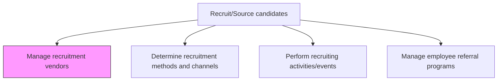
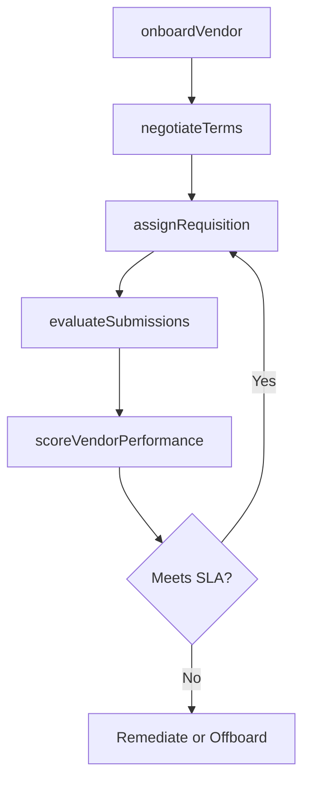

# Manage recruitment vendors

> Business-as-Code definition for managing recruitment vendors. Models the selection, onboarding, performance monitoring, and contract governance of staffing agencies, executive search firms, RPO providers, and other third-party recruitment partners.

## Overview

Establishing and maintaining relationships with recruitment vendors (suppliers). Create and maintain relationships with third-party agencies such as staffing and firms to expand. Use these relationships to implement the sourcing process effectively.

## Process Hierarchy



## GraphDL

```yaml
manage:
  object: Recruitment Vendors
  actor: TalentAcquisitionManager
  result: VendorScorecard
```

## Actions

| Action | Description |
|--------|-------------|
| onboardVendor | Register a new staffing agency or search firm in the vendor management system |
| negotiateTerms | Establish fee structures, SLAs, guarantee periods, and payment terms |
| assignRequisition | Route specific open positions to qualified vendor partners |
| evaluateSubmissions | Review candidate resumes and profiles submitted by vendors against role requirements |
| scoreVendorPerformance | Rate vendors on fill rate, time-to-submit, candidate quality, and retention |

## Events

| Event | Description |
|-------|-------------|
| vendorOnboarded | New recruitment vendor registered and activated in the VMS |
| termsNegotiated | Fee structure, SLA, and contract terms finalized with vendor |
| requisitionAssigned | Open position routed to one or more vendor partners |
| submissionsEvaluated | Vendor-submitted candidates reviewed and dispositioned |
| vendorPerformanceScored | Quarterly or annual vendor scorecard completed |

## Searches

| Search | Description |
|--------|-------------|
| findActiveVendors | List vendors currently under contract with active requisition assignments |
| getVendorScorecard | Retrieve performance metrics for a specific vendor |
| findVendorsBySpecialty | List vendors specializing in a given role family or industry |
| getVendorSubmissionHistory | Retrieve all candidate submissions from a vendor over a period |

## Process Flow



## RACI Matrix

| Activity | Responsible | Accountable | Consulted | Informed |
|----------|-------------|-------------|-----------|----------|
| onboardVendor | RecruitingCoordinator | TalentAcquisitionManager | Legal | Procurement |
| negotiateTerms | TalentAcquisitionManager | VP HR | Legal | Finance |
| scoreVendorPerformance | HRAnalyst | TalentAcquisitionManager | Recruiter | Procurement |

## Related Processes

| Process | Relationship |
|---------|-------------|
| 7.2.2.1 Determine recruitment methods and channels | Upstream - channel strategy determines when to engage vendors |
| 7.2.2.2 Perform recruiting activities/events | Parallel - vendors may co-sponsor or staff recruiting events |
| 7.2.2.4 Manage employee referral programs | Alternative - internal referrals may reduce vendor dependency |
| 7.2.3.2 Interview candidates | Downstream - vendor-submitted candidates enter the interview process |

## Related Departments

| Department | Role |
|-----------|------|
| Talent Acquisition | Manages vendor relationships and performance |
| Procurement | Handles contract negotiation and purchase orders |
| Legal | Reviews vendor agreements and compliance terms |
| Finance | Processes vendor invoices and tracks recruitment spend |

## Related Occupations

| Occupation | Involvement |
|-----------|-------------|
| Talent Acquisition Manager | Owns vendor relationships and performance governance |
| Recruiting Coordinator | Manages day-to-day vendor communications and submissions |
| Procurement Specialist | Negotiates contracts and manages vendor compliance |

## KPIs

| KPI | Description | Unit |
|-----|-------------|------|
| Vendor Fill Rate | Percentage of vendor-assigned requisitions resulting in a hire | % |
| Time to Submit | Average days from requisition assignment to first vendor submission | Days |
| Submission-to-Interview Ratio | Percentage of vendor submissions that advance to interview | % |
| Vendor Retention Rate | Percentage of vendor-placed hires still employed after 12 months | % |

## Usage

```typescript
import { manageRecruitmentVendors } from '@headlessly/manage-recruitment-vendors'

const vendors = manageRecruitmentVendors()

// Onboard a new staffing agency
await vendors.onboardVendor({
  vendorName: 'Apex Staffing Partners',
  specialty: 'engineering',
  feePercentage: 20,
  guaranteePeriodDays: 90
})

// Score vendor performance for Q3
const scorecard = await vendors.scoreVendorPerformance({
  vendorId: 'vendor-456',
  period: 'Q3-2025'
})
```
