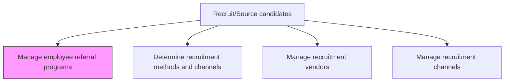
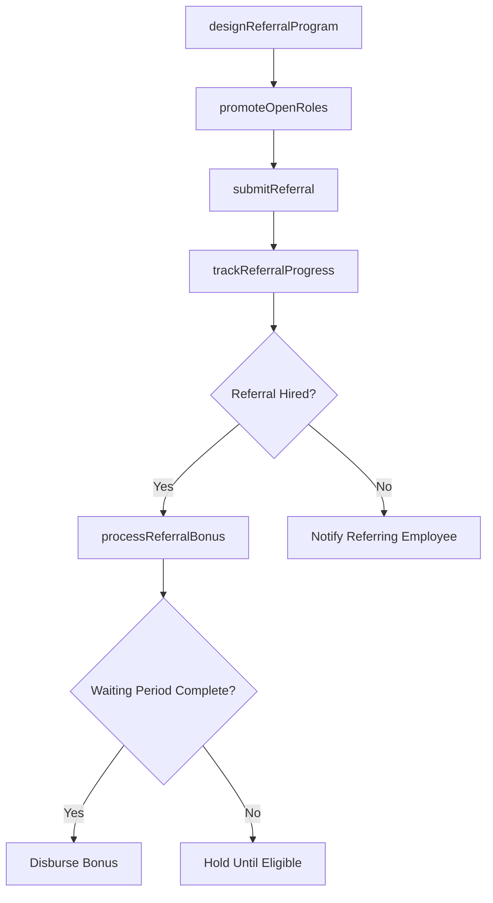

# Manage employee referral programs

> Business-as-Code definition for managing employee referral programs. Models the design, promotion, tracking, and reward fulfillment of referral incentive programs that motivate current employees to recommend qualified candidates from their professional networks.

## Overview

Creating and managing a recruiting strategy where current employees are rewarded for referring qualified candidates for employment. Design referral bonus tiers, communicate open roles to the workforce, track referral submissions through the hiring funnel, and process bonus payouts upon successful placement.

## Process Hierarchy



## GraphDL

```yaml
manage:
  object: Employee Referral Programs
  actor: TalentAcquisitionManager
  result: ReferralProgramStatus
```

## Actions

| Action | Description |
|--------|-------------|
| designReferralProgram | Define bonus tiers, eligibility rules, payout schedules, and hard-to-fill multipliers |
| promoteOpenRoles | Broadcast referral-eligible positions to the employee base via email, Slack, or intranet |
| submitReferral | Allow employees to nominate candidates and attach referral context |
| trackReferralProgress | Monitor referred candidates through screening, interview, and offer stages |
| processReferralBonus | Trigger bonus payout after the referred hire completes the waiting period |

## Events

| Event | Description |
|-------|-------------|
| referralProgramDesigned | Bonus structure, eligibility rules, and payout schedule established |
| openRolesPromoted | Referral-eligible positions broadcast to employees |
| referralSubmitted | Employee nominated a candidate with referral details recorded |
| referralProgressTracked | Referred candidate advanced to next stage in hiring pipeline |
| referralBonusProcessed | Referral bonus approved and queued for payroll disbursement |

## Searches

| Search | Description |
|--------|-------------|
| findActiveReferrals | List pending referrals by status, department, or referring employee |
| getReferralFunnelMetrics | Retrieve conversion rates at each stage for referred candidates |
| findBonusesPending | List referral bonuses awaiting payout after the waiting period |
| getReferralLeaderboard | Rank employees by number of successful referral hires |

## Process Flow



## RACI Matrix

| Activity | Responsible | Accountable | Consulted | Informed |
|----------|-------------|-------------|-----------|----------|
| designReferralProgram | TalentAcquisitionManager | VP HR | CompensationAnalyst | Finance |
| promoteOpenRoles | RecruitingCoordinator | Recruiter | InternalComms | AllEmployees |
| processReferralBonus | HROperations | TalentAcquisitionManager | Payroll | ReferringEmployee |

## Related Processes

| Process | Relationship |
|---------|-------------|
| 7.2.2.1 Determine recruitment methods and channels | Upstream - referrals are one sourcing channel in the mix |
| 7.2.2.3 Manage recruitment vendors | Alternative - referrals reduce need for external agency placements |
| 7.2.2.5 Manage recruitment channels | Parallel - referral program is a managed channel |
| 7.2.3.1 Identify and deploy candidate selection tools | Downstream - referred candidates enter the standard screening process |

## Related Departments

| Department | Role |
|-----------|------|
| Talent Acquisition | Designs and administers the referral program |
| HR Operations | Processes bonus payouts through payroll |
| Internal Communications | Promotes referral opportunities to employees |
| Finance | Budgets and approves referral bonus expenditures |

## Related Occupations

| Occupation | Involvement |
|-----------|-------------|
| Talent Acquisition Manager | Owns referral program strategy and bonus structure |
| Recruiting Coordinator | Tracks referral submissions and pipeline progress |
| Payroll Specialist | Processes referral bonus disbursements |

## KPIs

| KPI | Description | Unit |
|-----|-------------|------|
| Referral Submission Rate | Percentage of open positions receiving at least one employee referral | % |
| Referral-to-Hire Rate | Percentage of submitted referrals that result in a hire | % |
| Referral Time to Fill | Average days from referral submission to offer acceptance | Days |
| Referral Retention Rate | Percentage of referral hires retained after 12 months | % |

## Usage

```typescript
import { manageEmployeeReferralPrograms } from '@headlessly/manage-employee-referral-programs'

const referrals = manageEmployeeReferralPrograms()

// Submit a referral for an open engineering role
await referrals.submitReferral({
  referringEmployeeId: 'emp-1234',
  candidateName: 'Alex Chen',
  candidateEmail: 'alex.chen@example.com',
  requisitionId: 'req-5678',
  relationship: 'former-colleague'
})

// Check referral bonus payout eligibility
const pending = await referrals.findBonusesPending({
  waitingPeriodDays: 90,
  department: 'engineering'
})
```
