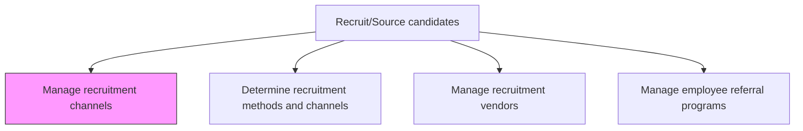
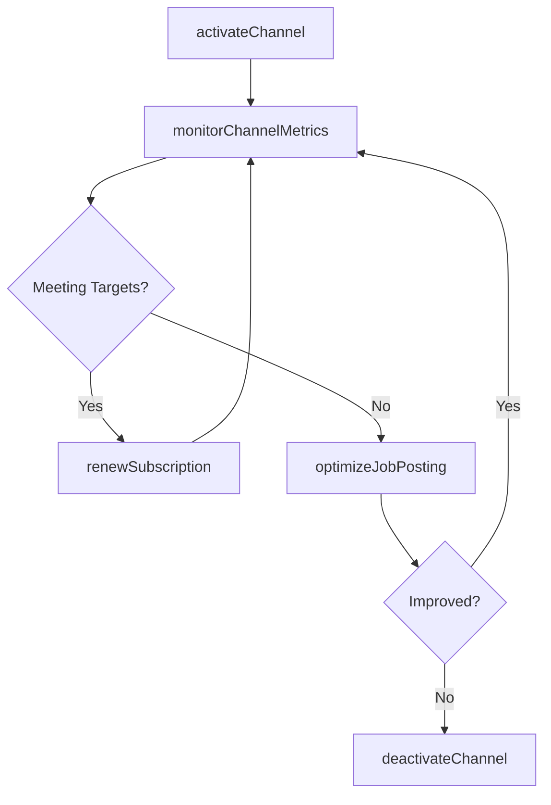

# Manage recruitment channels

> Business-as-Code definition for managing recruitment channels. Models the ongoing administration, optimization, and performance monitoring of all active sourcing channels -- job boards, social platforms, career sites, university partnerships, and internal mobility portals.

## Overview

Establishing and maintaining channels for recruiting. Extract the best out of every recruitment channel. Manage all the processes related to all the sourcing channels including job board subscriptions, social media employer branding, career site content, and university partnership agreements.

## Process Hierarchy



## GraphDL

```yaml
manage:
  object: Recruitment Channels
  actor: TalentAcquisitionManager
  result: ChannelPerformanceReport
```

## Actions

| Action | Description |
|--------|-------------|
| activateChannel | Enable a new job board, social platform, or sourcing tool for posting and sourcing |
| renewSubscription | Extend or renegotiate contracts with paid job boards and recruitment platforms |
| optimizeJobPosting | A/B test posting titles, descriptions, and media to improve applicant conversion |
| monitorChannelMetrics | Track applicant volume, quality, and cost across all active channels |
| deactivateChannel | Sunset underperforming channels and reallocate budget to higher-ROI sources |

## Events

| Event | Description |
|-------|-------------|
| channelActivated | New sourcing channel enabled and integrated with the ATS |
| subscriptionRenewed | Job board or platform contract extended for a new term |
| jobPostingOptimized | Posting content updated based on A/B test results or conversion data |
| channelMetricsMonitored | Monthly or weekly channel performance data refreshed and reviewed |
| channelDeactivated | Underperforming channel disabled and budget reallocated |

## Searches

| Search | Description |
|--------|-------------|
| findActiveChannels | List all currently enabled sourcing channels with contract status |
| getChannelMetrics | Retrieve applicant volume, cost, and quality data for a specific channel |
| findExpiringContracts | List channel subscriptions approaching renewal date |
| compareChannelROI | Side-by-side performance comparison across sourcing channels |

## Process Flow



## RACI Matrix

| Activity | Responsible | Accountable | Consulted | Informed |
|----------|-------------|-------------|-----------|----------|
| activateChannel | RecruitingCoordinator | TalentAcquisitionManager | IT | Recruiter |
| monitorChannelMetrics | HRAnalyst | TalentAcquisitionManager | Recruiter | Finance |
| deactivateChannel | TalentAcquisitionManager | VP HR | Finance | Recruiters |

## Related Processes

| Process | Relationship |
|---------|-------------|
| 7.2.2.1 Determine recruitment methods and channels | Upstream - initial channel selection feeds ongoing management |
| 7.2.2.2 Perform recruiting activities/events | Parallel - event channels managed alongside digital channels |
| 7.2.2.3 Manage recruitment vendors | Parallel - vendor channels overlap with direct-sourcing channels |
| 7.2.2.4 Manage employee referral programs | Parallel - referral program is a managed internal channel |

## Related Departments

| Department | Role |
|-----------|------|
| Talent Acquisition | Owns channel portfolio and optimization |
| IT | Manages ATS integrations with job boards and platforms |
| Marketing | Maintains employer brand consistency across channels |
| Finance | Approves channel subscriptions and tracks ROI |

## Related Occupations

| Occupation | Involvement |
|-----------|-------------|
| Talent Acquisition Manager | Governs channel portfolio and budget allocation |
| Recruiting Coordinator | Administers daily channel operations and postings |
| HR Analyst | Analyzes channel performance and recommends optimizations |

## KPIs

| KPI | Description | Unit |
|-----|-------------|------|
| Applicant Volume by Channel | Number of applicants received per sourcing channel per month | Count |
| Channel Conversion Rate | Percentage of channel applicants who advance to interview | % |
| Cost Per Application | Average cost to generate one application per channel | USD |
| Channel Diversity Index | Number of active channels contributing to the hire pipeline | Count |

## Usage

```typescript
import { manageRecruitmentChannels } from '@headlessly/manage-recruitment-channels'

const channels = manageRecruitmentChannels()

// Monitor monthly channel performance
const metrics = await channels.monitorChannelMetrics({
  period: '2025-Q3',
  channels: ['linkedin', 'indeed', 'glassdoor', 'career-site']
})

// Deactivate an underperforming channel
await channels.deactivateChannel({
  channelId: 'chan-ziprecruiter',
  reason: 'low-conversion',
  reallocateBudgetTo: 'chan-linkedin'
})
```
