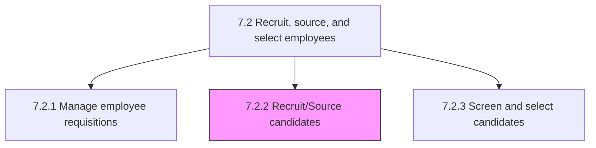
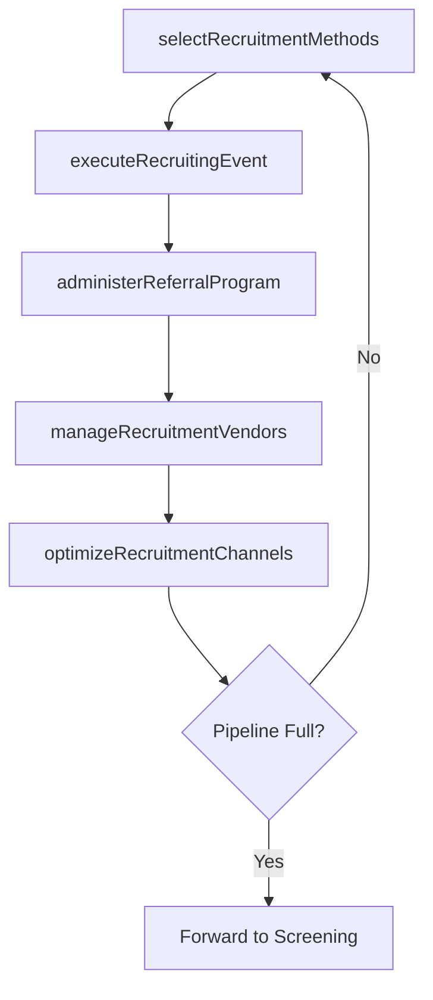

# Recruit/Source candidates

> Business-as-Code definition for candidate recruitment and sourcing. Models recruitment method selection, recruiting event execution, vendor management, referral programs, and channel optimization.

## Overview

Recruiting new candidates for deployment across various functional areas inside the organization. Select methods for sourcing new employees. Manage relationships with third-party agencies. Stage recruitment fairs and drives. Manage employee referral programs.

## Process Hierarchy



## GraphDL

```yaml
recruit/source:
  object: Candidates
  actor: Recruiter
  result: CandidatePipeline
```

## Actions

| Action | Description |
|--------|-------------|
| selectRecruitmentMethods | Choose optimal sourcing strategies and recruitment channels |
| executeRecruitingEvent | Organize and conduct hiring events, career fairs, and campus drives |
| manageRecruitmentVendors | Oversee relationships with staffing agencies and recruitment platforms |
| administerReferralProgram | Manage employee referral submissions and reward processing |
| optimizeRecruitmentChannels | Analyze channel performance and reallocate sourcing investment |

## Events

| Event | Description |
|-------|-------------|
| recruitmentMethodsSelected | Sourcing strategy and channels defined for requisition |
| recruitingEventExecuted | Hiring event or career fair completed |
| recruitmentVendorsManaged | Vendor performance reviewed and contracts updated |
| referralProgramAdministered | Employee referral processed and reward issued |
| recruitmentChannelsOptimized | Channel performance analysis completed with reallocation |

## Searches

| Search | Description |
|--------|-------------|
| getCandidatePipeline | List sourced candidates by requisition, channel, or stage |
| getChannelPerformance | Retrieve sourcing channel metrics and cost-per-hire data |
| getVendorPerformance | Query recruitment vendor delivery and quality metrics |
| getReferralSubmissions | List employee referrals by status or department |

## Process Flow



## RACI Matrix

| Activity | Responsible | Accountable | Consulted | Informed |
|----------|-------------|-------------|-----------|----------|
| selectRecruitmentMethods | Recruiter | Talent Acquisition Manager | Hiring Manager | Finance |
| executeRecruitingEvent | Recruiting Coordinator | Talent Acquisition Manager | Marketing | Department Heads |
| manageRecruitmentVendors | Talent Acquisition Manager | VP HR | Procurement, Legal | Finance |
| administerReferralProgram | HR Coordinator | Talent Acquisition Manager | Payroll | All Employees |

## Sub-Processes

| ID | Name | Description |
|----|------|-------------|
| 7.2.2.1 | Determine recruitment methods and channels | Defining the methods and channels for recruitments in order to maximize the amount of candidate avai |
| 7.2.2.2 | Perform recruiting activities/events | Organizing and executing recruiting activities and events. Activities and events include on-campus h |
| 7.2.2.3 | Manage recruitment vendors | Establishing and maintaining relationships with recruitment vendors (suppliers). Create and maintain |
| 7.2.2.4 | Manage employee referral programs | Creating and managing a recruiting strategy where current employees are rewarded for referring quali |
| 7.2.2.5 | Manage recruitment channels | Establishing and maintaining channels for recruiting. Extract the best out of every recruitment chan |

## Related Processes

| Process | Relationship |
|---------|-------------|
| 7.2.1 Manage employee requisitions | Upstream - approved requisitions trigger sourcing |
| 7.2.3 Screen and select candidates | Downstream - sourced candidates enter screening |
| 7.1.2.8 Develop recruitment program | Upstream - program defines sourcing strategy |

## Related Departments

| Department | Role |
|-----------|------|
| Talent Acquisition | Executes sourcing strategies and manages pipeline |
| Marketing | Supports employer branding and recruitment marketing |
| All Departments | Participate in employee referral programs |

## Related Occupations

| Occupation | Involvement |
|-----------|-------------|
| Sourcing Specialist | Identifies and engages passive candidates |
| Recruiting Coordinator | Manages events and candidate logistics |

## KPIs

| KPI | Description | Unit |
|-----|-------------|------|
| Source of Hire | Distribution of hires by recruitment channel | % |
| Cost Per Applicant | Total sourcing cost divided by applicants generated | USD |
| Referral Hire Rate | Percentage of hires coming from employee referrals | % |
| Pipeline Velocity | Average days from sourcing to screening stage | Days |

## Usage

```typescript
import { recruitSourceCandidates } from '@headlessly/recruit-source-candidates'

const sourcing = recruitSourceCandidates()

// Execute a recruiting event
const event = await sourcing.executeRecruitingEvent({
  type: 'campus-recruiting',
  university: 'MIT',
  targetRoles: ['software-engineer', 'data-scientist'],
  date: '2025-03-20'
})

// Optimize recruitment channels
const analysis = await sourcing.optimizeRecruitmentChannels({
  period: '2025-Q1',
  budgetReallocation: true
})
```
