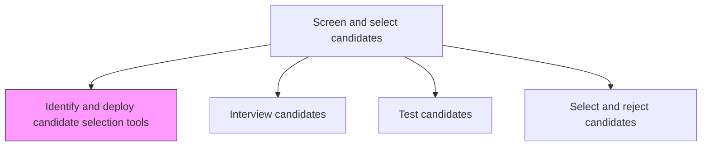
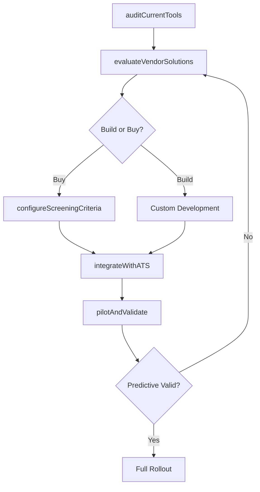

# Identify and deploy candidate selection tools

> Business-as-Code definition for identifying and deploying candidate selection tools. Models the evaluation, procurement, configuration, and rollout of screening instruments including resume parsers, pre-employment assessments, background check services, and AI-powered candidate matching systems.

## Overview

Identifying and implementing tools for the selection of candidates. Recognize candidate selection tools such as screening, telephone interviews, hiring manager interviews, drug testing, and skills assessment. Effectively deploy these tools to check if the candidates fit in the workplace or not, as well as to ensure workplace safety.

## Process Hierarchy



## GraphDL

```yaml
identify:
  object: Candidate Selection Tools
  actor: TalentAcquisitionManager
  result: SelectionToolkit
```

## Actions

| Action | Description |
|--------|-------------|
| auditCurrentTools | Inventory existing screening and assessment tools and evaluate their effectiveness |
| evaluateVendorSolutions | Research and demo candidate selection platforms against requirements |
| configureScreeningCriteria | Set up knockout questions, minimum qualifications, and scoring rubrics |
| integrateWithATS | Connect selection tools to the applicant tracking system for seamless data flow |
| pilotAndValidate | Run a trial deployment with a subset of requisitions and measure predictive validity |

## Events

| Event | Description |
|-------|-------------|
| currentToolsAudited | Existing screening tools inventoried and effectiveness gaps identified |
| vendorSolutionsEvaluated | Selection tool vendors demoed, scored, and shortlisted |
| screeningCriteriaConfigured | Knockout questions, qualifications, and scoring rubrics activated |
| atsIntegrationCompleted | Selection tools connected to ATS with data flowing bidirectionally |
| pilotValidated | Trial deployment results reviewed and tool effectiveness confirmed |

## Searches

| Search | Description |
|--------|-------------|
| findDeployedTools | List all active candidate selection tools by type and integration status |
| getToolEffectiveness | Retrieve predictive validity and false-positive rates for a selection tool |
| findToolsByStage | List tools configured for specific hiring stages (screen, assess, check) |
| getToolUsageMetrics | Access adoption rates and completion rates across deployed tools |

## Process Flow



## RACI Matrix

| Activity | Responsible | Accountable | Consulted | Informed |
|----------|-------------|-------------|-----------|----------|
| auditCurrentTools | HRTechnologyManager | TalentAcquisitionManager | Recruiter | VP HR |
| evaluateVendorSolutions | HRTechnologyManager | TalentAcquisitionManager | Legal | Procurement |
| pilotAndValidate | Recruiter | TalentAcquisitionManager | IOPsychologist | HiringManagers |

## Related Processes

| Process | Relationship |
|---------|-------------|
| 7.2.3.2 Interview candidates | Downstream - interview scheduling tools are part of the toolkit |
| 7.2.3.3 Test candidates | Downstream - assessment tools deployed here are used in testing |
| 7.2.3.4 Select and reject candidates | Downstream - tool outputs feed the selection decision |
| 7.2.2.1 Determine recruitment methods and channels | Upstream - sourcing approach influences which screening tools are needed |

## Related Departments

| Department | Role |
|-----------|------|
| Talent Acquisition | Defines screening requirements and adoption strategy |
| HR Technology | Evaluates, procures, and integrates selection tools |
| Legal | Reviews tools for EEOC compliance and adverse impact |
| IT | Supports tool integration with enterprise systems |

## Related Occupations

| Occupation | Involvement |
|-----------|-------------|
| HR Technology Manager | Evaluates and deploys screening platforms |
| Talent Acquisition Manager | Defines selection criteria and tool requirements |
| I/O Psychologist | Validates assessment instruments for predictive validity |

## KPIs

| KPI | Description | Unit |
|-----|-------------|------|
| Tool Adoption Rate | Percentage of recruiters actively using deployed selection tools | % |
| Screening Completion Rate | Percentage of candidates who complete the automated screening process | % |
| Predictive Validity | Correlation between tool scores and on-the-job performance ratings | Coefficient |
| Integration Uptime | Percentage of time selection tools are operational and synced with ATS | % |

## Usage

```typescript
import { identifyAndDeployCandidateSelectionTools } from '@headlessly/identify-and-deploy-candidate-selection-tools'

const tools = identifyAndDeployCandidateSelectionTools()

// Audit current screening tools for effectiveness gaps
const audit = await tools.auditCurrentTools({
  department: 'engineering',
  includeAdoptionMetrics: true
})

// Configure screening criteria for a new requisition
await tools.configureScreeningCriteria({
  requisitionId: 'req-5678',
  knockoutQuestions: ['years-experience >= 5', 'visa-sponsorship = no'],
  scoringRubric: 'technical-swe-senior'
})
```
