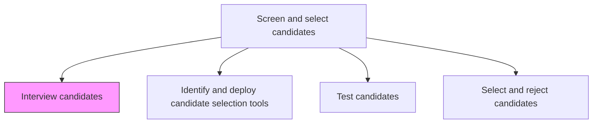
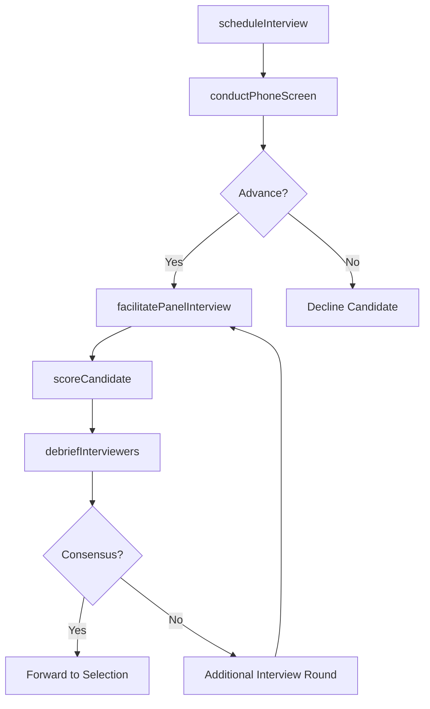

# Interview candidates

> Business-as-Code definition for interviewing candidates. Models the scheduling, execution, and evaluation of structured interviews across phone screens, panel interviews, technical assessments, and hiring manager conversations.

## Overview

Assessing the candidates by their performance in the interviews. Conduct HR interview, technical interview, hiring manager interview, etc. Understand the mindset of the candidate, and comprehend his/her personal and professional lives.

## Process Hierarchy



## GraphDL

```yaml
interview:
  object: Candidates
  actor: Recruiter
  result: InterviewEvaluation
```

## Actions

| Action | Description |
|--------|-------------|
| scheduleInterview | Coordinate interview times across candidate, interviewers, and room availability |
| conductPhoneScreen | Perform initial telephone or video screening to assess basic fit and interest |
| facilitatePanelInterview | Run a structured panel interview with standardized questions and scoring rubrics |
| debriefInterviewers | Facilitate a post-interview debrief to consolidate feedback and resolve split decisions |
| scoreCandidate | Record structured interview scores and written evaluations in the ATS |

## Events

| Event | Description |
|-------|-------------|
| interviewScheduled | Interview time confirmed with candidate and all interviewers |
| phoneScreenConducted | Initial screening call completed with pass/fail disposition |
| panelInterviewFacilitated | Structured panel interview completed with all scorecards submitted |
| interviewersDebriefed | Post-interview debrief concluded with consensus recommendation |
| candidateScored | Interview scores and evaluations recorded in the tracking system |

## Searches

| Search | Description |
|--------|-------------|
| findScheduledInterviews | List upcoming interviews by date, interviewer, or requisition |
| getCandidateScorecard | Retrieve all interview scores and feedback for a specific candidate |
| findIncompleteEvaluations | List interviewers who have not yet submitted their scorecards |
| getInterviewPipelineMetrics | Retrieve pass-through rates and average scores by interview stage |

## Process Flow



## RACI Matrix

| Activity | Responsible | Accountable | Consulted | Informed |
|----------|-------------|-------------|-----------|----------|
| scheduleInterview | RecruitingCoordinator | Recruiter | HiringManager | Candidate |
| facilitatePanelInterview | Recruiter | HiringManager | InterviewPanel | TalentAcquisitionManager |
| debriefInterviewers | Recruiter | TalentAcquisitionManager | InterviewPanel | HRBusinessPartner |

## Related Processes

| Process | Relationship |
|---------|-------------|
| 7.2.3.1 Identify and deploy candidate selection tools | Upstream - interview guides and rubrics come from deployed tools |
| 7.2.3.3 Test candidates | Parallel - technical tests may occur alongside or between interviews |
| 7.2.3.4 Select and reject candidates | Downstream - interview evaluations feed the selection decision |
| 7.2.1.6 Notify hiring manager | Upstream - manager receives interview schedule confirmation |

## Related Departments

| Department | Role |
|-----------|------|
| Talent Acquisition | Coordinates scheduling and ensures structured interview compliance |
| Hiring Department | Provides subject-matter interviewers and final evaluation |
| HR Compliance | Ensures interview questions comply with employment law |

## Related Occupations

| Occupation | Involvement |
|-----------|-------------|
| Recruiter | Manages interview logistics and candidate experience |
| Hiring Manager | Conducts final-round interviews and owns hiring decision |
| Recruiting Coordinator | Schedules rooms, video links, and travel arrangements |

## KPIs

| KPI | Description | Unit |
|-----|-------------|------|
| Interview-to-Offer Ratio | Percentage of interviewed candidates who receive an offer | % |
| Scorecard Completion Rate | Percentage of interviewers who submit evaluations within 24 hours | % |
| Candidate NPS | Net Promoter Score from post-interview candidate experience surveys | Score |
| Time in Interview Stage | Average days candidates spend in the interview process | Days |

## Usage

```typescript
import { interviewCandidates } from '@headlessly/interview-candidates'

const interviews = interviewCandidates()

// Schedule a panel interview for a shortlisted candidate
await interviews.scheduleInterview({
  candidateId: 'cand-001',
  requisitionId: 'req-5678',
  interviewerIds: ['emp-201', 'emp-202', 'mgr-100'],
  format: 'panel',
  duration: 60
})

// Retrieve scorecard after debrief
const scorecard = await interviews.getCandidateScorecard({
  candidateId: 'cand-001',
  requisitionId: 'req-5678'
})
```
