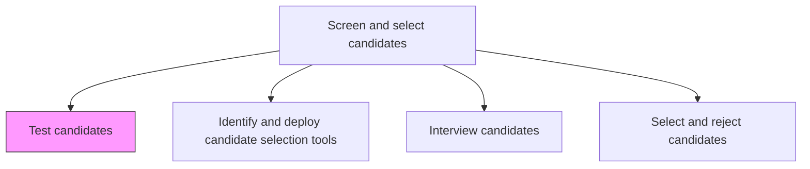
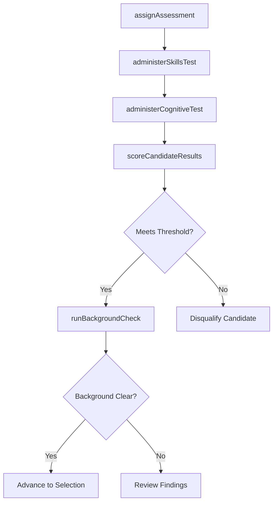

# Test candidates

> Business-as-Code definition for testing candidates. Models the administration, scoring, and evaluation of pre-employment assessments including aptitude tests, technical skills evaluations, personality inventories, cognitive ability measures, and drug/background screenings.

## Overview

Examining the candidates through tests. Prepare tools such as aptitude, technical, and grammar tests. Test the skills of the candidate through a written, oral, or computerized test.

## Process Hierarchy



## GraphDL

```yaml
test:
  object: Candidates
  actor: Recruiter
  result: AssessmentReport
```

## Actions

| Action | Description |
|--------|-------------|
| assignAssessment | Send the appropriate test battery to a candidate based on role requirements |
| administerSkillsTest | Deliver a technical, coding, or domain-specific skills evaluation |
| administerCognitiveTest | Administer a standardized aptitude or cognitive ability assessment |
| scoreCandidateResults | Calculate and normalize test scores against benchmarks and passing thresholds |
| runBackgroundCheck | Initiate criminal, education, and employment verification screenings |

## Events

| Event | Description |
|-------|-------------|
| assessmentAssigned | Test battery sent to candidate with instructions and deadline |
| skillsTestAdministered | Technical or domain-specific skills evaluation completed |
| cognitiveTestAdministered | Standardized aptitude or cognitive assessment completed |
| candidateResultsScored | Test scores calculated, normalized, and compared to benchmarks |
| backgroundCheckCompleted | Criminal, education, and employment verifications returned |

## Searches

| Search | Description |
|--------|-------------|
| findPendingAssessments | List candidates with assigned but incomplete assessments |
| getCandidateTestScores | Retrieve all test results and benchmark comparisons for a candidate |
| findCandidatesByScoreRange | List candidates whose scores fall within a specified range |
| getAssessmentCompletionRate | Track what percentage of candidates complete their assigned tests |

## Process Flow



## RACI Matrix

| Activity | Responsible | Accountable | Consulted | Informed |
|----------|-------------|-------------|-----------|----------|
| assignAssessment | Recruiter | TalentAcquisitionManager | HiringManager | Candidate |
| scoreCandidateResults | AssessmentVendor | Recruiter | IOPsychologist | HiringManager |
| runBackgroundCheck | BackgroundCheckVendor | Recruiter | Legal | HRBusinessPartner |

## Related Processes

| Process | Relationship |
|---------|-------------|
| 7.2.3.1 Identify and deploy candidate selection tools | Upstream - assessment instruments selected and configured here |
| 7.2.3.2 Interview candidates | Parallel - tests may occur before, during, or after interviews |
| 7.2.3.4 Select and reject candidates | Downstream - test results are key inputs to the selection decision |
| 7.2.4.1 Draw up and make offer | Downstream - background check clearance is a prerequisite for offer |

## Related Departments

| Department | Role |
|-----------|------|
| Talent Acquisition | Administers assessments and manages vendor relationships |
| Hiring Department | Defines technical test content and passing thresholds |
| Legal | Ensures assessments comply with EEOC and ADA requirements |
| Security | Reviews background check results for sensitive positions |

## Related Occupations

| Occupation | Involvement |
|-----------|-------------|
| Recruiter | Assigns tests and communicates results to hiring teams |
| I/O Psychologist | Designs and validates assessment instruments |
| Hiring Manager | Sets passing thresholds and reviews technical test outcomes |

## KPIs

| KPI | Description | Unit |
|-----|-------------|------|
| Assessment Completion Rate | Percentage of assigned assessments completed by candidates | % |
| Pass Rate | Percentage of candidates meeting minimum score thresholds | % |
| Background Check Turnaround | Average days from background check initiation to results | Days |
| Adverse Impact Ratio | Four-fifths rule compliance across demographic groups | Ratio |

## Usage

```typescript
import { testCandidates } from '@headlessly/test-candidates'

const testing = testCandidates()

// Assign a technical skills assessment
await testing.assignAssessment({
  candidateId: 'cand-001',
  requisitionId: 'req-5678',
  assessmentType: 'technical-coding',
  deadlineHours: 72
})

// Retrieve scored results with benchmark comparison
const results = await testing.getCandidateTestScores({
  candidateId: 'cand-001',
  includeBenchmarks: true
})
```
