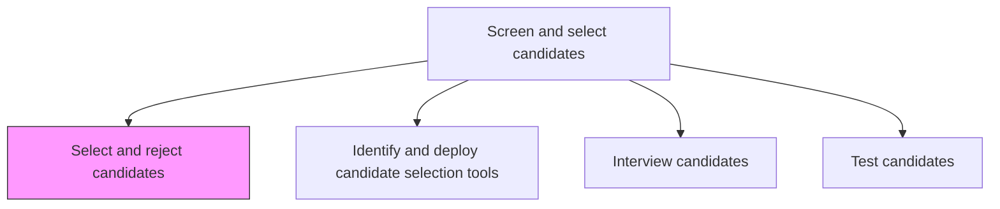
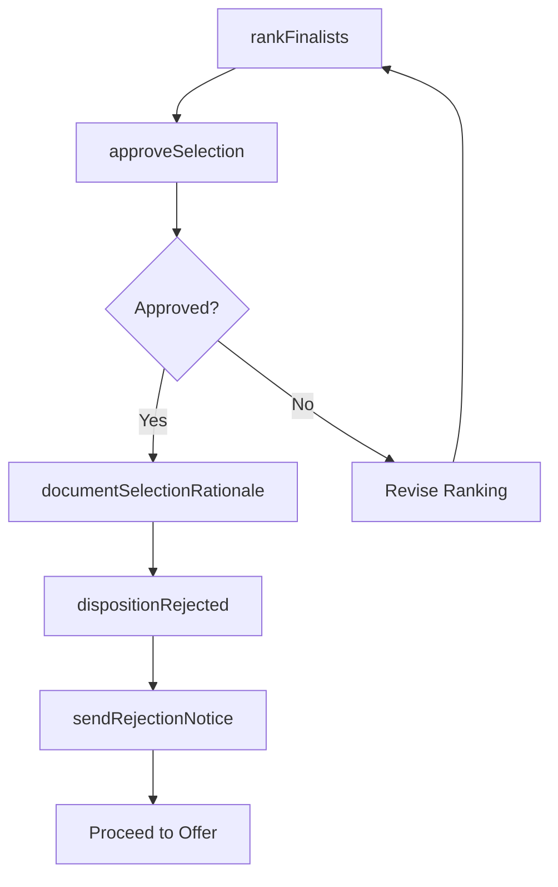

# Select and reject candidates

> Business-as-Code definition for selecting and rejecting candidates. Models the final decision-making process where hiring teams rank finalists, approve selections, disposition rejected candidates, and communicate outcomes while maintaining a compliant audit trail.

## Overview

Approving the deserving candidates, and rejecting the others. Examining the performance of candidates. Ensure candidates would fit well with the organization. (Assess performance from Interview candidates [10457] and Test candidates [10458].)

## Process Hierarchy



## GraphDL

```yaml
select:
  object: Candidates
  actor: HiringManager
  result: SelectionDecision
```

## Actions

| Action | Description |
|--------|-------------|
| rankFinalists | Order shortlisted candidates by composite interview, test, and cultural-fit scores |
| approveSelection | Obtain hiring manager and department head sign-off on the chosen candidate |
| dispositionRejected | Record rejection reasons in the ATS and tag candidates for talent pool retention |
| sendRejectionNotice | Deliver personalized rejection communication to non-selected candidates |
| documentSelectionRationale | Record the decision rationale and scoring for EEOC compliance and audit purposes |

## Events

| Event | Description |
|-------|-------------|
| finalistsRanked | Shortlisted candidates ordered by composite evaluation scores |
| selectionApproved | Hiring manager and department head signed off on the chosen candidate |
| rejectedCandidatesDispositioned | Non-selected candidates tagged with rejection reasons in ATS |
| rejectionNoticeSent | Personalized rejection communication delivered to candidate |
| selectionRationaleDocumented | Decision rationale recorded for compliance audit trail |

## Searches

| Search | Description |
|--------|-------------|
| findFinalists | List candidates in the final selection stage for a requisition |
| getSelectionDecision | Retrieve the approved candidate and selection rationale for a requisition |
| findRejectedCandidates | List rejected candidates by reason, requisition, or date |
| getCandidateFeedbackSummary | Aggregate interview and test scores for a candidate across all evaluators |

## Process Flow



## RACI Matrix

| Activity | Responsible | Accountable | Consulted | Informed |
|----------|-------------|-------------|-----------|----------|
| rankFinalists | Recruiter | HiringManager | InterviewPanel | TalentAcquisitionManager |
| approveSelection | HiringManager | DepartmentHead | HRBusinessPartner | Finance |
| sendRejectionNotice | RecruitingCoordinator | Recruiter | Legal | Candidate |

## Related Processes

| Process | Relationship |
|---------|-------------|
| 7.2.3.2 Interview candidates | Upstream - interview evaluations are primary input to ranking |
| 7.2.3.3 Test candidates | Upstream - test scores feed into the composite ranking |
| 7.2.4.1 Draw up and make offer | Downstream - selected candidate proceeds to offer creation |
| 7.2.5 Manage applicant information | Parallel - rejection dispositions update applicant records |

## Related Departments

| Department | Role |
|-----------|------|
| Hiring Department | Makes the final selection decision |
| Talent Acquisition | Facilitates ranking, communication, and compliance documentation |
| Legal | Reviews selection rationale for adverse impact and EEOC compliance |
| HR Operations | Updates candidate records and dispositions in HRIS |

## Related Occupations

| Occupation | Involvement |
|-----------|-------------|
| Hiring Manager | Ranks finalists and approves the selection |
| Recruiter | Facilitates the decision process and communicates outcomes |
| HR Compliance Officer | Audits selection rationale for legal compliance |

## KPIs

| KPI | Description | Unit |
|-----|-------------|------|
| Selection Ratio | Percentage of finalists who receive an offer | % |
| Rejection Communication Time | Average hours from decision to rejection notice delivery | Hours |
| Diversity of Finalist Pool | Demographic representation among final candidates | % |
| Offer Acceptance Prediction | Correlation between ranking position and offer acceptance | Coefficient |

## Usage

```typescript
import { selectAndRejectCandidates } from '@headlessly/select-and-reject-candidates'

const selection = selectAndRejectCandidates()

// Rank finalists for a requisition
const ranked = await selection.rankFinalists({
  requisitionId: 'req-5678',
  weightInterviewScore: 0.5,
  weightTestScore: 0.3,
  weightCulturalFit: 0.2
})

// Disposition rejected candidates and notify them
await selection.dispositionRejected({
  requisitionId: 'req-5678',
  candidateIds: ['cand-002', 'cand-003'],
  reason: 'stronger-finalist',
  retainInTalentPool: true
})
```
