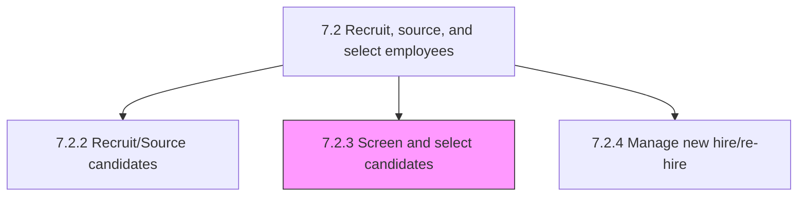
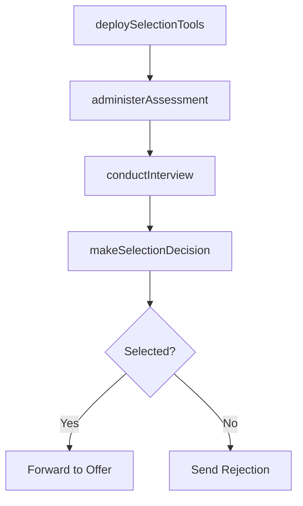

# Screen and select candidates

> Business-as-Code definition for candidate screening and selection. Models selection tool deployment, interview execution, candidate testing, and hire/reject decision processes.

## Overview

Evaluating and selecting potential employees through interviews, tests, etc.

## Process Hierarchy



## GraphDL

```yaml
screen:
  object: And Select Candidates
  actor: HiringManager
  result: SelectionDecision
```

## Actions

| Action | Description |
|--------|-------------|
| deploySelectionTools | Configure and activate screening tools such as ATS scoring and assessments |
| conductInterview | Execute structured interviews including HR, technical, and panel rounds |
| administerAssessment | Deliver aptitude, technical, or psychometric tests to candidates |
| makeSelectionDecision | Evaluate candidates and render hire or reject decisions |

## Events

| Event | Description |
|-------|-------------|
| selectionToolsDeployed | Screening tools configured and activated for requisition |
| interviewConducted | Candidate interview completed and evaluation submitted |
| assessmentAdministered | Candidate assessment test completed and scored |
| selectionDecisionMade | Hiring decision rendered for candidate |

## Searches

| Search | Description |
|--------|-------------|
| getCandidateEvaluations | Retrieve interview and assessment scores by candidate |
| getInterviewSchedule | Query upcoming interviews by requisition or interviewer |
| getSelectionPipeline | List candidates by stage in the selection process |

## Process Flow



## RACI Matrix

| Activity | Responsible | Accountable | Consulted | Informed |
|----------|-------------|-------------|-----------|----------|
| deploySelectionTools | Recruiter | Talent Acquisition Manager | IT | Hiring Manager |
| conductInterview | Hiring Manager | Department Head | Interview Panel | Recruiter |
| administerAssessment | Recruiter | Talent Acquisition Manager | Subject Matter Expert | Candidate |
| makeSelectionDecision | Hiring Manager | Department Head | HR Business Partner | Talent Acquisition |

## Sub-Processes

| ID | Name | Description |
|----|------|-------------|
| 7.2.3.1 | Identify and deploy candidate selection tools | Identifying and implementing tools for the selection of candidates. Recognize candidate selection to |
| 7.2.3.2 | Interview candidates | Assessing the candidates by their performance in the interviews. Conduct HR interview, technical int |
| 7.2.3.3 | Test candidates | Examining the candidates through tests. Prepare tools such as aptitude, technical, and grammar tests |
| 7.2.3.4 | Select and reject candidates | Approving the deserving candidates, and rejecting the others. Examining the performance of candidate |

## Related Processes

| Process | Relationship |
|---------|-------------|
| 7.2.2 Recruit/Source candidates | Upstream - sourced candidates enter screening |
| 7.2.4 Manage new hire/re-hire | Downstream - selected candidates proceed to offer |
| 7.2.5 Manage applicant information | Supporting - screening data captured in applicant records |

## Related Departments

| Department | Role |
|-----------|------|
| Talent Acquisition | Coordinates screening logistics and selection tools |
| Hiring Departments | Conduct technical interviews and make selection decisions |
| Human Resources | Ensures selection practices are fair and compliant |

## Related Occupations

| Occupation | Involvement |
|-----------|-------------|
| Recruiter | Manages screening pipeline and schedules interviews |
| Hiring Manager | Conducts interviews and makes selection decisions |

## KPIs

| KPI | Description | Unit |
|-----|-------------|------|
| Interview-to-Offer Ratio | Number of interviews conducted per offer extended | Ratio |
| Screening Cycle Time | Average days from application to selection decision | Days |
| Candidate Experience Score | Candidate satisfaction with the selection process | Score (1-5) |

## Usage

```typescript
import { screenAndSelectCandidates } from '@headlessly/screen-and-select-candidates'

const screening = screenAndSelectCandidates()

// Conduct an interview
const evaluation = await screening.conductInterview({
  candidateId: 'cand_12345',
  requisitionId: 'REQ-2025-100',
  interviewType: 'technical-panel',
  interviewers: ['emp_111', 'emp_222', 'emp_333']
})

// Make selection decision
const decision = await screening.makeSelectionDecision({
  candidateId: 'cand_12345',
  decision: 'selected',
  startDate: '2025-06-01'
})
```
