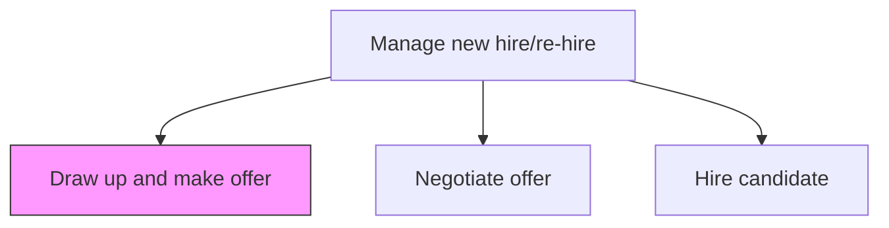
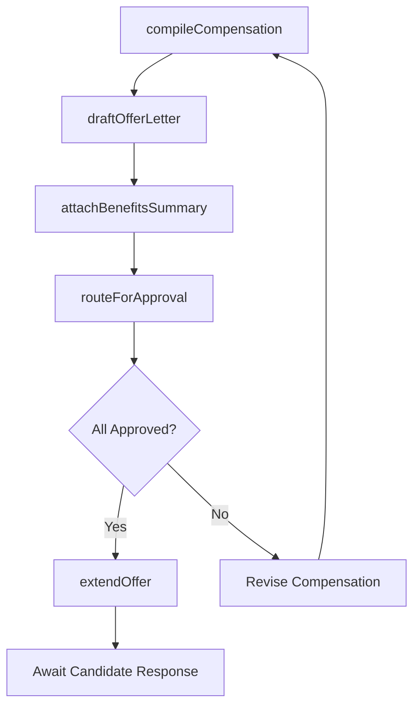

# Draw up and make offer

> Business-as-Code definition for drafting and extending employment offers. Models the compilation of compensation, benefits, and job terms into a formal offer letter, obtaining internal approvals, and delivering the offer to the selected candidate.

## Overview

Compiling job-related information for the selected candidates in order to make up a job. Include information about the job description, reporting relationship, salary, bonus potential, benefits, and vacation allotment.

## Process Hierarchy



## GraphDL

```yaml
draw:
  object: Offer Letter
  actor: Recruiter
  result: OfferPackage
```

## Actions

| Action | Description |
|--------|-------------|
| compileCompensation | Assemble base salary, bonus target, equity grant, and sign-on bonus into a total compensation package |
| draftOfferLetter | Generate the formal offer letter with job title, start date, reporting line, and employment terms |
| attachBenefitsSummary | Include benefits overview covering health insurance, PTO, retirement, and perks |
| routeForApproval | Submit the offer package for sign-off by hiring manager, compensation, and finance |
| extendOffer | Deliver the approved offer to the candidate via email, portal, or recruiter call |

## Events

| Event | Description |
|-------|-------------|
| compensationCompiled | Total compensation package assembled with all components |
| offerLetterDrafted | Formal offer letter generated with employment terms and conditions |
| benefitsSummaryAttached | Benefits and perks documentation included with the offer package |
| offerApprovalObtained | All required approvers signed off on the offer package |
| offerExtended | Approved offer delivered to the selected candidate |

## Searches

| Search | Description |
|--------|-------------|
| findPendingApprovals | List offer packages awaiting sign-off from approvers |
| getOfferPackage | Retrieve the complete offer details for a specific candidate |
| findExtendedOffers | List offers delivered to candidates awaiting response |
| getCompensationBenchmark | Compare proposed compensation against market data for the role |

## Process Flow



## RACI Matrix

| Activity | Responsible | Accountable | Consulted | Informed |
|----------|-------------|-------------|-----------|----------|
| compileCompensation | Recruiter | TalentAcquisitionManager | CompensationAnalyst | HiringManager |
| routeForApproval | RecruitingCoordinator | TalentAcquisitionManager | Finance | DepartmentHead |
| extendOffer | Recruiter | TalentAcquisitionManager | HiringManager | HRBusinessPartner |

## Related Processes

| Process | Relationship |
|---------|-------------|
| 7.2.3.4 Select and reject candidates | Upstream - selected candidate is the offer recipient |
| 7.2.4.2 Negotiate offer | Downstream - candidate may counter the initial offer terms |
| 7.2.4.3 Hire candidate | Downstream - accepted offer triggers formal hiring process |
| 7.2.1.5 Modify job requisitions | Parallel - offer creation may prompt final requisition updates |

## Related Departments

| Department | Role |
|-----------|------|
| Talent Acquisition | Drafts and delivers the offer package |
| Compensation | Validates salary range and total comp against market data |
| Finance | Approves headcount budget and sign-on bonus expenditure |
| Legal | Provides offer letter templates and employment law review |

## Related Occupations

| Occupation | Involvement |
|-----------|-------------|
| Recruiter | Compiles compensation and delivers the offer to the candidate |
| Compensation Analyst | Benchmarks proposed pay against market and internal equity |
| Hiring Manager | Reviews and approves the offer before extension |

## KPIs

| KPI | Description | Unit |
|-----|-------------|------|
| Offer Turnaround Time | Average days from selection decision to offer extension | Days |
| Approval Cycle Time | Average hours from offer submission to final approval | Hours |
| Offer Competitiveness | Percentage of offers at or above market median for the role | % |
| First-Offer Acceptance Rate | Percentage of candidates who accept without negotiation | % |

## Usage

```typescript
import { drawUpAndMakeOffer } from '@headlessly/draw-up-and-make-offer'

const offers = drawUpAndMakeOffer()

// Compile a compensation package for the selected candidate
await offers.compileCompensation({
  candidateId: 'cand-001',
  requisitionId: 'req-5678',
  baseSalary: 165000,
  bonusTarget: 15,
  equityShares: 5000,
  signOnBonus: 20000
})

// Extend the approved offer to the candidate
await offers.extendOffer({
  candidateId: 'cand-001',
  offerId: 'offer-9012',
  deliveryMethod: 'email',
  responseDeadlineDays: 5
})
```
