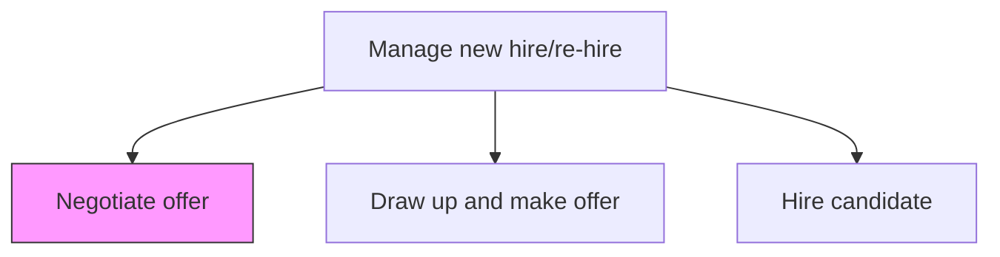
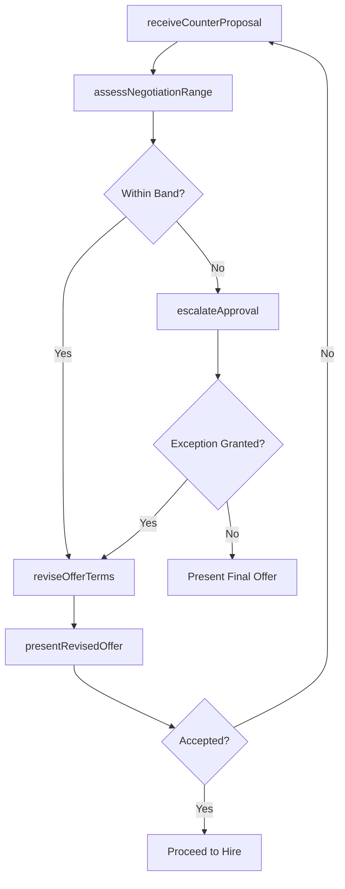

# Negotiate offer

> Business-as-Code definition for negotiating employment offers. Models the back-and-forth dialogue between the candidate and organization to reach mutually agreeable terms on compensation, benefits, start date, remote work, and other employment conditions.

## Overview

Negotiating an offer with selected candidates. Discuss the job offer with the candidate to ensure a mutual understanding. Address candidate counter-proposals on salary, equity, sign-on bonus, relocation, start date, and flexible work arrangements while staying within approved compensation bands and budget constraints.

## Process Hierarchy



## GraphDL

```yaml
negotiate:
  object: Offer
  actor: Recruiter
  result: NegotiatedTerms
```

## Actions

| Action | Description |
|--------|-------------|
| receiveCounterProposal | Log the candidate's counter-offer with requested changes to compensation or terms |
| assessNegotiationRange | Determine the available flexibility within approved salary bands and budget |
| reviseOfferTerms | Adjust salary, equity, bonus, start date, or other terms within approved limits |
| escalateApproval | Request higher-level sign-off when counter-proposal exceeds standard approval authority |
| presentRevisedOffer | Deliver the updated offer package to the candidate with revised terms |

## Events

| Event | Description |
|-------|-------------|
| counterProposalReceived | Candidate's counter-offer logged with requested term changes |
| negotiationRangeAssessed | Available flexibility within compensation bands and budget determined |
| offerTermsRevised | Offer package updated with adjusted compensation or employment terms |
| approvalEscalated | Revised terms sent to senior leadership for exception approval |
| revisedOfferPresented | Updated offer delivered to the candidate for consideration |

## Searches

| Search | Description |
|--------|-------------|
| findOffersInNegotiation | List offers currently in active counter-proposal discussions |
| getNegotiationHistory | Retrieve the full revision history for a specific offer |
| getCompensationBandRoom | Show remaining headroom within the approved salary band for a role |
| findEscalatedOffers | List offers requiring senior leadership exception approval |

## Process Flow



## RACI Matrix

| Activity | Responsible | Accountable | Consulted | Informed |
|----------|-------------|-------------|-----------|----------|
| receiveCounterProposal | Recruiter | TalentAcquisitionManager | HiringManager | CompensationAnalyst |
| reviseOfferTerms | Recruiter | TalentAcquisitionManager | CompensationAnalyst | Finance |
| escalateApproval | TalentAcquisitionManager | VP HR | DepartmentHead | Recruiter |

## Related Processes

| Process | Relationship |
|---------|-------------|
| 7.2.4.1 Draw up and make offer | Upstream - initial offer that triggers candidate negotiation |
| 7.2.4.3 Hire candidate | Downstream - accepted negotiated terms trigger formal hiring |
| 7.2.3.4 Select and reject candidates | Upstream - candidate's leverage depends on finalist ranking |
| 7.2.1.5 Modify job requisitions | Parallel - negotiated compensation may require requisition update |

## Related Departments

| Department | Role |
|-----------|------|
| Talent Acquisition | Manages negotiation dialogue and term revisions |
| Compensation | Provides market data and validates revised pay against internal equity |
| Finance | Approves budget impact of negotiated terms |
| Legal | Reviews non-standard employment terms or relocation agreements |

## Related Occupations

| Occupation | Involvement |
|-----------|-------------|
| Recruiter | Serves as primary negotiation liaison between candidate and organization |
| Compensation Analyst | Advises on market positioning and internal equity constraints |
| Hiring Manager | Provides input on role criticality and negotiation flexibility |

## KPIs

| KPI | Description | Unit |
|-----|-------------|------|
| Negotiation Cycle Time | Average days from first counter-proposal to final agreement | Days |
| Counter-Offer Rate | Percentage of extended offers that receive a counter-proposal | % |
| Escalation Rate | Percentage of negotiations requiring senior leadership approval | % |
| Final Acceptance Rate | Percentage of negotiated offers ultimately accepted by the candidate | % |

## Usage

```typescript
import { negotiateOffer } from '@headlessly/negotiate-offer'

const negotiation = negotiateOffer()

// Log a candidate counter-proposal
await negotiation.receiveCounterProposal({
  offerId: 'offer-9012',
  candidateId: 'cand-001',
  requestedBaseSalary: 180000,
  requestedSignOnBonus: 30000,
  requestedRemotePolicy: 'hybrid-2-days'
})

// Revise the offer within approved band
await negotiation.reviseOfferTerms({
  offerId: 'offer-9012',
  revisedBaseSalary: 175000,
  revisedSignOnBonus: 25000,
  remotePolicy: 'hybrid-3-days'
})
```
