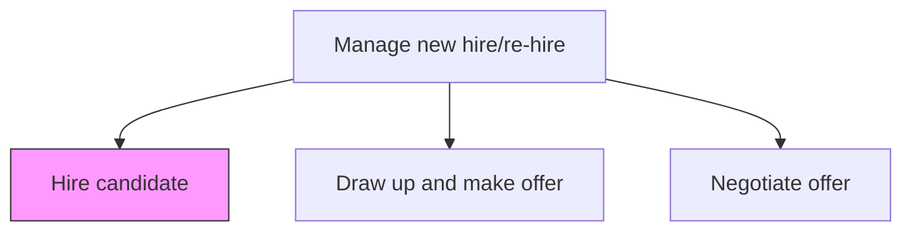
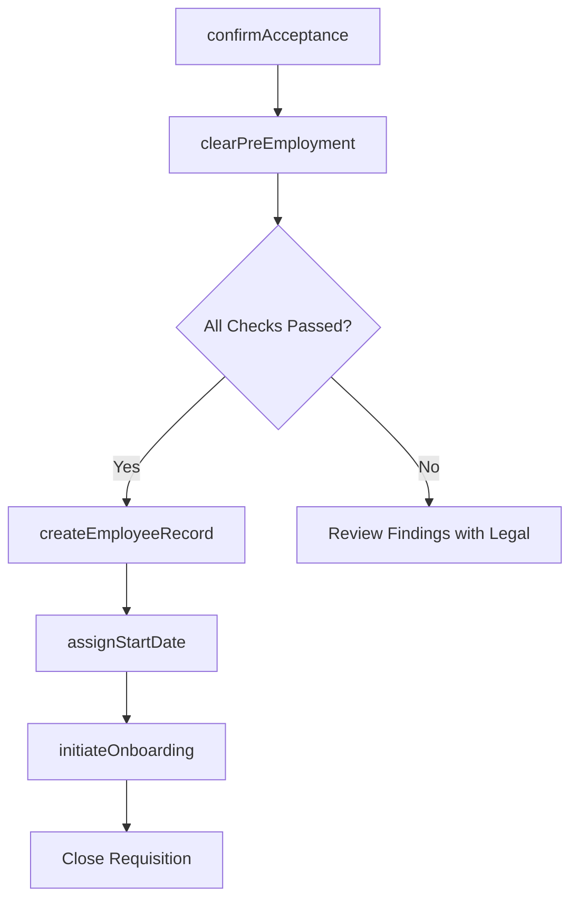

# Hire candidate

> Business-as-Code definition for hiring the candidate. Models the final steps of the recruitment process: confirming offer acceptance, completing pre-employment checks, creating the employee record in HRIS, and initiating onboarding workflows.

## Overview

Wrapping up the process for hiring candidates. Agree to all hiring terms and conditions. Have the candidate accept and sign the job offer. Trigger background clearance, create the employee record, assign a start date, and hand off to onboarding.

## Process Hierarchy



## GraphDL

```yaml
hire:
  object: Candidate
  actor: Recruiter
  result: EmployeeRecord
```

## Actions

| Action | Description |
|--------|-------------|
| confirmAcceptance | Verify the candidate has signed the offer letter and returned all required documents |
| clearPreEmployment | Ensure background check, drug screening, and reference verifications are complete and clear |
| createEmployeeRecord | Establish the new hire in HRIS with personal data, job assignment, and compensation |
| assignStartDate | Confirm the official start date and coordinate with hiring manager for day-one logistics |
| initiateOnboarding | Trigger onboarding workflows including IT provisioning, badge creation, and orientation scheduling |

## Events

| Event | Description |
|-------|-------------|
| acceptanceConfirmed | Candidate signed the offer and returned required employment documents |
| preEmploymentCleared | All background, drug, and reference checks passed successfully |
| employeeRecordCreated | New hire established in HRIS with job, compensation, and personal data |
| startDateAssigned | Official start date confirmed with hiring manager and new hire |
| onboardingInitiated | IT provisioning, badge, orientation, and benefits enrollment workflows triggered |

## Searches

| Search | Description |
|--------|-------------|
| findPendingHires | List candidates who have accepted but have incomplete pre-employment clearance |
| getNewHireChecklist | Retrieve the onboarding checklist and completion status for a new hire |
| findUpcomingStartDates | List confirmed start dates within a date range by department |
| getHiringFunnelSummary | Retrieve conversion metrics from offer to hire for a requisition |

## Process Flow



## RACI Matrix

| Activity | Responsible | Accountable | Consulted | Informed |
|----------|-------------|-------------|-----------|----------|
| confirmAcceptance | Recruiter | TalentAcquisitionManager | HiringManager | HRBusinessPartner |
| createEmployeeRecord | HRISAnalyst | HRManager | Recruiter | Payroll |
| initiateOnboarding | RecruitingCoordinator | TalentAcquisitionManager | ITHelpDesk | HiringManager |

## Related Processes

| Process | Relationship |
|---------|-------------|
| 7.2.4.1 Draw up and make offer | Upstream - signed offer triggers the hire process |
| 7.2.4.2 Negotiate offer | Upstream - final negotiated terms are captured in the hire |
| 7.2.3.3 Test candidates | Upstream - background and drug screening must be cleared |
| 7.2.5 Manage applicant information | Parallel - applicant record transitions to employee record |

## Related Departments

| Department | Role |
|-----------|------|
| Talent Acquisition | Confirms acceptance and coordinates handoff to HR operations |
| HR Operations | Creates employee record and initiates onboarding |
| IT | Provisions accounts, equipment, and access badges |
| Payroll | Sets up compensation and tax withholding for the new hire |

## Related Occupations

| Occupation | Involvement |
|-----------|-------------|
| Recruiter | Confirms acceptance and manages the transition from candidate to employee |
| HRIS Analyst | Creates and configures the employee record |
| Onboarding Coordinator | Manages day-one logistics and orientation scheduling |

## KPIs

| KPI | Description | Unit |
|-----|-------------|------|
| Offer-to-Hire Conversion | Percentage of accepted offers that result in a completed hire | % |
| Pre-Employment Clearance Time | Average days from acceptance to full background clearance | Days |
| Day-One Readiness | Percentage of new hires with IT, badge, and workspace ready on start date | % |
| Requisition Close Time | Average days from offer acceptance to requisition closure | Days |

## Usage

```typescript
import { hireCandidate } from '@headlessly/hire-candidate'

const hiring = hireCandidate()

// Confirm the candidate accepted and signed the offer
await hiring.confirmAcceptance({
  candidateId: 'cand-001',
  offerId: 'offer-9012',
  signedDate: '2025-08-01'
})

// Create the employee record once pre-employment is cleared
await hiring.createEmployeeRecord({
  candidateId: 'cand-001',
  requisitionId: 'req-5678',
  startDate: '2025-09-02',
  department: 'engineering',
  manager: 'mgr-100'
})
```
