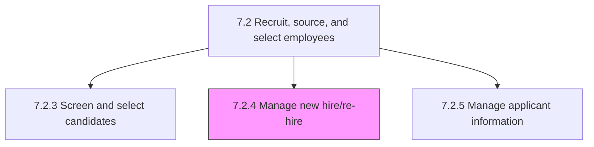
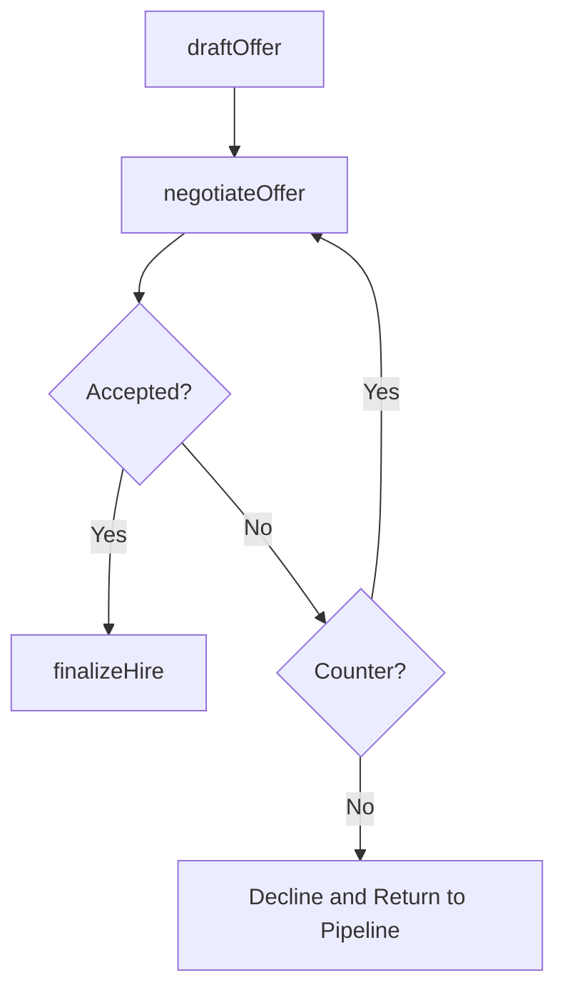

# Manage new hire/re-hire

> Business-as-Code definition for new hire and re-hire management. Models offer creation, negotiation, acceptance, and hire completion processes.

## Overview

Creating and making job offers to the selected candidates. Fairly negotiate the job offers. Agree on terms with the candidate to complete the hiring process.

## Process Hierarchy



## GraphDL

```yaml
manage:
  object: New Hire/re-hire
  actor: TalentAcquisitionManager
  result: SignedOfferLetter
```

## Actions

| Action | Description |
|--------|-------------|
| draftOffer | Compile compensation, benefits, and role details into a formal offer |
| negotiateOffer | Discuss terms with candidate and adjust offer as needed |
| finalizeHire | Complete all hiring paperwork and employment agreements |

## Events

| Event | Description |
|-------|-------------|
| offerDrafted | Employment offer compiled and submitted for approval |
| offerNegotiated | Offer terms discussed and agreed upon with candidate |
| hireFinalized | Hiring paperwork completed and start date confirmed |

## Searches

| Search | Description |
|--------|-------------|
| getPendingOffers | List outstanding offers by status, candidate, or department |
| getOfferHistory | Retrieve offer details and negotiation history for a candidate |

## Process Flow



## RACI Matrix

| Activity | Responsible | Accountable | Consulted | Informed |
|----------|-------------|-------------|-----------|----------|
| draftOffer | Recruiter | Talent Acquisition Manager | Compensation, Legal | Hiring Manager |
| negotiateOffer | Talent Acquisition Manager | VP HR | Hiring Manager | Finance |
| finalizeHire | HR Coordinator | Talent Acquisition Manager | IT, Facilities | All Onboarding Parties |

## Sub-Processes

| ID | Name | Description |
|----|------|-------------|
| 7.2.4.1 | Draw up and make offer | Compiling job-related information for the selected candidates in order to make up a job. Include inf |
| 7.2.4.2 | Negotiate offer | Negotiating an offer with selected candidates. Discuss the job offer with the candidate to ensure a  |
| 7.2.4.3 | Hire candidate | Wrapping up the process for hiring candidates. Agree to all hiring terms and conditions. Have the ca |

## Related Processes

| Process | Relationship |
|---------|-------------|
| 7.2.3 Screen and select candidates | Upstream - selected candidates proceed to offer |
| 7.3.1 Manage employee orientation and deployment | Downstream - hired employees enter onboarding |

## Related Departments

| Department | Role |
|-----------|------|
| Talent Acquisition | Drafts offers and manages negotiation process |
| Compensation | Validates offer within salary bands and equity guidelines |
| Legal | Reviews employment agreements and compliance |

## Related Occupations

| Occupation | Involvement |
|-----------|-------------|
| Recruiter | Manages offer process and candidate communication |
| HR Coordinator | Processes hire paperwork and system setup |

## KPIs

| KPI | Description | Unit |
|-----|-------------|------|
| Offer Acceptance Rate | Percentage of offers accepted by candidates | % |
| Time to Offer | Average days from selection decision to offer extension | Days |
| Offer Decline Reasons | Distribution of decline reasons by category | % |

## Usage

```typescript
import { manageNewHireReHire } from '@headlessly/manage-new-hire-re-hire'

const hiring = manageNewHireReHire()

// Draft an offer
const offer = await hiring.draftOffer({
  candidateId: 'cand_12345',
  role: 'Senior Software Engineer',
  baseSalary: 145000,
  signingBonus: 10000,
  startDate: '2025-06-01'
})

// Finalize the hire
await hiring.finalizeHire({
  offerId: offer.id,
  acceptedDate: '2025-04-20'
})
```
