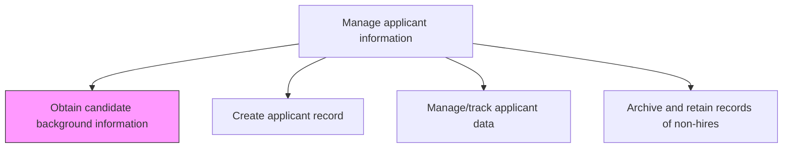
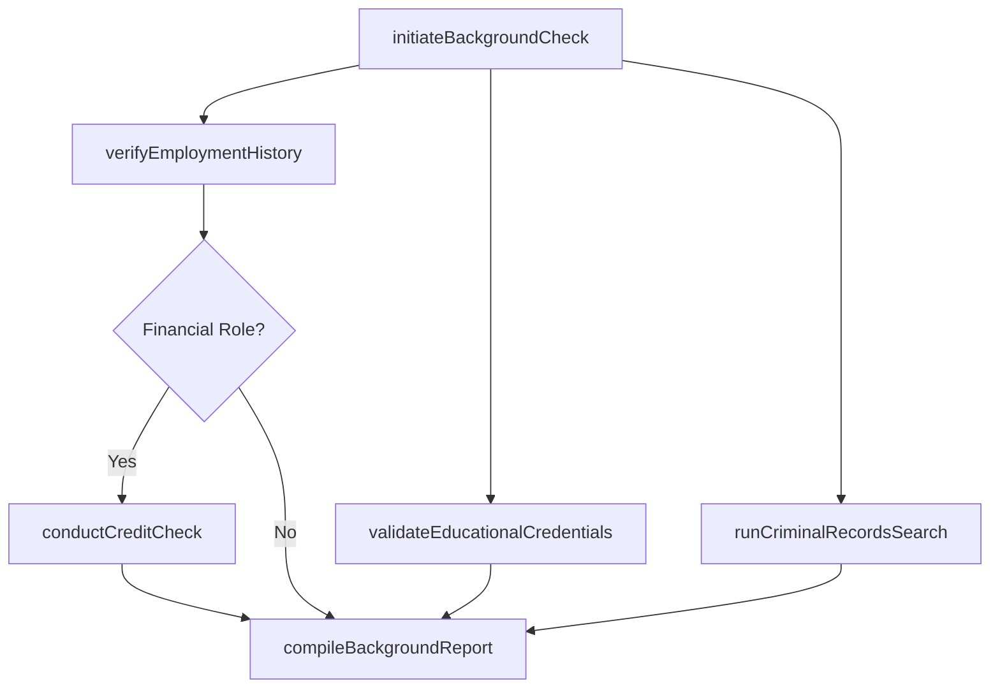

# Obtain candidate background information

> Business-as-Code definition for obtain candidate background information. Models the complete process of conducting a background investigation on the candidates with the objective of looking up and compiling criminal, commercial, and financial records.

## Overview

Conducting a background investigation on the candidates with the objective of looking up and compiling criminal, commercial, and financial records. Verify employment history, educational credentials, and professional licenses. Run credit checks where applicable and confirm identity documents. Consolidate findings into a standardized background report for the hiring decision.

## Process Hierarchy



## GraphDL

```yaml
obtain:
  object: Candidate Background Information
  actor: Recruiter
  result: BackgroundCheckReport
```

## Actions

| Action | Description |
|--------|-------------|
| initiateBackgroundCheck | Submit a background check request specifying the candidate, requisition, and check types required |
| verifyEmploymentHistory | Confirm prior employers, job titles, dates of employment, and reasons for departure |
| validateEducationalCredentials | Authenticate degrees, certifications, and academic records with issuing institutions |
| runCriminalRecordsSearch | Search federal, state, and county criminal databases for relevant offenses |
| conductCreditCheck | Execute a credit history inquiry for roles involving financial responsibility |
| compileBackgroundReport | Consolidate all verification results into a standardized background check report |

## Events

| Event | Description |
|-------|-------------|
| backgroundCheckInitiated | Background check request submitted to screening provider with candidate consent |
| employmentHistoryVerified | Prior employment records confirmed and documented |
| educationalCredentialsValidated | Academic degrees and certifications authenticated with institutions |
| criminalRecordsSearched | Criminal database search completed with findings recorded |
| backgroundReportCompiled | All verification results consolidated into final background report |

## Searches

| Search | Description |
|--------|-------------|
| findBackgroundChecks | List background checks filtered by candidate, requisition, or status |
| getBackgroundReport | Retrieve the completed background check report for a specific candidate |
| getPendingVerifications | List outstanding verification requests awaiting third-party response |
| getCheckTypeResults | Retrieve results for a specific check type (criminal, employment, education) |

## Process Flow



## RACI Matrix

| Activity | Responsible | Accountable | Consulted | Informed |
|----------|-------------|-------------|-----------|----------|
| initiateBackgroundCheck | Recruiter | TalentAcquisitionManager | HiringManager | Candidate |
| verifyEmploymentHistory | BackgroundScreeningProvider | Recruiter | Candidate | HiringManager |
| runCriminalRecordsSearch | BackgroundScreeningProvider | Recruiter | LegalCounsel | TalentAcquisitionManager |
| compileBackgroundReport | Recruiter | TalentAcquisitionManager | LegalCounsel | HiringManager |

## Related Processes

| Process | Relationship |
|---------|-------------|
| 7.2.5.2 Create applicant record | Downstream - background results are attached to the applicant record |
| 7.2.5.3 Manage/track applicant data | Downstream - background status updates feed applicant tracking |
| 7.2.4 Screen and select candidates | Upstream - candidate screening triggers background check requests |

## Related Departments

| Department | Role |
|-----------|------|
| Talent Acquisition | Initiates and manages background check requests |
| Legal/Compliance | Ensures background checks comply with FCRA and local regulations |
| Human Resources | Oversees screening policies and adverse action procedures |
| Hiring Department | Receives background findings to inform hiring decisions |

## Related Occupations

| Occupation | Involvement |
|-----------|-------------|
| Recruiter | Initiates checks and compiles final reports for hiring managers |
| Background Screening Analyst | Executes verifications and criminal records searches |
| Compliance Specialist | Ensures adherence to FCRA, EEOC, and state-specific screening laws |

## KPIs

| KPI | Description | Unit |
|-----|-------------|------|
| Background Check Turnaround | Average business days from initiation to completed report | Days |
| Discrepancy Rate | Percentage of background checks revealing material discrepancies | % |
| Adverse Action Rate | Percentage of candidates receiving adverse action notices | % |
| Check Completion Rate | Percentage of initiated background checks completed without escalation | % |

## Usage

```typescript
import { obtainCandidateBackgroundInformation } from '@headlessly/obtain-candidate-background-information'

const screening = obtainCandidateBackgroundInformation()

// Initiate a background check for a candidate
const check = await screening.initiateBackgroundCheck({
  candidateId: 'CND-8842',
  requisitionId: 'REQ-2025-0341',
  checkTypes: ['employment-history', 'education', 'criminal', 'credit']
})

// Compile the final background report
const report = await screening.compileBackgroundReport({
  backgroundCheckId: check.id,
  includeAdverseActionAssessment: true
})
```
