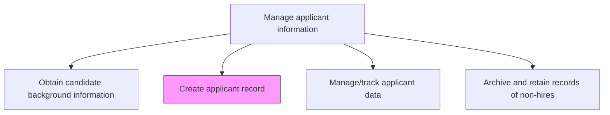
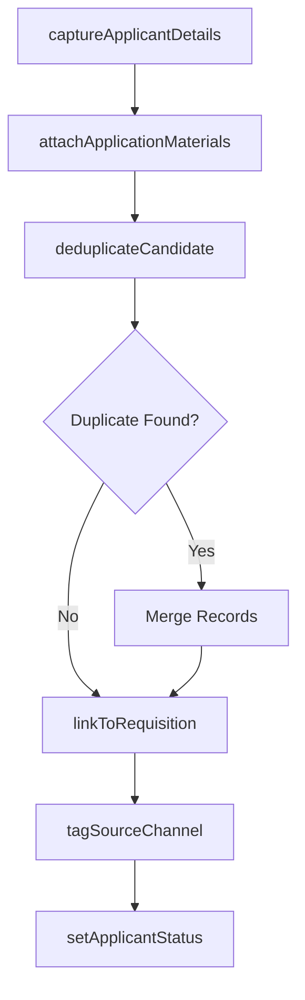

# Create applicant record

> Business-as-Code definition for create applicant record. Models the complete process of creating and documenting the records of all applicants.

## Overview

Creating and documenting the records of all applicants. Manage all individual applicants, including hires and non-hires. Capture personal information, application materials, interview notes, and assessment scores in the applicant tracking system. Deduplicate entries to prevent multiple records for the same candidate. Maintain records to avoid any duplication and promote efficiency.

## Process Hierarchy



## GraphDL

```yaml
create:
  object: Applicant Record
  actor: Recruiter
  result: ApplicantProfile
```

## Actions

| Action | Description |
|--------|-------------|
| captureApplicantDetails | Record candidate personal information, contact details, and source channel |
| attachApplicationMaterials | Upload resume, cover letter, portfolio, and supporting documents to the record |
| linkToRequisition | Associate the applicant record with one or more open job requisitions |
| deduplicateCandidate | Check the ATS for existing records and merge duplicates to maintain a single profile |
| tagSourceChannel | Label the applicant record with the recruitment source (referral, job board, career site) |
| setApplicantStatus | Assign the initial pipeline stage (applied, screening, interview, offer) |

## Events

| Event | Description |
|-------|-------------|
| applicantDetailsCaptured | Candidate personal information and contact details recorded in ATS |
| applicationMaterialsAttached | Resume and supporting documents uploaded to the applicant record |
| requisitionLinked | Applicant record associated with target job requisition |
| candidateDeduplicated | Duplicate check completed and records merged where necessary |
| applicantStatusSet | Initial pipeline stage assigned to the applicant |

## Searches

| Search | Description |
|--------|-------------|
| findApplicants | List applicants filtered by requisition, source channel, or pipeline stage |
| getApplicantProfile | Retrieve the full applicant record including documents and assessment history |
| findDuplicateCandidates | Search for potential duplicate records by name, email, or phone number |
| getApplicantsBySource | List applicants grouped by recruitment source channel |

## Process Flow



## RACI Matrix

| Activity | Responsible | Accountable | Consulted | Informed |
|----------|-------------|-------------|-----------|----------|
| captureApplicantDetails | Recruiter | TalentAcquisitionManager | Candidate | HiringManager |
| deduplicateCandidate | RecruitingCoordinator | TalentAcquisitionManager | Recruiter | HRISAdmin |
| linkToRequisition | Recruiter | TalentAcquisitionManager | HiringManager | RecruitingCoordinator |
| setApplicantStatus | Recruiter | TalentAcquisitionManager | HiringManager | Candidate |

## Related Processes

| Process | Relationship |
|---------|-------------|
| 7.2.5.1 Obtain candidate background information | Upstream - background check results feed into the applicant record |
| 7.2.5.3 Manage/track applicant data | Downstream - created records are tracked through the hiring pipeline |
| 7.2.5.4 Archive and retain records of non-hires | Downstream - non-hire records are archived after disposition |

## Related Departments

| Department | Role |
|-----------|------|
| Talent Acquisition | Creates and maintains applicant records in the ATS |
| HRIS | Administers the applicant tracking system and data integrations |
| Hiring Department | Reviews applicant records and provides interview feedback |
| Compliance | Ensures applicant data handling meets privacy regulations |

## Related Occupations

| Occupation | Involvement |
|-----------|-------------|
| Recruiter | Primary creator of applicant records and pipeline management |
| Recruiting Coordinator | Handles record deduplication and administrative data entry |
| HRIS Analyst | Maintains ATS configuration and data quality rules |

## KPIs

| KPI | Description | Unit |
|-----|-------------|------|
| Record Completeness Rate | Percentage of applicant records with all required fields populated | % |
| Duplicate Rate | Percentage of new records identified as duplicates before creation | % |
| Time to Create Record | Average minutes from application submission to record creation | Minutes |
| Source Attribution Accuracy | Percentage of records with correctly tagged recruitment source | % |

## Usage

```typescript
import { createApplicantRecord } from '@headlessly/create-applicant-record'

const applicants = createApplicantRecord()

// Create a new applicant record from a job board application
const record = await applicants.captureApplicantDetails({
  firstName: 'Jordan',
  lastName: 'Rivera',
  email: 'jordan.rivera@example.com',
  sourceChannel: 'linkedin-job-posting',
  requisitionId: 'REQ-2025-0341'
})

// Deduplicate against existing records
const dedup = await applicants.deduplicateCandidate({
  applicantId: record.id,
  matchFields: ['email', 'phone', 'full-name']
})
```
