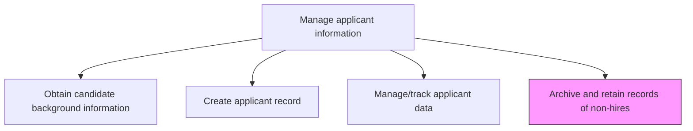
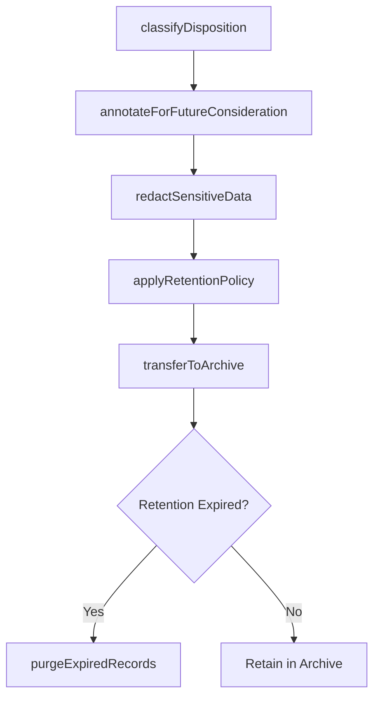

# Archive and retain records of non-hires

> Business-as-Code definition for archive and retain records of non-hires. Models the complete process of retaining and storing the records of the candidates who were rejected and not hired to ensure future availability in case the need arises.

## Overview

Retaining and storing the records of the candidates who were rejected and not hired to ensure future availability in case the need arises. Create a centralized repository of profiles. Label these records in order to readily identify them. Add remarks for any future consideration. Apply data retention policies that comply with employment law and privacy regulations, and purge records that exceed the mandated retention period.

## Process Hierarchy



## GraphDL

```yaml
archive:
  object: Non-Hire Records
  actor: RecruitingCoordinator
  result: ArchivedCandidateRecord
```

## Actions

| Action | Description |
|--------|-------------|
| classifyDisposition | Categorize the non-hire reason (declined offer, failed screening, position filled, withdrew) |
| annotateForFutureConsideration | Add recruiter remarks flagging strong candidates for future requisitions |
| applyRetentionPolicy | Assign the applicable data retention period based on jurisdiction and record type |
| transferToArchive | Move closed applicant records from the active ATS pipeline to long-term storage |
| redactSensitiveData | Remove or mask personally identifiable information per privacy regulations before archival |
| purgeExpiredRecords | Delete archived records that have exceeded their mandated retention period |

## Events

| Event | Description |
|-------|-------------|
| dispositionClassified | Non-hire reason categorized and recorded on the applicant record |
| futureConsiderationAnnotated | Recruiter remarks added for candidates flagged as potential future hires |
| retentionPolicyApplied | Data retention period assigned based on applicable regulations |
| recordTransferredToArchive | Applicant record moved from active pipeline to long-term storage |
| expiredRecordsPurged | Archived records exceeding retention period permanently deleted |

## Searches

| Search | Description |
|--------|-------------|
| findArchivedCandidates | Search archived non-hire records by disposition reason, skills, or date range |
| getFutureConsiderationPool | List candidates flagged for future consideration filtered by role or skill set |
| getRetentionSchedule | Retrieve upcoming record purge dates by jurisdiction or record category |
| getDispositionSummary | Aggregate non-hire disposition reasons by requisition or time period |

## Process Flow



## RACI Matrix

| Activity | Responsible | Accountable | Consulted | Informed |
|----------|-------------|-------------|-----------|----------|
| classifyDisposition | Recruiter | TalentAcquisitionManager | HiringManager | RecruitingCoordinator |
| applyRetentionPolicy | HRCompliance | TalentAcquisitionManager | LegalCounsel | HRISAdmin |
| transferToArchive | RecruitingCoordinator | TalentAcquisitionManager | HRISAdmin | Recruiter |
| purgeExpiredRecords | HRISAdmin | HRCompliance | LegalCounsel | TalentAcquisitionManager |

## Related Processes

| Process | Relationship |
|---------|-------------|
| 7.2.5.2 Create applicant record | Upstream - applicant records are created before archival |
| 7.2.5.3 Manage/track applicant data | Upstream - tracking determines final disposition triggering archival |
| 7.2.5.1 Obtain candidate background information | Upstream - background data must be retained or redacted per policy |

## Related Departments

| Department | Role |
|-----------|------|
| Talent Acquisition | Classifies dispositions and flags future consideration candidates |
| Legal/Compliance | Defines retention periods and privacy requirements |
| HRIS | Manages archive storage, automated purge schedules, and data redaction |
| Human Resources | Oversees archival policies and EEO record-keeping obligations |

## Related Occupations

| Occupation | Involvement |
|-----------|-------------|
| Recruiting Coordinator | Manages the archival workflow and record transfers |
| HR Compliance Specialist | Ensures retention policies align with EEOC, OFCCP, and GDPR requirements |
| HRIS Administrator | Configures automated retention and purge schedules in the ATS |

## KPIs

| KPI | Description | Unit |
|-----|-------------|------|
| Archive Compliance Rate | Percentage of non-hire records archived within policy timeframe | % |
| Future Consideration Conversion | Percentage of archived candidates later hired from the talent pool | % |
| Retention Policy Adherence | Percentage of records purged on schedule per regulatory requirements | % |
| Redaction Completeness | Percentage of archived records with PII properly masked or removed | % |

## Usage

```typescript
import { archiveAndRetainRecordsOfNonHires } from '@headlessly/archive-and-retain-records-of-nonhires'

const archive = archiveAndRetainRecordsOfNonHires()

// Classify disposition and archive a non-hire candidate
const disposition = await archive.classifyDisposition({
  applicantId: 'CND-7723',
  reason: 'position-filled',
  futureConsideration: true,
  recruiterNotes: 'Strong technical skills, consider for next engineering opening'
})

// Search the archived talent pool for future requisitions
const pool = await archive.findArchivedCandidates({
  skills: ['python', 'machine-learning'],
  archivedAfter: '2024-01-01',
  futureConsiderationOnly: true
})
```
