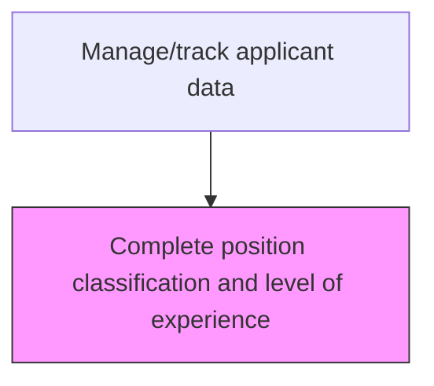
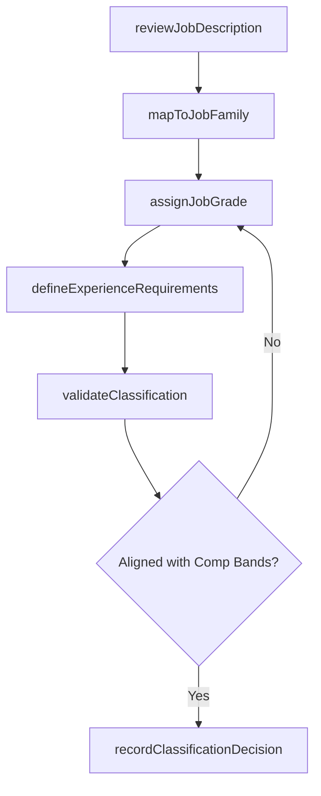

# Complete position classification and level of experience

> Business-as-Code definition for complete position classification and level of experience. Models the complete process of identifying the requirements for the position to be filled.

## Overview

Identifying the requirements for the position to be filled. Determine the experience and skills necessary to perform the tasks outlined. Map the role to the organization's job classification framework, assign the appropriate job grade and level, and define minimum experience thresholds. Ensure the classification aligns with compensation bands and regulatory requirements for the position.

## Process Hierarchy



## GraphDL

```yaml
complete:
  object: Position Classification
  actor: CompensationAnalyst
  result: ClassifiedPosition
```

## Actions

| Action | Description |
|--------|-------------|
| reviewJobDescription | Analyze the position's duties, responsibilities, and reporting structure against the classification framework |
| mapToJobFamily | Assign the position to the appropriate job family and sub-family within the organizational taxonomy |
| assignJobGrade | Determine the compensation grade and level based on role scope, complexity, and market benchmarks |
| defineExperienceRequirements | Establish minimum and preferred years of experience, certifications, and educational qualifications |
| validateClassification | Confirm the classification aligns with internal equity, compensation bands, and regulatory standards |
| recordClassificationDecision | Document the final position classification, grade, and experience level in the HRIS |

## Events

| Event | Description |
|-------|-------------|
| jobDescriptionReviewed | Position duties analyzed against the classification framework |
| jobFamilyMapped | Position assigned to the appropriate job family and sub-family |
| jobGradeAssigned | Compensation grade and level determined for the position |
| experienceRequirementsDefined | Minimum experience, certifications, and education thresholds established |
| classificationValidated | Position classification confirmed as aligned with internal equity and regulations |

## Searches

| Search | Description |
|--------|-------------|
| getPositionClassification | Retrieve the classification, grade, and experience level for a specific position |
| findPositionsByJobFamily | List positions filtered by job family, grade level, or department |
| getClassificationHistory | Retrieve historical classification changes for a position |
| getCompensationBandByGrade | Look up the salary range and benefits tier for a given job grade |

## Process Flow



## RACI Matrix

| Activity | Responsible | Accountable | Consulted | Informed |
|----------|-------------|-------------|-----------|----------|
| reviewJobDescription | CompensationAnalyst | HRManager | HiringManager | Recruiter |
| assignJobGrade | CompensationAnalyst | CompensationManager | Finance | HiringManager |
| defineExperienceRequirements | HiringManager | HRManager | CompensationAnalyst | Recruiter |
| validateClassification | CompensationManager | VP HR | LegalCounsel | HiringManager |

## Related Processes

| Process | Relationship |
|---------|-------------|
| 7.2.5.3 Manage/track applicant data | Parent - classification feeds into applicant tracking and matching |
| 7.2.5.2 Create applicant record | Downstream - classified position requirements are used to evaluate applicants |
| 7.5.2 Manage and administer benefits | Downstream - job grade determines benefits eligibility |

## Related Departments

| Department | Role |
|-----------|------|
| Compensation and Benefits | Owns the job classification framework and grade structure |
| Human Resources | Oversees classification policies and internal equity |
| Hiring Department | Defines role requirements and validates experience thresholds |
| Finance | Ensures classifications align with budgeted headcount costs |

## Related Occupations

| Occupation | Involvement |
|-----------|-------------|
| Compensation Analyst | Executes classification analysis and grade assignment |
| HR Business Partner | Facilitates alignment between hiring managers and classification standards |
| Hiring Manager | Provides role context and validates experience requirements |

## KPIs

| KPI | Description | Unit |
|-----|-------------|------|
| Classification Turnaround Time | Average business days to complete position classification | Days |
| Internal Equity Compliance | Percentage of classifications validated against internal equity standards | % |
| Grade Accuracy | Percentage of classifications that do not require reclassification within 12 months | % |
| Compensation Band Alignment | Percentage of classified positions falling within approved salary ranges | % |

## Usage

```typescript
import { completePositionClassification } from '@headlessly/complete-position-classification-and-level-of-experience'

const classification = completePositionClassification()

// Classify a new position and assign job grade
const result = await classification.assignJobGrade({
  positionId: 'POS-2025-0187',
  jobFamily: 'engineering',
  subFamily: 'software-development',
  marketBenchmark: 'radford-tech-survey-2025'
})

// Define experience requirements for the classified position
const requirements = await classification.defineExperienceRequirements({
  positionId: 'POS-2025-0187',
  gradeLevel: result.grade,
  minimumYears: 5,
  preferredCertifications: ['AWS-SAA', 'CKA'],
  educationMinimum: 'bachelors'
})
```
