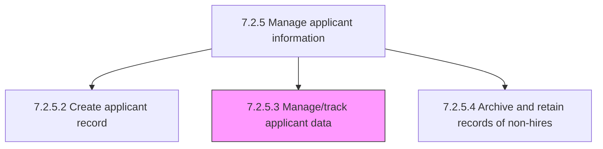
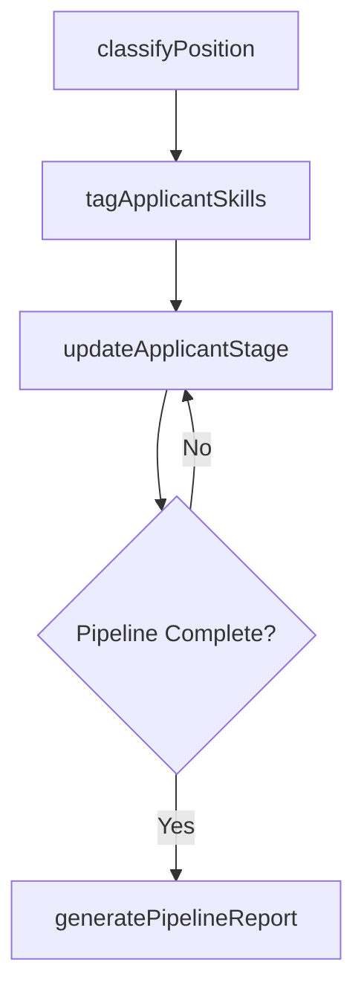

# Manage/track applicant data

> Business-as-Code definition for applicant data tracking. Models position classification, experience level mapping, ATS data management, and applicant pipeline tracking.

## Overview

Keeping track of all the information about the candidates who apply for jobs. Use applicant-tracking systems that can be accessed online as a central location and database for recruitment efforts.

## Process Hierarchy



## GraphDL

```yaml
manage/track:
  object: Applicant Data
  actor: RecruitingCoordinator
  result: TrackedApplicantRecord
```

## Actions

| Action | Description |
|--------|-------------|
| classifyPosition | Map applicant to position classification and required experience level |
| updateApplicantStage | Move applicant through recruitment pipeline stages in the ATS |
| tagApplicantSkills | Assign skill and competency tags to applicant profiles for searchability |
| generatePipelineReport | Produce applicant pipeline status reports by requisition or stage |

## Events

| Event | Description |
|-------|-------------|
| positionClassified | Applicant mapped to position classification and experience level |
| applicantStageUpdated | Applicant advanced to next recruitment pipeline stage |
| applicantSkillsTagged | Skills and competencies assigned to applicant profile |
| pipelineReportGenerated | Applicant pipeline status report produced |

## Searches

| Search | Description |
|--------|-------------|
| getApplicantsByStage | List applicants by current pipeline stage and requisition |
| getApplicantSkills | Query applicant profiles by skill tags or competency matches |
| getPipelineMetrics | Retrieve applicant funnel conversion rates by stage |

## Process Flow



## RACI Matrix

| Activity | Responsible | Accountable | Consulted | Informed |
|----------|-------------|-------------|-----------|----------|
| classifyPosition | Recruiting Coordinator | Talent Acquisition Manager | Hiring Manager | Recruiter |
| updateApplicantStage | Recruiter | Talent Acquisition Manager | Hiring Manager | HRIS Admin |
| tagApplicantSkills | Recruiter | Talent Acquisition Manager | Hiring Manager | ATS Admin |

## Sub-Processes

| ID | Name | Description |
|----|------|-------------|
| 7.2.5.3.1 | Complete position classification and level of experience | Identifying the requirements for the position to be filled. Determine the experience and skills nece |

## Related Processes

| Process | Relationship |
|---------|-------------|
| 7.2.5.2 Create applicant record | Upstream - created records enter tracking pipeline |
| 7.2.3 Screen and select candidates | Downstream - tracked data supports screening decisions |
| 7.2.5.4 Archive and retain records of non-hires | Downstream - completed applicant records archived |

## Related Departments

| Department | Role |
|-----------|------|
| Talent Acquisition | Manages applicant data and pipeline tracking |
| Information Technology | Maintains ATS platform and data integrations |
| Hiring Departments | Provides position classification and experience requirements |

## Related Occupations

| Occupation | Involvement |
|-----------|-------------|
| Recruiting Coordinator | Tracks applicant data and maintains ATS records |
| ATS Administrator | Configures system workflows and reporting |

## KPIs

| KPI | Description | Unit |
|-----|-------------|------|
| Pipeline Conversion Rate | Percentage of applicants advancing through each stage | % |
| Data Accuracy Rate | Percentage of applicant records passing quality checks | % |
| ATS Adoption Rate | Percentage of recruitment activities tracked through ATS | % |

## Usage

```typescript
import { manageTrackApplicantData } from '@headlessly/manage-track-applicant-data'

const tracking = manageTrackApplicantData()

// Update applicant stage
await tracking.updateApplicantStage({
  applicantId: 'APP-12345',
  requisitionId: 'REQ-2025-100',
  fromStage: 'phone-screen',
  toStage: 'on-site-interview'
})

// Generate pipeline report
const report = await tracking.generatePipelineReport({
  requisitionId: 'REQ-2025-100',
  includeConversionRates: true
})
```
