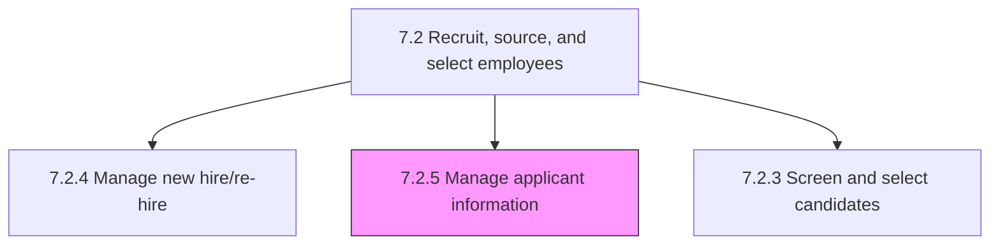
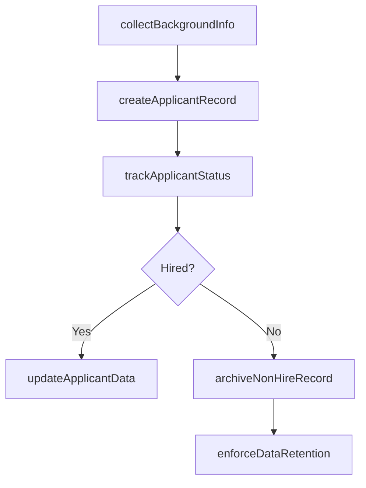

# Manage applicant information

> Business-as-Code definition for applicant information management. Models background verification, applicant record creation, data tracking through ATS systems, and archival of non-hire records.

## Overview

Creating and maintaining a system for managing the information of applicants. Create records for all candidates who apply. Maintain and track information through the use applicant-tracking systems.

## Process Hierarchy



## GraphDL

```yaml
manage:
  object: Applicant Information
  actor: HRISAdministrator
  result: ApplicantRecord
```

## Actions

| Action | Description |
|--------|-------------|
| collectBackgroundInfo | Gather candidate background data including employment history and references |
| createApplicantRecord | Initialize a new applicant profile in the applicant tracking system |
| updateApplicantData | Modify applicant records with new information or status changes |
| trackApplicantStatus | Monitor candidate progression through recruitment pipeline stages |
| archiveNonHireRecord | Move rejected or withdrawn applicant records to long-term storage |
| enforceDataRetention | Apply data retention policies and purge expired applicant records |

## Events

| Event | Description |
|-------|-------------|
| backgroundInfoCollected | Candidate background verification data compiled |
| applicantRecordCreated | New applicant profile established in ATS |
| applicantDataUpdated | Applicant record modified with new information |
| applicantStatusTracked | Candidate pipeline stage progression recorded |
| nonHireRecordArchived | Rejected applicant record moved to archive storage |
| dataRetentionEnforced | Expired applicant records purged per policy |

## Searches

| Search | Description |
|--------|-------------|
| getApplicantRecord | Retrieve applicant profile by ID, name, or requisition |
| getApplicantsByStatus | List applicants filtered by pipeline stage or disposition |
| getBackgroundCheckResults | Query background verification data for a candidate |
| getArchivedApplicants | Search archived non-hire records by date range or reason |

## Process Flow



## RACI Matrix

| Activity | Responsible | Accountable | Consulted | Informed |
|----------|-------------|-------------|-----------|----------|
| collectBackgroundInfo | Recruiter | Talent Acquisition Manager | Legal, Compliance | Hiring Manager |
| createApplicantRecord | HRIS Administrator | Talent Acquisition Manager | Recruiter | IT |
| trackApplicantStatus | Recruiter | Talent Acquisition Manager | Hiring Manager | HR Business Partner |
| archiveNonHireRecord | HRIS Administrator | VP HR | Legal | Data Privacy Officer |

## Sub-Processes

| ID | Name | Description |
|----|------|-------------|
| 7.2.5.1 | Obtain candidate background information | Conducting a background investigation on the candidates with the objective of looking up and compili |
| 7.2.5.2 | Create applicant record | Creating and documenting the records of all applicants. Manage all individual applicants, including  |
| 7.2.5.3 | Manage/track applicant data | Keeping track of all the information about the candidates who apply for jobs. Use applicant-tracking |
| 7.2.5.4 | Archive and retain records of non-hires | Retaining and storing the records of the candidates who were rejected and not hired to ensure future |

## Related Processes

| Process | Relationship |
|---------|-------------|
| 7.2.3 Screen and select candidates | Upstream - screening results populate applicant records |
| 7.2.4 Manage new hire/re-hire | Downstream - hired applicant records transition to employee records |
| 7.2.2 Recruit/Source candidates | Upstream - sourced candidates create initial applicant records |
| 7.7.1 Manage employee information | Downstream - hired applicant data feeds employee master records |

## Related Departments

| Department | Role |
|-----------|------|
| Talent Acquisition | Owns applicant data lifecycle and ATS administration |
| Human Resources | Governs data retention policies and compliance requirements |
| Information Technology | Maintains ATS infrastructure and system integrations |
| Legal | Advises on data privacy regulations and record retention obligations |

## Related Occupations

| Occupation | Involvement |
|-----------|-------------|
| HRIS Administrator | Manages ATS configuration and applicant data integrity |
| Recruiter | Creates and updates applicant records throughout hiring lifecycle |
| Data Privacy Officer | Ensures applicant data handling complies with regulations |

## KPIs

| KPI | Description | Unit |
|-----|-------------|------|
| Data Completeness Rate | Percentage of applicant records with all required fields populated | % |
| Record Accuracy | Percentage of applicant records passing data quality audits | % |
| Archive Compliance Rate | Percentage of non-hire records archived within policy timeframe | % |
| ATS Utilization | Percentage of applicant interactions tracked through ATS vs. offline | % |

## Usage

```typescript
import { manageApplicantInformation } from '@headlessly/manage-applicant-information'

const applicants = manageApplicantInformation()

// Create an applicant record
const record = await applicants.createApplicantRecord({
  candidateId: 'cand_12345',
  requisitionId: 'REQ-2025-100',
  source: 'linkedin',
  applicationDate: '2025-04-01'
})

// Archive non-hire records
await applicants.archiveNonHireRecord({
  applicantId: record.id,
  reason: 'position-filled',
  retentionPeriod: '24-months'
})
```
