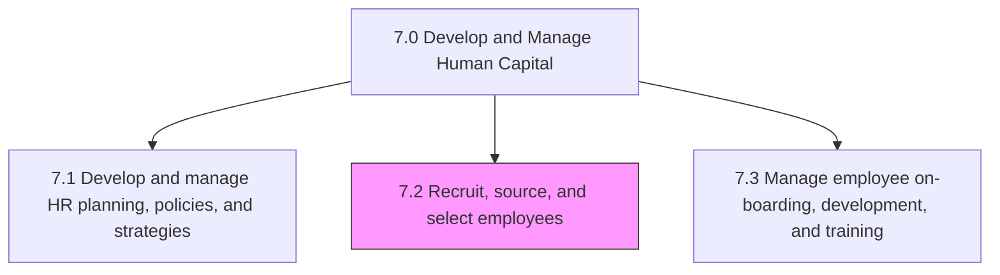
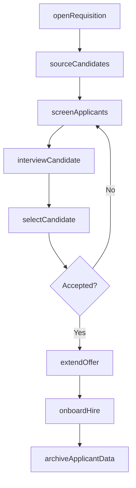

# Recruit, source, and select employees

> Business-as-Code definition for talent acquisition and selection. Models the full recruitment lifecycle from requisition management through candidate sourcing, screening, offer management, and applicant record keeping.

## Overview

Determining and handling employee requirements. Recruit or source the candidates as per the requirements. Screen and select the most appropriate candidates. Take care of the newly hired and re-hired employees. Maintain records of information for all applicants.

## Process Hierarchy



## GraphDL

```yaml
recruit,:
  object: Source, And Select Employees
  actor: TalentAcquisitionManager
  result: HireDecision
```

## Actions

| Action | Description |
|--------|-------------|
| openRequisition | Create and post a job requisition aligned with workforce plan |
| sourceCandidates | Identify and attract candidates through recruitment channels |
| screenApplicants | Review applications and assess candidates against requirements |
| interviewCandidate | Conduct structured interviews to evaluate candidate fit |
| selectCandidate | Choose the best-qualified candidate from the applicant pool |
| extendOffer | Draft and present an employment offer to the selected candidate |
| onboardHire | Complete new hire paperwork and initiate orientation |
| archiveApplicantData | Store applicant records for compliance and future reference |

## Events

| Event | Description |
|-------|-------------|
| requisitionOpened | Job requisition created and approved for posting |
| candidatesSourced | Candidate pipeline populated from recruitment channels |
| applicantsScreened | Application review and initial screening completed |
| candidateInterviewed | Candidate interview conducted and evaluation recorded |
| candidateSelected | Hiring decision made and candidate chosen |
| offerExtended | Employment offer presented to selected candidate |
| hireOnboarded | New hire paperwork completed and orientation scheduled |
| applicantDataArchived | Non-hire applicant records stored for compliance |

## Searches

| Search | Description |
|--------|-------------|
| getOpenRequisitions | List open job requisitions by department, role, or priority |
| findCandidates | Search candidate pipeline by skills, experience, or status |
| getInterviewSchedule | Retrieve upcoming interview slots by requisition or interviewer |
| getOfferStatus | Query outstanding offers by candidate or requisition |
| getApplicantRecords | Retrieve applicant history and evaluation data |

## Process Flow



## RACI Matrix

| Activity | Responsible | Accountable | Consulted | Informed |
|----------|-------------|-------------|-----------|----------|
| openRequisition | Hiring Manager | VP Human Resources | Finance | Talent Acquisition |
| sourceCandidates | Recruiter | Talent Acquisition Manager | Hiring Manager | HR Business Partner |
| screenApplicants | Recruiter | Talent Acquisition Manager | Hiring Manager | HRIS Admin |
| interviewCandidate | Hiring Manager | Department Head | Panel Members | HR |
| extendOffer | Talent Acquisition Manager | VP Human Resources | Compensation, Legal | Hiring Manager |

## Sub-Processes

| ID | Name | Description |
|----|------|-------------|
| 7.2.1 | Manage employee requisitions | Handling the requirements for new employees. Create and open job requisitions by clearly defining th |
| 7.2.2 | Recruit/Source candidates | Recruiting new candidates for deployment across various functional areas inside the organization. Se |
| 7.2.3 | Screen and select candidates | Evaluating and selecting potential employees through interviews, tests, etc. |
| 7.2.4 | Manage new hire/re-hire | Creating and making job offers to the selected candidates. Fairly negotiate the job offers. Agree on |
| 7.2.5 | Manage applicant information | Creating and maintaining a system for managing the information of applicants. Create records for all |

## Related Processes

| Process | Relationship |
|---------|-------------|
| 7.1 Develop and manage HR planning, policies, and strategies | Upstream - workforce plan drives recruitment needs |
| 7.3 Manage employee on-boarding, development, and training | Downstream - hires transition to onboarding |
| 7.7 Manage employee information and analytics | Supporting - applicant data feeds HR systems |

## Related Departments

| Department | Role |
|-----------|------|
| Talent Acquisition | Primary owner of recruitment pipeline and candidate management |
| Hiring Departments | Define requirements and participate in selection |
| Human Resources | Oversees compliance and offer approvals |
| Finance | Approves headcount budget and compensation packages |
| Legal | Reviews employment agreements and background check compliance |

## Related Occupations

| Occupation | Involvement |
|-----------|-------------|
| Recruiter | Sources and screens candidates against requirements |
| Talent Acquisition Manager | Oversees recruitment strategy and vendor management |
| Hiring Manager | Defines role requirements and makes selection decisions |
| HR Coordinator | Processes new hire paperwork and onboarding logistics |

## KPIs

| KPI | Description | Unit |
|-----|-------------|------|
| Time to Fill | Average days from requisition opening to offer acceptance | Days |
| Cost Per Hire | Total recruitment costs divided by number of hires | USD |
| Quality of Hire | New hire performance rating after first year | Score (1-5) |
| Offer Acceptance Rate | Percentage of offers accepted by candidates | % |
| Source Effectiveness | Percentage of hires by recruitment channel | % |

## Usage

```typescript
import { recruitSourceAndSelectEmployees } from '@headlessly/recruit-source-and-select-employees'

const recruitment = recruitSourceAndSelectEmployees()

// Open a new requisition
const req = await recruitment.openRequisition({
  title: 'Senior Software Engineer',
  department: 'Engineering',
  level: 'L5',
  location: 'Remote',
  targetStartDate: '2025-06-01'
})

// Screen applicants
const shortlist = await recruitment.screenApplicants({
  requisitionId: req.id,
  criteria: ['5+ years experience', 'TypeScript', 'distributed systems'],
  maxCandidates: 10
})
```
