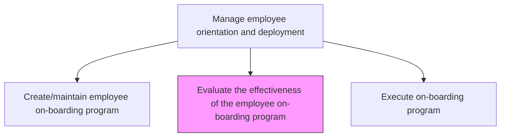
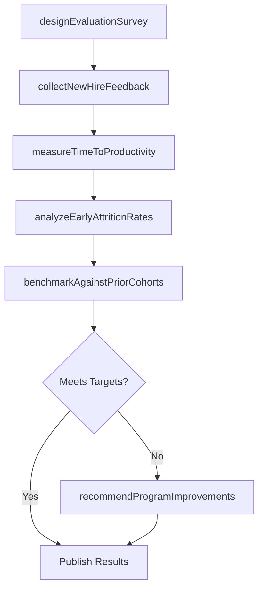

# Evaluate the effectiveness of the employee on-boarding program

> Business-as-Code definition for evaluate the effectiveness of the employee on-boarding program. Models the complete process of assessing the performance and effectiveness of employee on-boarding program.

## Overview

Assessing the performance and effectiveness of employee on-boarding program. Examine the performance of on-boarding program through feedback and reviews from the new employees. Create web and written forms. Obtain information through face-to-face discussions. Measure time-to-productivity, early attrition rates, and new hire satisfaction scores. Benchmark results against industry standards and prior cohorts to identify improvement opportunities.

## Process Hierarchy



## GraphDL

```yaml
evaluate:
  object: Onboarding Program Effectiveness
  actor: LearningDevelopmentManager
  result: OnboardingEffectivenessReport
```

## Actions

| Action | Description |
|--------|-------------|
| designEvaluationSurvey | Create structured feedback instruments for 30-, 60-, and 90-day new hire check-ins |
| collectNewHireFeedback | Administer satisfaction and experience surveys to recent hires at each milestone |
| measureTimeToProductivity | Track the elapsed time from start date to full role proficiency for each cohort |
| analyzeEarlyAttritionRates | Calculate voluntary turnover within the first 6 and 12 months and correlate with onboarding factors |
| benchmarkAgainstPriorCohorts | Compare current cohort metrics against historical onboarding performance data |
| recommendProgramImprovements | Synthesize findings into actionable recommendations for onboarding program enhancements |

## Events

| Event | Description |
|-------|-------------|
| evaluationSurveyDesigned | Feedback instruments created and approved for new hire milestone check-ins |
| newHireFeedbackCollected | Satisfaction and experience survey responses gathered from the current cohort |
| timeToProductivityMeasured | Average days to full proficiency calculated for the evaluation period |
| earlyAttritionAnalyzed | First-year voluntary turnover analyzed with root causes identified |
| programImprovementsRecommended | Actionable enhancement recommendations delivered to program owners |

## Searches

| Search | Description |
|--------|-------------|
| getOnboardingSatisfactionScores | Retrieve new hire satisfaction ratings by cohort, department, or milestone |
| getTimeToProductivityMetrics | Query average time-to-productivity data by role, department, or hire date |
| getAttritionCorrelations | Analyze early attrition rates correlated with onboarding program variables |
| getEvaluationHistory | Retrieve historical onboarding effectiveness reports by period |

## Process Flow



## RACI Matrix

| Activity | Responsible | Accountable | Consulted | Informed |
|----------|-------------|-------------|-----------|----------|
| designEvaluationSurvey | LearningDevelopmentManager | HRDirector | HRBusinessPartner | HiringManagers |
| collectNewHireFeedback | OnboardingCoordinator | LearningDevelopmentManager | NewHires | HRAnalyst |
| analyzeEarlyAttritionRates | HRAnalyst | LearningDevelopmentManager | TalentAcquisition | CHRO |
| recommendProgramImprovements | LearningDevelopmentManager | HRDirector | DepartmentHeads | AllManagers |

## Related Processes

| Process | Relationship |
|---------|-------------|
| 7.3.1.1 Create/maintain employee on-boarding program | Upstream - the program being evaluated is designed and maintained here |
| 7.3.1.3 Execute on-boarding program | Upstream - execution outcomes provide the data for evaluation |
| 7.3.2.1 Define employee performance objectives | Downstream - evaluation informs objective-setting for new hires |

## Related Departments

| Department | Role |
|-----------|------|
| Learning and Development | Owns the evaluation methodology and improvement recommendations |
| Human Resources | Provides attrition data and policy context for the evaluation |
| HR Analytics | Performs quantitative analysis of onboarding metrics |
| Business Units | Provides time-to-productivity assessments for their new hires |

## Related Occupations

| Occupation | Involvement |
|-----------|-------------|
| Learning Development Manager | Leads the evaluation cycle and improvement planning |
| HR Analyst | Performs data analysis on survey responses and attrition trends |
| Onboarding Coordinator | Administers surveys and collects feedback from new hires |

## KPIs

| KPI | Description | Unit |
|-----|-------------|------|
| New Hire Satisfaction Score | Average satisfaction rating from onboarding surveys | Score (1-5) |
| Time to Full Productivity | Average days from hire date to independent task completion | Days |
| 90-Day Retention Rate | Percentage of new hires still employed after 90 days | % |
| Survey Response Rate | Percentage of new hires completing the onboarding evaluation survey | % |

## Usage

```typescript
import { evaluateOnboardingEffectiveness } from '@headlessly/evaluate-effectiveness-of-employee-onboarding-program'

const evaluation = evaluateOnboardingEffectiveness()

// Collect new hire feedback for a cohort
const feedback = await evaluation.collectNewHireFeedback({
  cohort: 'Q4-2025',
  milestone: '90-day',
  surveyTemplate: 'onboarding-effectiveness-v3'
})

// Benchmark current cohort against historical data
const benchmark = await evaluation.benchmarkAgainstPriorCohorts({
  currentCohort: 'Q4-2025',
  comparisonPeriod: 'last-4-quarters',
  metrics: ['satisfaction-score', 'time-to-productivity', 'retention-rate']
})
```
