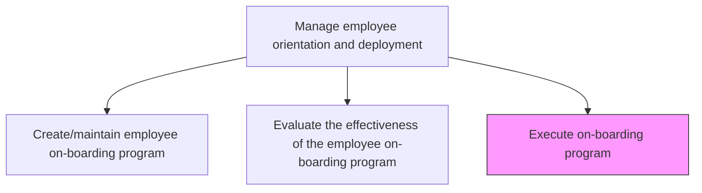
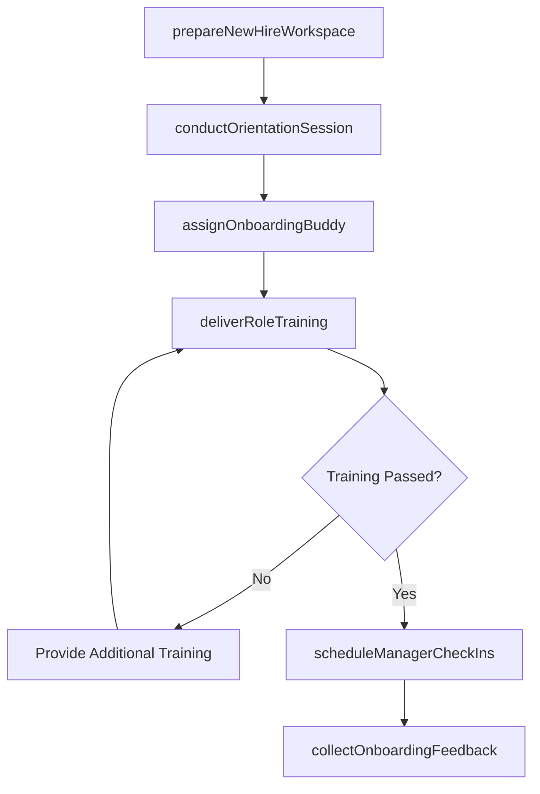

# Execute on-boarding program

> Business-as-Code definition for execute on-boarding program. Models the complete process of bringing the employee on-boarding program into effect.

## Overview

Bringing the employee on-boarding program into effect. Implement the on-boarding program designed in Create/Maintain employee on-boarding program. Conduct training sessions and employee engagement programs. Prepare workspaces and access credentials, deliver orientation and role-specific training, assign peer mentors, and establish recurring manager check-ins through the new hire's first 90 days.

## Process Hierarchy



## GraphDL

```yaml
execute:
  object: Onboarding Program
  actor: OnboardingCoordinator
  result: CompletedOnboarding
```

## Actions

| Action | Description |
|--------|-------------|
| prepareNewHireWorkspace | Coordinate IT equipment provisioning, access credentials, and physical workspace setup before day one |
| conductOrientationSession | Deliver company overview, culture introduction, organizational structure, and policy briefing |
| assignOnboardingBuddy | Pair the new hire with an experienced colleague for peer mentoring and informal guidance |
| deliverRoleTraining | Execute role-specific training modules, hands-on exercises, and system walkthroughs |
| scheduleManagerCheckIns | Arrange recurring check-in meetings between the new hire and their manager at 30, 60, and 90 days |
| collectOnboardingFeedback | Gather new hire feedback on the onboarding experience at each milestone checkpoint |

## Events

| Event | Description |
|-------|-------------|
| newHireWorkspacePrepared | IT equipment, credentials, and workspace ready before the new hire's start date |
| orientationSessionConducted | Company overview and policy briefing delivered to the new hire |
| onboardingBuddyAssigned | Peer mentor paired with the new hire for first 90 days |
| roleTrainingDelivered | Role-specific training modules completed by the new hire |
| managerCheckInsScheduled | Recurring check-in cadence established for the first 90 days |
| onboardingFeedbackCollected | New hire feedback gathered at 30-, 60-, or 90-day milestone |

## Searches

| Search | Description |
|--------|-------------|
| findOnboardingSchedules | List upcoming onboarding sessions filtered by start date, department, or cohort |
| getNewHireProgress | Retrieve onboarding milestone completion status for a specific new hire |
| getOnboardingCohortMetrics | Access program effectiveness data including satisfaction and time to productivity by cohort |
| getOnboardingFeedback | Retrieve aggregated new hire feedback by cohort or time period |

## Process Flow



## RACI Matrix

| Activity | Responsible | Accountable | Consulted | Informed |
|----------|-------------|-------------|-----------|----------|
| prepareNewHireWorkspace | OnboardingCoordinator | HRManager | ITHelpDesk | HiringManager |
| conductOrientationSession | TrainingSpecialist | LearningDevelopmentManager | HRBusinessPartner | NewHire |
| assignOnboardingBuddy | HiringManager | LearningDevelopmentManager | TeamLead | NewHire |
| collectOnboardingFeedback | OnboardingCoordinator | LearningDevelopmentManager | HiringManager | CHRO |

## Related Processes

| Process | Relationship |
|---------|-------------|
| 7.3.1.1 Create/maintain employee on-boarding program | Upstream - defines the program content and structure being executed |
| 7.3.1.2 Evaluate the effectiveness of the employee on-boarding program | Downstream - execution data feeds into effectiveness evaluation |
| 7.3.2.1 Define employee performance objectives | Downstream - onboarding completion triggers initial objective-setting |

## Related Departments

| Department | Role |
|-----------|------|
| Learning and Development | Designs onboarding content and facilitates orientation sessions |
| Information Technology | Provisions equipment, accounts, and system access for new hires |
| Hiring Department | Provides role-specific training and assigns onboarding buddies |
| Human Resources | Oversees onboarding policy compliance and new hire documentation |

## Related Occupations

| Occupation | Involvement |
|-----------|-------------|
| Onboarding Coordinator | Manages end-to-end onboarding logistics and milestone tracking |
| Training Specialist | Delivers orientation sessions and role-specific training modules |
| Hiring Manager | Ensures role readiness and provides ongoing guidance through check-ins |

## KPIs

| KPI | Description | Unit |
|-----|-------------|------|
| Onboarding Completion Rate | Percentage of new hires completing all onboarding milestones on schedule | % |
| Time to Productivity | Average days from start date to independent task completion | Days |
| New Hire Satisfaction | Average satisfaction rating from post-onboarding surveys | Score (1-5) |
| Day-One Readiness | Percentage of new hires with workspace and access fully provisioned by start date | % |

## Usage

```typescript
import { executeOnboardingProgram } from '@headlessly/execute-onboarding-program'

const onboarding = executeOnboardingProgram()

// Conduct orientation for a new hire cohort
const orientation = await onboarding.conductOrientationSession({
  newHireId: 'EMP-7890',
  startDate: '2025-08-04',
  cohort: 'august-2025',
  sessions: ['company-overview', 'culture', 'benefits', 'compliance']
})

// Track onboarding milestone progress
const progress = await onboarding.getNewHireProgress({
  newHireId: 'EMP-7890',
  includeFeedback: true
})
```
