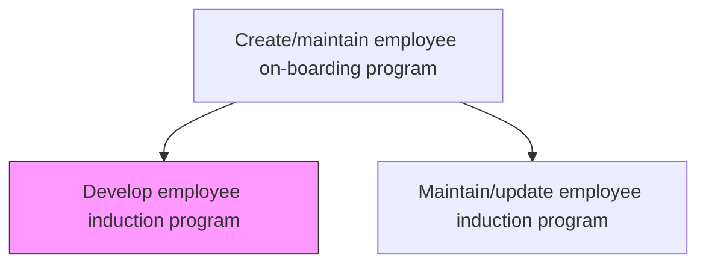
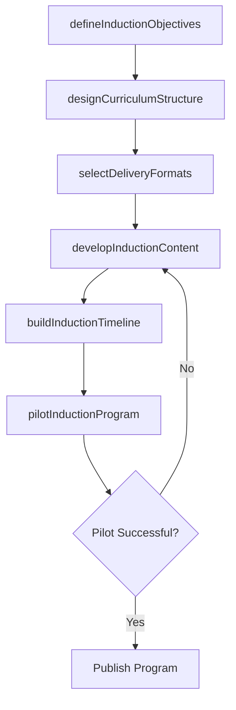

# Develop employee induction program

> Business-as-Code definition for develop employee induction program. Models the complete process of designing a program to systematically introduce newly hired employees to the organizational culture of the company.

## Overview

Designing a program to systematically introduce newly hired employees to the organizational culture of the company. Define the induction curriculum covering company history, values, organizational structure, policies, and role-specific orientation. Determine delivery formats (in-person, virtual, self-paced), establish the timeline and milestone schedule, and create evaluation criteria to measure new hire readiness at the end of the program.

## Process Hierarchy



## GraphDL

```yaml
develop:
  object: Employee Induction Program
  actor: LearningDevelopmentManager
  result: InductionProgramDesign
```

## Actions

| Action | Description |
|--------|-------------|
| defineInductionObjectives | Establish learning outcomes and readiness criteria for the induction program |
| designCurriculumStructure | Organize induction topics into modules covering culture, policies, systems, and role orientation |
| selectDeliveryFormats | Choose appropriate delivery methods (in-person, virtual, e-learning, blended) for each module |
| developInductionContent | Create presentations, handbooks, videos, and interactive materials for each module |
| buildInductionTimeline | Define the day-by-day and week-by-week schedule for the complete induction journey |
| pilotInductionProgram | Run a trial of the induction program with a test cohort to validate content and logistics |

## Events

| Event | Description |
|-------|-------------|
| inductionObjectivesDefined | Learning outcomes and readiness criteria established for the program |
| curriculumStructureDesigned | Induction modules organized by topic and sequenced for delivery |
| deliveryFormatsSelected | Delivery methods chosen and confirmed for each induction module |
| inductionContentDeveloped | Presentations, handbooks, and interactive materials created and reviewed |
| inductionTimelineBuilt | Day-by-day induction schedule finalized and published |
| inductionProgramPiloted | Trial run completed with test cohort feedback incorporated |

## Searches

| Search | Description |
|--------|-------------|
| getInductionPrograms | List induction program versions filtered by status, effective date, or target audience |
| getInductionModules | Retrieve module details including content, format, and duration for a specific program |
| getInductionTimeline | Query the day-by-day schedule for a given induction program version |
| getPilotFeedback | Retrieve feedback from pilot cohort participants by module or overall |

## Process Flow



## RACI Matrix

| Activity | Responsible | Accountable | Consulted | Informed |
|----------|-------------|-------------|-----------|----------|
| defineInductionObjectives | LearningDevelopmentManager | HRDirector | DepartmentHeads | CHRO |
| designCurriculumStructure | InstructionalDesigner | LearningDevelopmentManager | SubjectMatterExperts | HRBusinessPartner |
| developInductionContent | InstructionalDesigner | LearningDevelopmentManager | SubjectMatterExperts | IT |
| pilotInductionProgram | TrainingSpecialist | LearningDevelopmentManager | PilotCohort | AllManagers |

## Related Processes

| Process | Relationship |
|---------|-------------|
| 7.3.1.1.2 Maintain/update employee induction program | Downstream - the developed program is maintained and updated over time |
| 7.3.1.3 Execute on-boarding program | Downstream - the induction program is executed as part of overall onboarding |
| 7.3.1.2 Evaluate the effectiveness of the employee on-boarding program | Downstream - program effectiveness is evaluated after execution |

## Related Departments

| Department | Role |
|-----------|------|
| Learning and Development | Designs the induction curriculum and content |
| Human Resources | Provides policy content and ensures regulatory compliance |
| Business Units | Contributes role-specific orientation requirements |
| Information Technology | Supports e-learning platform and content hosting |

## Related Occupations

| Occupation | Involvement |
|-----------|-------------|
| Learning Development Manager | Leads program design and stakeholder alignment |
| Instructional Designer | Creates curriculum structure and learning content |
| Training Specialist | Facilitates pilot sessions and validates delivery logistics |

## KPIs

| KPI | Description | Unit |
|-----|-------------|------|
| Program Development Time | Calendar days from project kickoff to published induction program | Days |
| Module Coverage | Percentage of required induction topics covered by the program | % |
| Pilot Satisfaction Score | Average satisfaction rating from pilot cohort participants | Score (1-5) |
| Content Readiness | Percentage of induction materials approved and ready for delivery by launch date | % |

## Usage

```typescript
import { developEmployeeInductionProgram } from '@headlessly/develop-employee-induction-program'

const induction = developEmployeeInductionProgram()

// Design the curriculum structure for a new induction program
const curriculum = await induction.designCurriculumStructure({
  programName: 'Global Induction 2026',
  targetAudience: 'all-new-hires',
  modules: ['company-history', 'values-culture', 'policies-compliance', 'systems-tools', 'role-orientation']
})

// Pilot the program with a test cohort
const pilot = await induction.pilotInductionProgram({
  programId: curriculum.programId,
  cohortSize: 12,
  startDate: '2025-11-01',
  feedbackSurveyTemplate: 'pilot-evaluation-v2'
})
```
