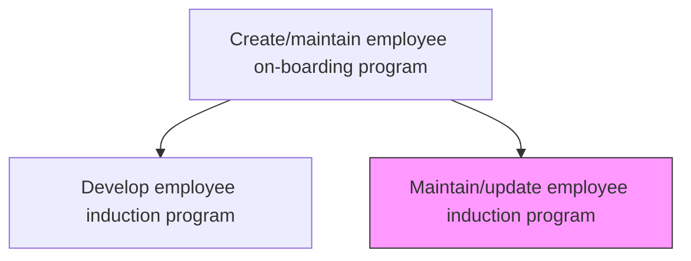
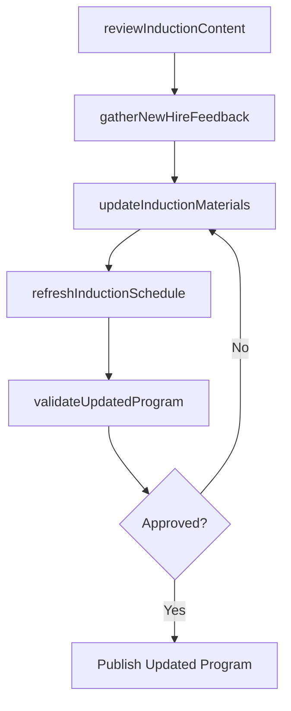

# Maintain/Update employee induction program

> Business-as-Code definition for maintaining and updating employee induction programs. Models the process of reviewing, refreshing, and improving new hire orientation content, schedules, and delivery methods to reflect current organizational culture and policies.

## Overview

Managing the orientation and training of new employees about the organizational culture of the company. Review and update induction materials, schedules, and delivery methods to ensure they remain current, relevant, and effective for onboarding new hires. Incorporate feedback from recent cohorts, reflect organizational changes such as policy updates or restructuring, and retire outdated content.

## Process Hierarchy



## GraphDL

```yaml
maintain:
  object: Employee Induction Program
  actor: LearningDevelopmentManager
  result: UpdatedInductionProgram
```

## Actions

| Action | Description |
|--------|-------------|
| reviewInductionContent | Audit existing induction materials for accuracy, relevance, and alignment with current policies |
| gatherNewHireFeedback | Collect feedback from recent hires on induction program effectiveness and gaps |
| updateInductionMaterials | Revise presentations, handbooks, and digital content based on review findings |
| refreshInductionSchedule | Adjust induction timeline, session sequence, and delivery formats |
| validateUpdatedProgram | Test updated induction program with a pilot cohort before full rollout |

## Events

| Event | Description |
|-------|-------------|
| inductionContentReviewed | Audit of existing induction materials completed with findings documented |
| newHireFeedbackGathered | Feedback collection from recent hires finalized and analyzed |
| inductionMaterialsUpdated | Revised induction content published and distributed |
| inductionScheduleRefreshed | Updated induction timeline and session plan approved |
| updatedProgramValidated | Pilot validation of revised induction program completed |

## Searches

| Search | Description |
|--------|-------------|
| findInductionPrograms | List induction program versions filtered by status or effective date |
| getInductionFeedback | Retrieve new hire feedback results by cohort or date range |
| getInductionMaterials | Query current induction content inventory by topic or format |
| getInductionSchedule | Retrieve active induction schedule and session details |

## Process Flow



## RACI Matrix

| Activity | Responsible | Accountable | Consulted | Informed |
|----------|-------------|-------------|-----------|----------|
| reviewInductionContent | LearningDevelopmentManager | HRDirector | HRBusinessPartner | DepartmentManagers |
| gatherNewHireFeedback | TrainingSpecialist | LearningDevelopmentManager | RecentHires | HRAnalyst |
| updateInductionMaterials | InstructionalDesigner | LearningDevelopmentManager | SubjectMatterExperts | IT |
| validateUpdatedProgram | LearningDevelopmentManager | HRDirector | PilotCohort | AllManagers |

## Related Processes

| Process | Relationship |
|---------|-------------|
| 7.3.1.1.1 Develop employee induction program | Upstream - the original program being maintained was developed here |
| 7.3.1.2 Evaluate the effectiveness of the employee on-boarding program | Upstream - evaluation findings drive update priorities |
| 7.3.1.3 Execute on-boarding program | Downstream - updated program is deployed through execution |

## Related Departments

| Department | Role |
|-----------|------|
| Learning and Development | Owns induction program content and update cycle |
| Human Resources | Provides policy changes and compliance updates for incorporation |
| Business Units | Supplies role-specific induction requirements and feedback |
| Information Technology | Supports learning management system and digital content updates |

## Related Occupations

| Occupation | Involvement |
|-----------|-------------|
| Learning Development Manager | Leads induction program review and update cycles |
| Instructional Designer | Revises content and creates updated learning materials |
| Training Specialist | Validates updated materials and facilitates pilot sessions |

## KPIs

| KPI | Description | Unit |
|-----|-------------|------|
| Content Currency Rate | Percentage of induction materials reviewed within the last 12 months | % |
| New Hire Satisfaction | Average satisfaction rating from post-induction surveys | Score (1-5) |
| Time to Proficiency | Average days for new employees to reach full productivity | Days |
| Induction Completion Rate | Percentage of new hires completing all induction modules on schedule | % |

## Usage

```typescript
import { maintainEmployeeInductionProgram } from '@headlessly/maintain-employee-induction-program'

const induction = maintainEmployeeInductionProgram()

// Review current induction content for gaps and outdated material
const review = await induction.reviewInductionContent({
  programVersion: 'v2025.2',
  focusAreas: ['company-culture', 'compliance-training', 'role-orientation']
})

// Gather feedback from the most recent hire cohort
const feedback = await induction.gatherNewHireFeedback({
  cohort: 'Q4-2025',
  surveyType: 'post-induction',
  includeComments: true
})
```
