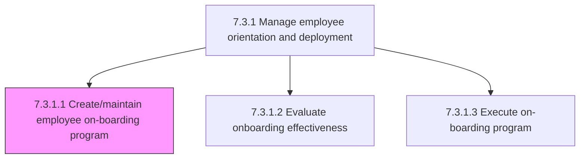
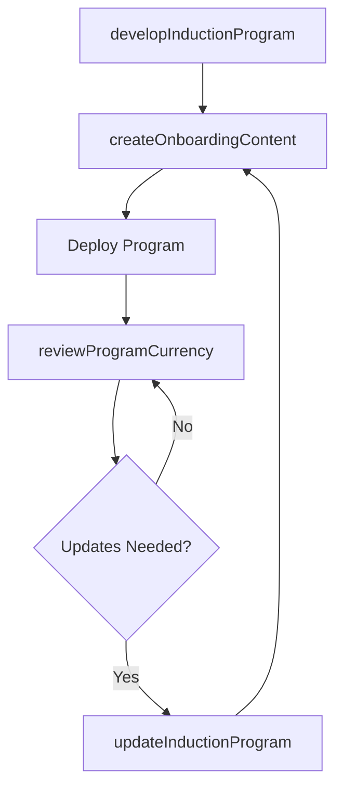

# Create/maintain employee on-boarding program

> Business-as-Code definition for onboarding program creation and maintenance. Models induction curriculum design, content development, program updates, and ongoing program management.

## Overview

Creating and maintaining a mechanism through which new employees acquire the necessary knowledge, skills, and behaviors to become effective organizational members and insiders. Conduct formal meetings, lectures, videos, printed materials, and/or computer-based orientations to introduce newcomers to their new jobs and the organization.

## Process Hierarchy



## GraphDL

```yaml
create/maintain:
  object: Employee On-boarding Program
  actor: OnboardingProgramManager
  result: OnboardingCurriculum
```

## Actions

| Action | Description |
|--------|-------------|
| developInductionProgram | Design structured onboarding curriculum covering culture, policies, and role-specific content |
| createOnboardingContent | Develop materials including presentations, videos, checklists, and e-learning modules |
| updateInductionProgram | Revise onboarding content based on feedback, policy changes, and organizational updates |
| reviewProgramCurrency | Audit onboarding materials for accuracy and relevance on a scheduled basis |

## Events

| Event | Description |
|-------|-------------|
| inductionProgramDeveloped | Onboarding curriculum designed and approved |
| onboardingContentCreated | Program materials and resources published |
| inductionProgramUpdated | Onboarding content revised with current information |
| programCurrencyReviewed | Onboarding materials audited for accuracy and completeness |

## Searches

| Search | Description |
|--------|-------------|
| getOnboardingCurriculum | Retrieve current onboarding program structure and content |
| getContentVersionHistory | List revisions to onboarding materials by date or section |
| getProgramFeedback | Query new hire feedback on onboarding content and delivery |

## Process Flow



## RACI Matrix

| Activity | Responsible | Accountable | Consulted | Informed |
|----------|-------------|-------------|-----------|----------|
| developInductionProgram | Onboarding Program Manager | VP HR | Department Heads | L&D |
| createOnboardingContent | Instructional Designer | Onboarding Program Manager | Subject Matter Experts | IT |
| updateInductionProgram | Onboarding Program Manager | VP HR | HR Business Partners | All Managers |

## Sub-Processes

| ID | Name | Description |
|----|------|-------------|
| 7.3.1.1.1 | Develop employee induction program | Designing a program to systematically introduce newly hired employees to the organizational culture  |
| 7.3.1.1.2 | Maintain/Update employee induction program | Managing the orientation and training of new employees about the organizational culture of the compa |

## Related Processes

| Process | Relationship |
|---------|-------------|
| 7.3.1.2 Evaluate the effectiveness of the employee on-boarding program | Downstream - program outcomes drive content updates |
| 7.3.1.3 Execute on-boarding program | Downstream - designed program delivered to new hires |

## Related Departments

| Department | Role |
|-----------|------|
| Human Resources | Designs and manages onboarding program content |
| Learning and Development | Creates instructional materials and e-learning modules |
| All Departments | Contributes role-specific onboarding content |

## Related Occupations

| Occupation | Involvement |
|-----------|-------------|
| Onboarding Program Manager | Oversees program design and ongoing maintenance |
| Instructional Designer | Creates learning content and multimedia materials |

## KPIs

| KPI | Description | Unit |
|-----|-------------|------|
| Content Currency Rate | Percentage of onboarding materials updated within the last 12 months | % |
| Program Completeness | Percentage of required onboarding topics covered in curriculum | % |
| Content Satisfaction Score | New hire rating of onboarding material quality and relevance | Score (1-5) |

## Usage

```typescript
import { createMaintainEmployeeOnBoardingProgram } from '@headlessly/create-maintain-employee-on-boarding-program'

const program = createMaintainEmployeeOnBoardingProgram()

// Develop an induction program
const curriculum = await program.developInductionProgram({
  targetRoles: ['engineering', 'product', 'design'],
  modules: ['company-culture', 'tools-and-systems', 'security-compliance', 'role-specific'],
  deliveryFormat: 'blended'
})

// Update the induction program
await program.updateInductionProgram({
  curriculumId: curriculum.id,
  updates: [
    { module: 'tools-and-systems', reason: 'new-collaboration-platform' },
    { module: 'security-compliance', reason: 'updated-data-privacy-policy' }
  ]
})
```
