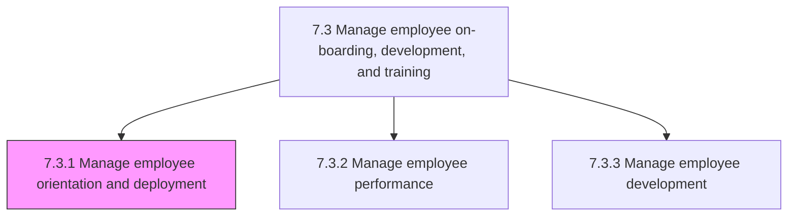
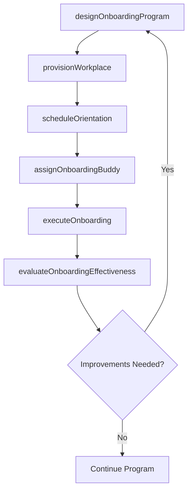

# Manage employee orientation and deployment

> Business-as-Code definition for employee orientation and deployment management. Models onboarding program design, effectiveness evaluation, and program execution for new hire integration.

## Overview

Creating and maintaining various employee on-boarding programs typically known as induction programs in order to ensure that the new employees are effectively introduced to the organization and its existing employees. Examine and evaluate the performance of these induction programs. Execute these programs on the ground level.

## Process Hierarchy



## GraphDL

```yaml
manage:
  object: Employee Orientation And Deployment
  actor: OnboardingCoordinator
  result: OnboardedEmployee
```

## Actions

| Action | Description |
|--------|-------------|
| designOnboardingProgram | Create structured onboarding curriculum with milestones and checklists |
| assignOnboardingBuddy | Pair new hire with experienced employee for guidance during initial period |
| scheduleOrientation | Set up orientation sessions covering company culture, policies, and systems |
| provisionWorkplace | Coordinate IT equipment, workspace, system access, and badge provisioning |
| executeOnboarding | Deliver onboarding program activities and track completion progress |
| evaluateOnboardingEffectiveness | Assess program outcomes through surveys and new hire performance data |

## Events

| Event | Description |
|-------|-------------|
| onboardingProgramDesigned | Onboarding curriculum and milestones defined |
| onboardingBuddyAssigned | New hire paired with designated buddy or mentor |
| orientationScheduled | Orientation sessions arranged and calendar invites sent |
| workplaceProvisioned | IT equipment, access credentials, and workspace prepared |
| onboardingExecuted | Onboarding program activities delivered to new hire |
| onboardingEffectivenessEvaluated | Program assessment completed with improvement recommendations |

## Searches

| Search | Description |
|--------|-------------|
| getOnboardingProgress | Retrieve onboarding checklist completion status by employee |
| getNewHireCohort | List new hires by start date, department, or onboarding stage |
| getOrientationSchedule | Query upcoming orientation sessions by date or location |
| getOnboardingSurveyResults | Retrieve new hire satisfaction and feedback survey data |

## Process Flow



## RACI Matrix

| Activity | Responsible | Accountable | Consulted | Informed |
|----------|-------------|-------------|-----------|----------|
| designOnboardingProgram | Onboarding Coordinator | VP HR | Department Heads | Talent Acquisition |
| provisionWorkplace | IT Service Desk | IT Manager | Facilities | Hiring Manager |
| scheduleOrientation | HR Coordinator | Onboarding Coordinator | Hiring Manager | New Hire |
| executeOnboarding | Onboarding Coordinator | VP HR | Hiring Manager, IT | Department Team |
| evaluateOnboardingEffectiveness | HR Analyst | VP HR | Department Heads | CHRO |

## Sub-Processes

| ID | Name | Description |
|----|------|-------------|
| 7.3.1.1 | Create/maintain employee on-boarding program | Creating and maintaining a mechanism through which new employees acquire the necessary knowledge, sk |
| 7.3.1.2 | Evaluate the effectiveness of the employee on-boarding program | Assessing the performance and effectiveness of employee on-boarding program. Examine the performance |
| 7.3.1.3 | Execute on-boarding program | Bringing the employee on-boarding program into effect. Implement Create/Maintain employee on-boardin |

## Related Processes

| Process | Relationship |
|---------|-------------|
| 7.2.4 Manage new hire/re-hire | Upstream - hired candidates enter onboarding |
| 7.3.2 Manage employee performance | Downstream - onboarded employees enter performance cycle |
| 7.3.4 Develop and train employees | Downstream - initial training needs identified during onboarding |
| 7.7.1 Manage employee information | Parallel - employee records established during onboarding |

## Related Departments

| Department | Role |
|-----------|------|
| Human Resources | Designs and manages onboarding programs and orientation |
| Information Technology | Provisions equipment, system access, and technical setup |
| Facilities | Prepares workspace, security badges, and building access |
| Hiring Departments | Provides role-specific onboarding content and team introductions |

## Related Occupations

| Occupation | Involvement |
|-----------|-------------|
| Onboarding Coordinator | Orchestrates end-to-end new hire onboarding experience |
| HR Coordinator | Schedules sessions and manages onboarding logistics |
| IT Support Specialist | Provisions hardware, software, and system credentials |

## KPIs

| KPI | Description | Unit |
|-----|-------------|------|
| Time to Productivity | Average days from start date to full role productivity | Days |
| Onboarding Completion Rate | Percentage of new hires completing all onboarding tasks on time | % |
| New Hire Satisfaction Score | New hire rating of the onboarding experience | Score (1-5) |
| 90-Day Retention Rate | Percentage of new hires still employed after 90 days | % |

## Usage

```typescript
import { manageEmployeeOrientationAndDeployment } from '@headlessly/manage-employee-orientation-and-deployment'

const onboarding = manageEmployeeOrientationAndDeployment()

// Execute onboarding for a new hire
const session = await onboarding.executeOnboarding({
  employeeId: 'emp_12345',
  startDate: '2025-06-01',
  department: 'engineering',
  buddyId: 'emp_67890'
})

// Evaluate onboarding effectiveness
const evaluation = await onboarding.evaluateOnboardingEffectiveness({
  cohort: '2025-Q2',
  metrics: ['satisfaction', 'time-to-productivity', 'retention']
})
```
