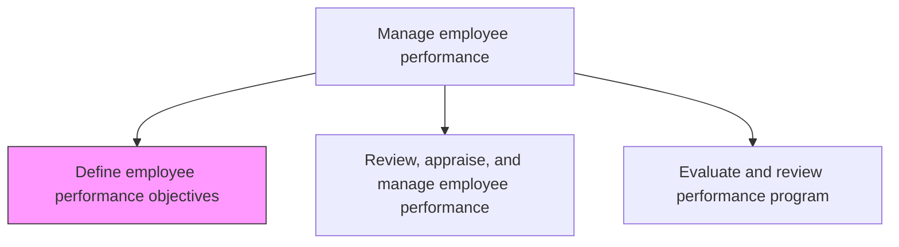
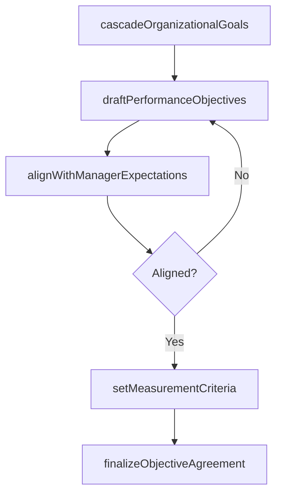

# Define employee performance objectives

> Business-as-Code definition for define employee performance objectives. Models the complete process of outlining the objectives for employee performance.

## Overview

Outlining the objectives for employee performance. Establish key performance objectives and measures such as customer-focus objectives, financially focused objectives, and employee growth objectives. Cascade organizational goals to department and individual levels, draft SMART objectives with the employee's manager, define quantitative and qualitative success metrics, and obtain mutual sign-off on the performance contract.

## Process Hierarchy



## GraphDL

```yaml
define:
  object: Employee Performance Objectives
  actor: HRBusinessPartner
  result: PerformanceObjectiveSet
```

## Actions

| Action | Description |
|--------|-------------|
| cascadeOrganizationalGoals | Translate strategic and departmental goals into individual performance dimensions |
| draftPerformanceObjectives | Author SMART objectives covering financial, customer, operational, and growth perspectives |
| alignWithManagerExpectations | Review and calibrate draft objectives with the employee's direct manager |
| setMeasurementCriteria | Define quantitative and qualitative success metrics for each performance objective |
| finalizeObjectiveAgreement | Obtain mutual sign-off between the employee and manager on the performance contract |

## Events

| Event | Description |
|-------|-------------|
| organizationalGoalsCascaded | Strategic and departmental goals translated into individual performance dimensions |
| performanceObjectivesDrafted | SMART objectives authored covering all balanced scorecard perspectives |
| managerExpectationsAligned | Draft objectives reviewed and calibrated with the direct manager |
| measurementCriteriaSet | Quantitative and qualitative success metrics defined for each objective |
| objectiveAgreementFinalized | Employee and manager mutually signed off on the performance contract |

## Searches

| Search | Description |
|--------|-------------|
| getObjectivesByEmployee | Retrieve performance objectives for a specific employee and review period |
| findObjectivesByDepartment | List all active objectives filtered by department, team, or manager |
| getObjectiveCompletionStatus | Query objective sign-off and agreement status across the organization |
| getOrganizationalGoalsCascade | Trace how strategic goals cascade to department and individual objectives |

## Process Flow



## RACI Matrix

| Activity | Responsible | Accountable | Consulted | Informed |
|----------|-------------|-------------|-----------|----------|
| cascadeOrganizationalGoals | HRBusinessPartner | DepartmentManager | StrategyTeam | AllEmployees |
| draftPerformanceObjectives | Employee | DirectManager | HRBusinessPartner | TalentManagement |
| setMeasurementCriteria | DirectManager | DepartmentHead | PerformanceManagement | HRAnalytics |
| finalizeObjectiveAgreement | DirectManager | DepartmentHead | Employee | HR |

## Related Processes

| Process | Relationship |
|---------|-------------|
| 7.3.2.2 Review, appraise, and manage employee performance | Downstream - objectives are the basis for performance reviews |
| 7.3.2.3 Evaluate and review performance program | Downstream - objective quality informs program evaluation |
| 7.3.3.1 Define employee development guidelines | Parallel - development guidelines inform growth-oriented objectives |

## Related Departments

| Department | Role |
|-----------|------|
| Human Resources | Provides performance management framework and tools |
| Business Units | Cascades departmental goals to individual employees |
| Strategy | Sets organizational goals that drive individual objectives |
| HR Analytics | Tracks objective completion and alignment metrics |

## Related Occupations

| Occupation | Involvement |
|-----------|-------------|
| HR Business Partner | Facilitates goal cascade and objective-setting workshops |
| Direct Manager | Collaborates with employees to draft and approve objectives |
| Performance Management Specialist | Designs the objective-setting framework and criteria |

## KPIs

| KPI | Description | Unit |
|-----|-------------|------|
| Objective Completion Rate | Percentage of employees with finalized objective agreements by deadline | % |
| Goal Alignment Score | Percentage of individual objectives traceable to organizational goals | % |
| Objective Quality Rating | Average quality score of objectives assessed against SMART criteria | Score (1-5) |
| Manager Calibration Variance | Variance in objective difficulty levels across peer groups | % |

## Usage

```typescript
import { defineEmployeePerformanceObjectives } from '@headlessly/define-employee-performance-objectives'

const objectives = defineEmployeePerformanceObjectives()

// Cascade organizational goals to a department
const cascade = await objectives.cascadeOrganizationalGoals({
  strategicGoalIds: ['revenue-growth-15pct', 'customer-nps-improvement'],
  department: 'Engineering',
  reviewPeriod: '2025-H2'
})

// Draft performance objectives for an employee
const draft = await objectives.draftPerformanceObjectives({
  employeeId: 'EMP-3891',
  cascadeId: cascade.id,
  perspectives: ['financial', 'customer', 'operational', 'growth']
})
```
