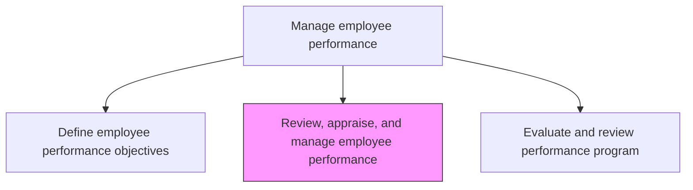
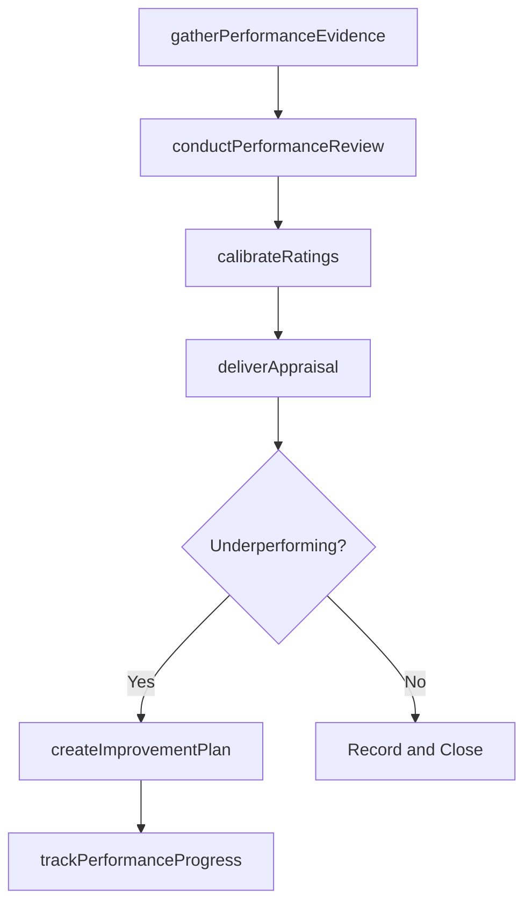

# Review, appraise, and manage employee performance

> Business-as-Code definition for review, appraise, and manage employee performance. Models the complete process of reviewing, appraising, and managing the performance of employees.

## Overview

Reviewing, appraising, and managing the performance of employees. Create performance reviews for all the employees by qualitatively and quantitatively measuring them. Use the reviews to provide performance appraisals. Calibrate ratings across departments to ensure consistency. Deliver appraisal results and constructive feedback to employees. Create performance improvement plans for underperforming employees and monitor progress against objectives.

## Process Hierarchy



## GraphDL

```yaml
review:
  object: Employee Performance
  actor: PerformanceManager
  result: PerformanceAppraisalReport
```

## Actions

| Action | Description |
|--------|-------------|
| gatherPerformanceEvidence | Collect goal achievement data, 360-degree feedback, and self-assessments for the review period |
| conductPerformanceReview | Execute formal performance evaluation using quantitative and qualitative measures |
| calibrateRatings | Normalize performance ratings across departments to ensure consistency and fairness |
| deliverAppraisal | Communicate performance assessment results and constructive feedback to the employee |
| createImprovementPlan | Develop performance improvement plans with milestones for underperforming employees |
| trackPerformanceProgress | Monitor ongoing progress against objectives and improvement plan milestones |

## Events

| Event | Description |
|-------|-------------|
| performanceEvidenceGathered | Goal data, 360-degree feedback, and self-assessments collected for evaluation |
| performanceReviewConducted | Formal performance evaluation completed for employee |
| ratingsCalibrated | Performance ratings normalized across departments for consistency |
| appraisalDelivered | Performance assessment and feedback communicated to employee |
| improvementPlanCreated | Performance improvement plan documented with milestones and agreed upon |
| performanceProgressTracked | Ongoing performance against objectives and improvement milestones updated |

## Searches

| Search | Description |
|--------|-------------|
| findPerformanceReviews | List performance reviews filtered by department, rating, or review period |
| getEmployeePerformanceHistory | Retrieve historical performance ratings and trends for an employee |
| getPendingReviews | List employees with overdue or upcoming performance reviews |
| getImprovementPlans | Retrieve active performance improvement plans by status or manager |

## Process Flow



## RACI Matrix

| Activity | Responsible | Accountable | Consulted | Informed |
|----------|-------------|-------------|-----------|----------|
| gatherPerformanceEvidence | DirectManager | DepartmentHead | Employee | HRBusinessPartner |
| conductPerformanceReview | DirectManager | DepartmentHead | HRBusinessPartner | Employee |
| calibrateRatings | HRBusinessPartner | CHRO | DepartmentHeads | DirectManagers |
| deliverAppraisal | DirectManager | DepartmentHead | HRBusinessPartner | Employee |

## Related Processes

| Process | Relationship |
|---------|-------------|
| 7.3.2.1 Define employee performance objectives | Upstream - objectives are prerequisites for reviews |
| 7.3.2.3 Evaluate and review performance program | Downstream - program effectiveness assessed after reviews |
| 7.5.1 Develop and manage reward, recognition, and motivation programs | Downstream - appraisals inform compensation and reward decisions |

## Related Departments

| Department | Role |
|-----------|------|
| Human Resources | Designs review processes and calibration frameworks |
| Business Units | Conduct reviews and set performance objectives |
| Compensation and Benefits | Uses appraisals to inform merit increases and bonuses |
| Legal | Ensures compliance in performance documentation |

## Related Occupations

| Occupation | Involvement |
|-----------|-------------|
| HR Business Partner | Facilitates calibration and advises managers on reviews |
| People Manager | Primary executor of performance reviews and appraisals |
| HR Analyst | Provides performance data analysis and reporting |

## KPIs

| KPI | Description | Unit |
|-----|-------------|------|
| Review Completion Rate | Percentage of scheduled performance reviews completed on time | % |
| Calibration Variance | Standard deviation of performance ratings across departments | Score |
| Improvement Plan Success Rate | Percentage of employees on PIPs who return to satisfactory performance | % |
| Employee Feedback Score | Average employee satisfaction with the review process | Score (1-5) |

## Usage

```typescript
import { reviewAppraiseAndManageEmployeePerformance } from '@headlessly/review-appraise-and-manage-employee-performance'

const performance = reviewAppraiseAndManageEmployeePerformance()

// Conduct a performance review for an employee
const review = await performance.conductPerformanceReview({
  employeeId: 'EMP-4521',
  reviewPeriod: 'H2-2025',
  dimensions: ['goal-achievement', 'competencies', 'values-alignment'],
  includeThreeSixtyFeedback: true
})

// Calibrate ratings across the engineering department
const calibration = await performance.calibrateRatings({
  department: 'Engineering',
  reviewPeriod: 'H2-2025',
  distributionCurve: 'guided'
})
```
