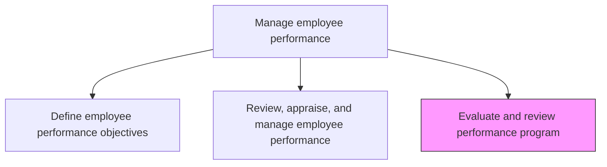
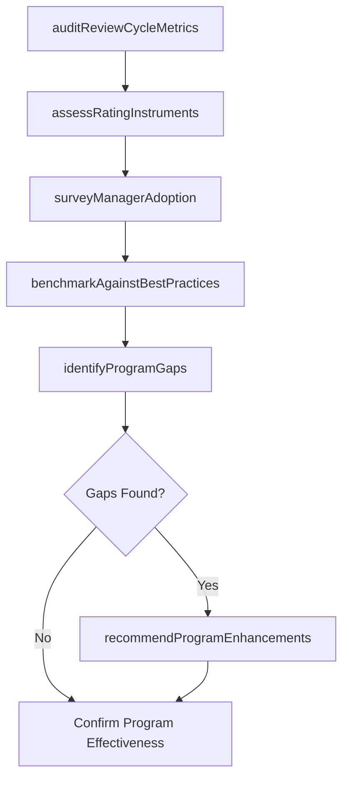

# Evaluate and review performance program

> Business-as-Code definition for evaluate and review performance program. Models the complete process of assessing and revamping performance programs, including the instruments used to measure employee performance standards.

## Overview

Assessing and revamping performance programs, including the instruments used to measure employee performance standards. Review and upgrade these performance programs to avoid any deprivations and ensure effectiveness. Analyze review completion rates, calibration consistency, manager adoption, and employee satisfaction with the review process. Identify gaps in rating instruments, feedback mechanisms, and cycle timing. Recommend enhancements to the performance management framework and tools.

## Process Hierarchy



## GraphDL

```yaml
evaluate:
  object: Performance Program
  actor: PerformanceManagementSpecialist
  result: ProgramEvaluationReport
```

## Actions

| Action | Description |
|--------|-------------|
| auditReviewCycleMetrics | Analyze completion rates, timeliness, and participation data for the most recent review cycle |
| assessRatingInstruments | Evaluate the effectiveness of rating scales, competency models, and feedback forms used in reviews |
| surveyManagerAdoption | Measure manager proficiency and satisfaction with performance management tools and processes |
| benchmarkAgainstBestPractices | Compare the organization's performance program design against industry best practices and peer organizations |
| identifyProgramGaps | Document specific deficiencies in cycle timing, calibration methods, feedback quality, or tool usability |
| recommendProgramEnhancements | Propose changes to the performance management framework, instruments, and delivery schedule |

## Events

| Event | Description |
|-------|-------------|
| reviewCycleMetricsAudited | Completion rates, timeliness, and participation data analyzed for the review cycle |
| ratingInstrumentsAssessed | Effectiveness of rating scales and feedback forms evaluated with findings documented |
| managerAdoptionSurveyed | Manager proficiency and satisfaction data collected and analyzed |
| bestPracticesBenchmarked | Organizational performance program compared against industry standards |
| programGapsIdentified | Deficiencies in the performance management framework documented |
| programEnhancementsRecommended | Proposed changes to the performance program delivered to leadership |

## Searches

| Search | Description |
|--------|-------------|
| getReviewCycleMetrics | Retrieve completion rates, timeliness, and participation statistics by cycle and department |
| getManagerAdoptionScores | Query manager proficiency and satisfaction ratings for performance tools |
| getProgramBenchmarks | Retrieve benchmark comparison data against industry standards |
| getProgramChangeHistory | List historical changes to the performance management framework by version |

## Process Flow



## RACI Matrix

| Activity | Responsible | Accountable | Consulted | Informed |
|----------|-------------|-------------|-----------|----------|
| auditReviewCycleMetrics | HRAnalyst | PerformanceManagementSpecialist | HRBusinessPartners | CHRO |
| assessRatingInstruments | PerformanceManagementSpecialist | VP HR | DepartmentHeads | AllManagers |
| surveyManagerAdoption | HRAnalyst | PerformanceManagementSpecialist | PeopleManagers | LearningDevelopment |
| recommendProgramEnhancements | PerformanceManagementSpecialist | VP HR | CHRO | AllManagers |

## Related Processes

| Process | Relationship |
|---------|-------------|
| 7.3.2.1 Define employee performance objectives | Upstream - objective-setting quality feeds into program evaluation |
| 7.3.2.2 Review, appraise, and manage employee performance | Upstream - review execution data is the primary input for evaluation |
| 7.3.3.1 Define employee development guidelines | Downstream - program evaluation findings inform development guideline updates |

## Related Departments

| Department | Role |
|-----------|------|
| Human Resources | Owns the performance management framework and evaluation process |
| HR Analytics | Provides quantitative analysis of review cycle data and trends |
| Business Units | Supplies manager and employee feedback on program effectiveness |
| Information Technology | Supports performance management system configuration and reporting |

## Related Occupations

| Occupation | Involvement |
|-----------|-------------|
| Performance Management Specialist | Leads program evaluation and designs enhancement recommendations |
| HR Analyst | Conducts quantitative analysis of review metrics and survey data |
| HR Business Partner | Provides qualitative feedback from department-level program experience |

## KPIs

| KPI | Description | Unit |
|-----|-------------|------|
| Program Satisfaction Score | Average employee and manager satisfaction with the performance program | Score (1-5) |
| Review Cycle Completion Rate | Percentage of scheduled reviews completed within the designated cycle window | % |
| Rating Distribution Health | Degree to which rating distributions match expected calibration curves | % deviation |
| Enhancement Adoption Rate | Percentage of recommended program changes implemented within 12 months | % |

## Usage

```typescript
import { evaluateAndReviewPerformanceProgram } from '@headlessly/evaluate-and-review-performance-program'

const evaluation = evaluateAndReviewPerformanceProgram()

// Audit the most recent review cycle metrics
const metrics = await evaluation.auditReviewCycleMetrics({
  reviewCycle: 'H2-2025',
  departments: ['engineering', 'sales', 'operations'],
  includeTimeliness: true
})

// Benchmark the program against industry best practices
const benchmark = await evaluation.benchmarkAgainstBestPractices({
  frameworkVersion: 'v2025.1',
  peerGroup: 'tech-industry-500plus',
  dimensions: ['rating-scales', 'feedback-frequency', 'calibration-methods']
})
```
