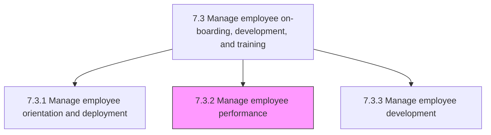
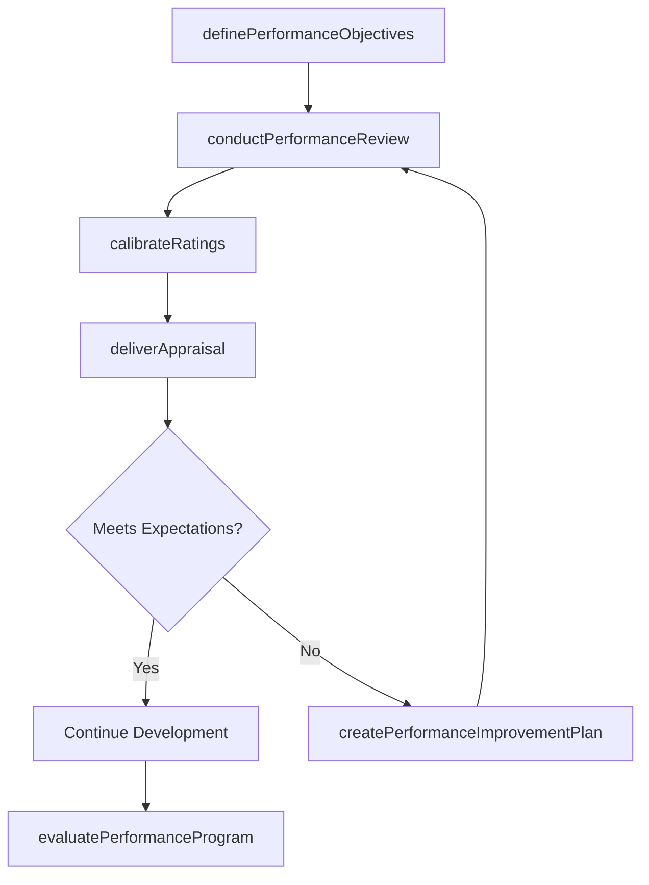

# Manage employee performance

> Business-as-Code definition for employee performance management. Models goal setting, performance review cycles, appraisal delivery, and program evaluation processes.

## Overview

Defining individual performance objectives. Review performance in order to provide appraisals. Evaluate the efficiency and effectiveness of the current performance program. Update it regularly.

## Process Hierarchy



## GraphDL

```yaml
manage:
  object: Employee Performance
  actor: PerformanceManager
  result: PerformanceAppraisal
```

## Actions

| Action | Description |
|--------|-------------|
| definePerformanceObjectives | Establish individual goals aligned with team and organizational objectives |
| conductPerformanceReview | Execute formal review cycle with manager assessment and self-evaluation |
| deliverAppraisal | Communicate performance ratings, feedback, and development recommendations |
| calibrateRatings | Normalize performance ratings across teams to ensure consistency and fairness |
| createPerformanceImprovementPlan | Design structured plan for underperforming employees with milestones |
| evaluatePerformanceProgram | Assess overall program effectiveness and recommend enhancements |

## Events

| Event | Description |
|-------|-------------|
| performanceObjectivesDefined | Individual goals and key results established for review period |
| performanceReviewConducted | Formal performance review cycle completed |
| appraisalDelivered | Performance rating and feedback communicated to employee |
| ratingsCalibrated | Cross-team rating calibration session completed |
| performanceImprovementPlanCreated | Structured improvement plan issued for underperforming employee |
| performanceProgramEvaluated | Program effectiveness assessment completed with findings |

## Searches

| Search | Description |
|--------|-------------|
| getPerformanceReviews | Retrieve review records by employee, manager, or review cycle |
| getObjectiveProgress | Query goal attainment status by employee or team |
| getCalibrationResults | List calibrated ratings by department or review period |
| getImprovementPlans | Retrieve active performance improvement plans by status |
| getPerformanceDistribution | Query rating distribution across teams or the organization |

## Process Flow



## RACI Matrix

| Activity | Responsible | Accountable | Consulted | Informed |
|----------|-------------|-------------|-----------|----------|
| definePerformanceObjectives | Manager | Department Head | HR Business Partner | Employee |
| conductPerformanceReview | Manager | Department Head | HR Business Partner | Employee |
| calibrateRatings | HR Business Partner | VP HR | Department Heads | Compensation |
| deliverAppraisal | Manager | Department Head | HR Business Partner | Employee |
| evaluatePerformanceProgram | HR Performance Analyst | CHRO | Department Heads | All Managers |

## Sub-Processes

| ID | Name | Description |
|----|------|-------------|
| 7.3.2.1 | Define employee performance objectives | Outlining the objectives for employee performance. Establish key performance objectives and measures |
| 7.3.2.2 | Review, appraise, and manage employee performance | Refurbishing, appraising, and managing the performance of employees. Create performance reviews for  |
| 7.3.2.3 | Evaluate and review performance program | Assessing and revamping performance programs, including the instruments used to measure employee per |

## Related Processes

| Process | Relationship |
|---------|-------------|
| 7.3.1 Manage employee orientation and deployment | Upstream - onboarded employees enter performance cycle |
| 7.3.3 Manage employee development | Downstream - performance gaps drive development planning |
| 7.5.1 Develop and manage reward, recognition, and motivation programs | Downstream - ratings inform compensation and reward decisions |
| 7.6.1 Manage the employee separation process | Downstream - sustained underperformance may lead to separation |

## Related Departments

| Department | Role |
|-----------|------|
| Human Resources | Designs performance framework and facilitates calibration |
| All Departments | Managers conduct reviews and set objectives for direct reports |
| Compensation | Uses performance ratings to inform merit and bonus decisions |
| Learning and Development | Addresses skill gaps identified through performance reviews |

## Related Occupations

| Occupation | Involvement |
|-----------|-------------|
| HR Business Partner | Facilitates review cycles, calibration, and manager coaching |
| People Manager | Conducts reviews, sets goals, and delivers appraisals |
| HR Performance Analyst | Analyzes program data and recommends improvements |

## KPIs

| KPI | Description | Unit |
|-----|-------------|------|
| Review Completion Rate | Percentage of employees receiving timely performance reviews | % |
| Goal Attainment Rate | Percentage of individual objectives met within review period | % |
| Calibration Variance | Standard deviation of ratings before vs. after calibration | Score |
| PIP Success Rate | Percentage of improvement plans resulting in satisfactory performance | % |

## Usage

```typescript
import { manageEmployeePerformance } from '@headlessly/manage-employee-performance'

const performance = manageEmployeePerformance()

// Define performance objectives
const objectives = await performance.definePerformanceObjectives({
  employeeId: 'emp_12345',
  reviewCycle: '2025-H2',
  goals: [
    { objective: 'Increase pipeline coverage to 3x', weight: 40 },
    { objective: 'Achieve 95% customer satisfaction', weight: 30 },
    { objective: 'Complete leadership training', weight: 30 }
  ]
})

// Conduct performance review
const review = await performance.conductPerformanceReview({
  employeeId: 'emp_12345',
  reviewCycle: '2025-H2',
  rating: 'exceeds-expectations',
  managerComments: 'Consistently exceeded targets across all objectives'
})
```
