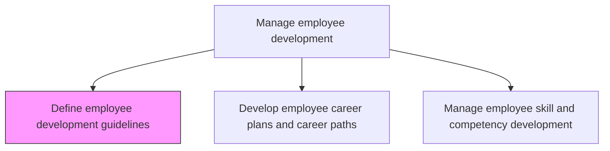
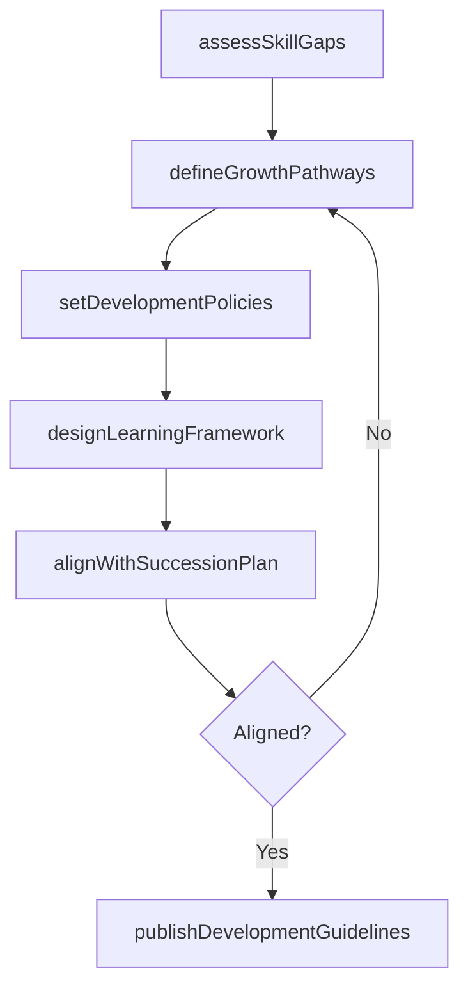

# Define employee development guidelines

> Business-as-Code definition for define employee development guidelines. Models the complete process of outlining the guidelines for development of employees.

## Overview

Outlining the guidelines for development of employees. Design development policies and procedures to identify areas of growth for employees, either in their current position or in preparation for future roles. Include topics related to knowledge and skill development. Establish eligibility criteria for training programs, tuition reimbursement, and development time allocation. Align guidelines with succession planning and organizational capability needs.

## Process Hierarchy



## GraphDL

```yaml
define:
  object: Employee Development Guidelines
  actor: LearningDevelopmentManager
  result: DevelopmentGuidelinesPolicy
```

## Actions

| Action | Description |
|--------|-------------|
| assessSkillGaps | Analyze current workforce competencies against organizational needs to identify development areas |
| defineGrowthPathways | Establish structured career pathways for vertical, lateral, and cross-functional development |
| setDevelopmentPolicies | Draft formal policies covering training eligibility, tuition reimbursement, and development time allocation |
| designLearningFramework | Create a competency-based framework that maps learning activities to role requirements |
| alignWithSuccessionPlan | Ensure development guidelines support talent pipeline and succession planning objectives |
| publishDevelopmentGuidelines | Distribute approved development guidelines to managers and employees organization-wide |

## Events

| Event | Description |
|-------|-------------|
| skillGapsAssessed | Workforce competency analysis completed and development areas identified |
| growthPathwaysDefined | Structured career development pathways established for all job families |
| developmentPoliciesSet | Formal training and development policies drafted and approved |
| learningFrameworkDesigned | Competency-based learning framework mapped to role requirements |
| successionPlanAligned | Development guidelines verified as supporting succession and talent pipeline goals |
| developmentGuidelinesPublished | Approved guidelines distributed to managers and employees across the organization |

## Searches

| Search | Description |
|--------|-------------|
| getDevelopmentGuidelines | Retrieve current development guidelines by job family, level, or department |
| getCareerPathways | List available career development pathways for a specific role or job family |
| getSkillGapAnalysis | Query skill gap assessments by department, team, or individual employee |
| getDevelopmentPolicyStatus | Check approval and publication status of development policy documents |

## Process Flow



## RACI Matrix

| Activity | Responsible | Accountable | Consulted | Informed |
|----------|-------------|-------------|-----------|----------|
| assessSkillGaps | LearningDevelopmentManager | VP HR | BusinessUnitLeaders | HRBusinessPartners |
| defineGrowthPathways | LearningDevelopmentManager | VP HR | TalentManagement | AllManagers |
| setDevelopmentPolicies | HRPolicySpecialist | VP HR | LegalCounsel | Finance |
| publishDevelopmentGuidelines | LearningDevelopmentManager | VP HR | CorporateCommunications | AllEmployees |

## Related Processes

| Process | Relationship |
|---------|-------------|
| 7.3.3.2 Develop employee career plans and career paths | Downstream - guidelines provide the framework for individual career planning |
| 7.3.3.3 Manage employee skill and competency development | Downstream - guidelines inform skill development priorities and methods |
| 7.3.4 Develop and train employees | Downstream - guidelines inform training program design and eligibility |

## Related Departments

| Department | Role |
|-----------|------|
| Learning and Development | Primary owner of development guideline creation |
| Human Resources | Provides strategic direction and policy alignment |
| Business Units | Supplies skill requirements and development needs |
| Talent Management | Ensures alignment with succession planning |

## Related Occupations

| Occupation | Involvement |
|-----------|-------------|
| Learning and Development Manager | Leads guideline creation and skill gap analysis |
| Talent Management Specialist | Aligns development with succession and talent pipeline |
| HR Policy Specialist | Drafts formal development policies and eligibility rules |

## KPIs

| KPI | Description | Unit |
|-----|-------------|------|
| Guideline Coverage | Percentage of job families with published development guidelines | % |
| Skill Gap Closure Rate | Percentage reduction in identified skill gaps year over year | % |
| Development Policy Compliance | Percentage of managers adhering to development time allocation policies | % |
| Career Pathway Utilization | Percentage of employees actively following a defined career pathway | % |

## Usage

```typescript
import { defineEmployeeDevelopmentGuidelines } from '@headlessly/define-employee-development-guidelines'

const guidelines = defineEmployeeDevelopmentGuidelines()

// Assess skill gaps across the organization
const gaps = await guidelines.assessSkillGaps({
  scope: 'enterprise',
  jobFamilies: ['engineering', 'product', 'sales', 'operations'],
  benchmarkSource: 'industry-competency-model'
})

// Define growth pathways based on gap analysis
const pathways = await guidelines.defineGrowthPathways({
  gapAnalysisId: gaps.id,
  pathwayTypes: ['vertical', 'lateral', 'cross-functional']
})
```
