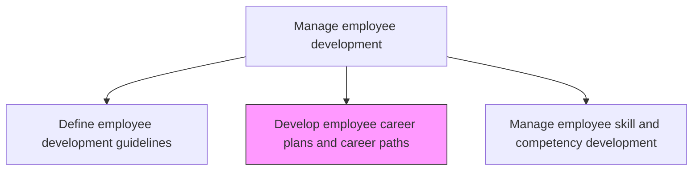
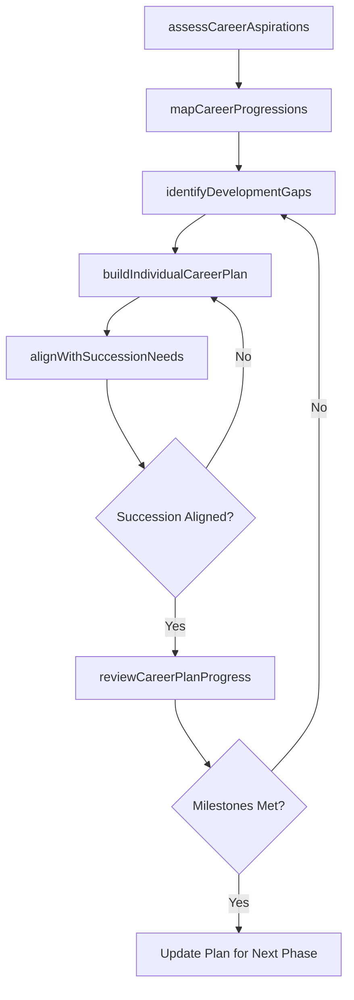

# Develop employee career plans and career paths

> Business-as-Code definition for develop employee career plans and career paths. Models the complete process of designing a future career path for the employees that encourages them to explore and gather information.

## Overview

Designing a future career path for the employees that encourages them to explore and gather information. Assess individual employee aspirations, strengths, and development needs. Map available career progressions including vertical promotions, lateral moves, and cross-functional transitions. Create individualized career plans with specific milestones, learning activities, and target timelines. Align career paths with organizational succession needs and talent pipeline priorities.

## Process Hierarchy



## GraphDL

```yaml
develop:
  object: Employee Career Plans
  actor: TalentManagementSpecialist
  result: IndividualCareerPlan
```

## Actions

| Action | Description |
|--------|-------------|
| assessCareerAspirations | Conduct career conversations to understand employee interests, strengths, and long-term goals |
| mapCareerProgressions | Identify available vertical, lateral, and cross-functional career paths within the organization |
| identifyDevelopmentGaps | Compare employee current competencies against target role requirements to surface gaps |
| buildIndividualCareerPlan | Create a personalized career plan with milestones, learning activities, and target timelines |
| alignWithSuccessionNeeds | Ensure individual career plans support organizational succession planning and critical role coverage |
| reviewCareerPlanProgress | Conduct periodic check-ins to assess progress against career plan milestones and adjust as needed |

## Events

| Event | Description |
|-------|-------------|
| careerAspirationsAssessed | Employee career interests, strengths, and goals documented through career conversations |
| careerProgressionsMapped | Available career paths identified and communicated to the employee |
| developmentGapsIdentified | Competency gaps between current role and target role surfaced and documented |
| individualCareerPlanBuilt | Personalized career plan created with milestones and learning activities |
| successionNeedsAligned | Career plan verified as supporting organizational succession and pipeline goals |
| careerPlanProgressReviewed | Periodic check-in completed with progress assessed and plan adjusted |

## Searches

| Search | Description |
|--------|-------------|
| getCareerPlanByEmployee | Retrieve the active career plan for a specific employee including milestones and progress |
| findCareerPaths | List available career progressions filtered by job family, department, or transition type |
| getSuccessionCoverage | Query succession plan coverage showing career-planned employees mapped to critical roles |
| getCareerPlanMetrics | Retrieve aggregate career planning statistics by department or organization |

## Process Flow



## RACI Matrix

| Activity | Responsible | Accountable | Consulted | Informed |
|----------|-------------|-------------|-----------|----------|
| assessCareerAspirations | DirectManager | HRBusinessPartner | Employee | TalentManagement |
| mapCareerProgressions | TalentManagementSpecialist | LearningDevelopmentManager | HRBusinessPartner | AllManagers |
| buildIndividualCareerPlan | Employee | DirectManager | TalentManagementSpecialist | HRBusinessPartner |
| alignWithSuccessionNeeds | TalentManagementSpecialist | VP HR | DepartmentHeads | CHRO |

## Related Processes

| Process | Relationship |
|---------|-------------|
| 7.3.3.1 Define employee development guidelines | Upstream - guidelines provide the framework and policies for career planning |
| 7.3.3.3 Manage employee skill and competency development | Downstream - career plans drive skill development activities and priorities |
| 7.3.2.1 Define employee performance objectives | Parallel - performance objectives and career plans should reinforce each other |

## Related Departments

| Department | Role |
|-----------|------|
| Talent Management | Designs career path frameworks and succession alignment |
| Learning and Development | Provides learning activities and resources for career development |
| Business Units | Identifies career opportunities and supports employee transitions |
| Human Resources | Oversees career planning policies and equity in opportunity access |

## Related Occupations

| Occupation | Involvement |
|-----------|-------------|
| Talent Management Specialist | Designs career path frameworks and maps succession coverage |
| HR Business Partner | Facilitates career conversations and aligns plans with business needs |
| Direct Manager | Conducts career conversations and supports employee development |

## KPIs

| KPI | Description | Unit |
|-----|-------------|------|
| Career Plan Coverage | Percentage of employees with an active individualized career plan | % |
| Internal Mobility Rate | Percentage of open positions filled by internal candidates following career paths | % |
| Career Plan Milestone Achievement | Percentage of career plan milestones completed on schedule | % |
| Succession Pipeline Strength | Percentage of critical roles with at least two career-planned successors | % |

## Usage

```typescript
import { developEmployeeCareerPlans } from '@headlessly/develop-employee-career-plans-and-career-paths'

const careers = developEmployeeCareerPlans()

// Assess career aspirations for an employee
const aspirations = await careers.assessCareerAspirations({
  employeeId: 'EMP-5102',
  conversationType: 'annual-career-review',
  includeStrengthsAssessment: true
})

// Build an individualized career plan
const plan = await careers.buildIndividualCareerPlan({
  employeeId: 'EMP-5102',
  targetRole: 'engineering-manager',
  currentCompetencies: aspirations.competencyProfile,
  timelineMonths: 24,
  learningActivities: ['leadership-program', 'project-management-cert', 'cross-team-rotation']
})
```
