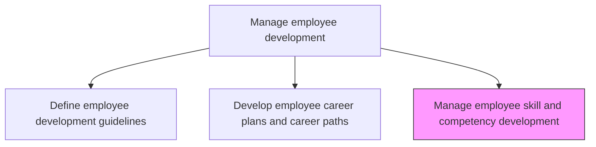
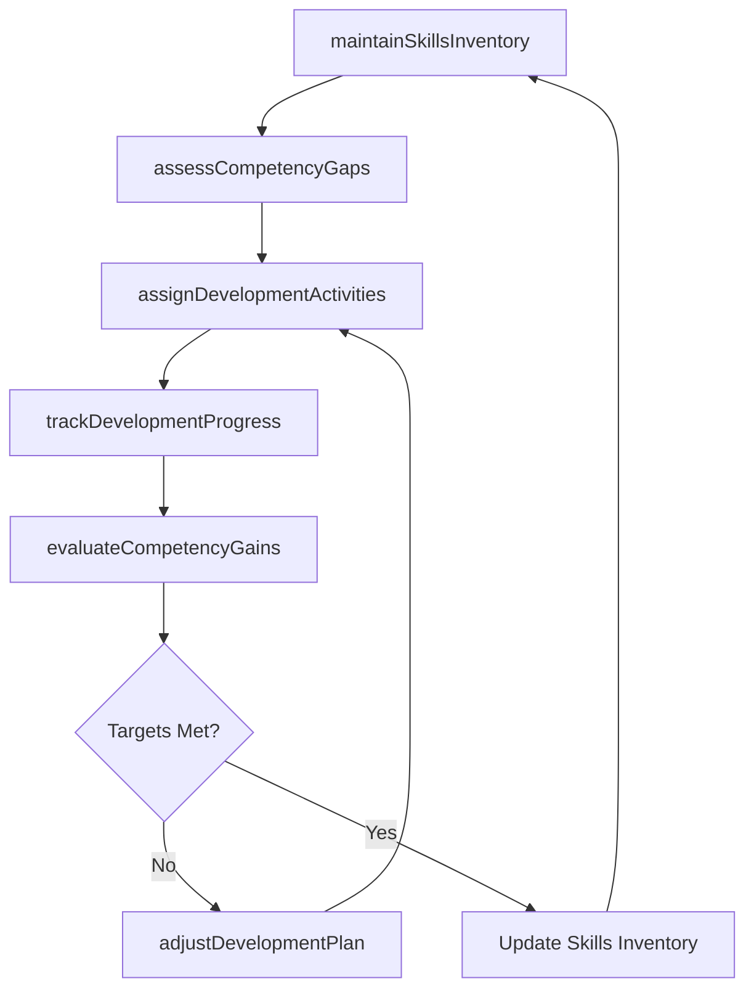

# Manage employee skill and competency development

> Business-as-Code definition for manage employee skill and competency development. Models the complete process of administering the development of employee skills.

## Overview

Administering the development of employee skills. Conduct training, coaching and mentoring, job-rotation and cross training, lateral moves, and stretch assignments. Maintain a skills inventory that tracks each employee's current competency levels. Match employees to development opportunities based on their career plans and organizational needs. Monitor progress toward skill targets and adjust development activities as gaps evolve.

## Process Hierarchy



## GraphDL

```yaml
manage:
  object: Skill And Competency Development
  actor: LearningDevelopmentManager
  result: CompetencyProgressRecord
```

## Actions

| Action | Description |
|--------|-------------|
| maintainSkillsInventory | Update and curate the organization-wide skills database with current employee competency levels |
| assessCompetencyGaps | Compare employee skill profiles against role requirements and career plan targets |
| assignDevelopmentActivities | Match employees to training courses, coaching, mentoring, rotations, or stretch assignments |
| trackDevelopmentProgress | Monitor employee advancement through assigned development activities and competency milestones |
| evaluateCompetencyGains | Measure skill improvement through assessments, manager observations, and certification results |
| adjustDevelopmentPlan | Revise development activities based on progress reviews and changing organizational needs |

## Events

| Event | Description |
|-------|-------------|
| skillsInventoryUpdated | Employee competency levels refreshed in the organization-wide skills database |
| competencyGapsAssessed | Skill gaps identified between current levels and role or career plan requirements |
| developmentActivitiesAssigned | Employee matched to specific training, mentoring, rotation, or stretch assignment |
| developmentProgressTracked | Employee advancement through assigned development milestones recorded |
| competencyGainsEvaluated | Skill improvement measured through assessments or certification results |
| developmentPlanAdjusted | Development activities revised based on progress review or evolving needs |

## Searches

| Search | Description |
|--------|-------------|
| getSkillsInventory | Retrieve employee competency profiles filtered by skill, level, department, or team |
| findCompetencyGaps | List employees with skill gaps against their role requirements or career targets |
| getDevelopmentAssignments | Query active development activities by employee, type, or status |
| getCompetencyTrends | Retrieve competency level trends over time for an employee, team, or organization |

## Process Flow



## RACI Matrix

| Activity | Responsible | Accountable | Consulted | Informed |
|----------|-------------|-------------|-----------|----------|
| maintainSkillsInventory | HRAnalyst | LearningDevelopmentManager | AllManagers | HRIS |
| assessCompetencyGaps | DirectManager | LearningDevelopmentManager | Employee | HRBusinessPartner |
| assignDevelopmentActivities | DirectManager | LearningDevelopmentManager | Employee | TrainingCoordinator |
| evaluateCompetencyGains | DirectManager | LearningDevelopmentManager | TrainingSpecialist | HRAnalyst |

## Related Processes

| Process | Relationship |
|---------|-------------|
| 7.3.3.1 Define employee development guidelines | Upstream - guidelines define the competency framework and development policies |
| 7.3.3.2 Develop employee career plans and career paths | Upstream - career plans drive individual skill development priorities |
| 7.3.4 Develop and train employees | Downstream - skill gaps feed into training program design and delivery |

## Related Departments

| Department | Role |
|-----------|------|
| Learning and Development | Designs development activities and manages the competency framework |
| Human Resources | Oversees skill development policies and workforce planning alignment |
| Business Units | Identifies role-specific skill requirements and provides on-the-job development |
| HRIS | Maintains the skills inventory database and reporting tools |

## Related Occupations

| Occupation | Involvement |
|-----------|-------------|
| Learning and Development Manager | Oversees the competency framework and development activity portfolio |
| Direct Manager | Assesses employee skills, assigns activities, and evaluates progress |
| HR Analyst | Maintains skills inventory data and generates competency trend reports |

## KPIs

| KPI | Description | Unit |
|-----|-------------|------|
| Skills Inventory Currency | Percentage of employee profiles updated within the last 12 months | % |
| Competency Gap Closure Rate | Percentage of identified skill gaps closed through development activities | % |
| Development Activity Completion | Percentage of assigned development activities completed on schedule | % |
| Certification Attainment Rate | Percentage of employees achieving targeted professional certifications | % |

## Usage

```typescript
import { manageEmployeeSkillAndCompetencyDevelopment } from '@headlessly/manage-employee-skill-and-competency-development'

const skills = manageEmployeeSkillAndCompetencyDevelopment()

// Assess competency gaps for a team
const gaps = await skills.assessCompetencyGaps({
  teamId: 'engineering-platform',
  competencyFramework: 'software-engineering-v3',
  includeCareerPlanTargets: true
})

// Assign development activities based on identified gaps
const assignments = await skills.assignDevelopmentActivities({
  employeeId: 'EMP-4410',
  gaps: gaps.employeeGaps['EMP-4410'],
  activityTypes: ['online-course', 'mentoring', 'stretch-assignment']
})
```
