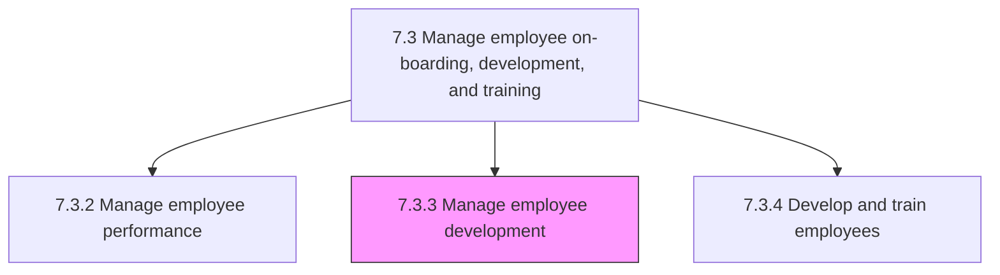
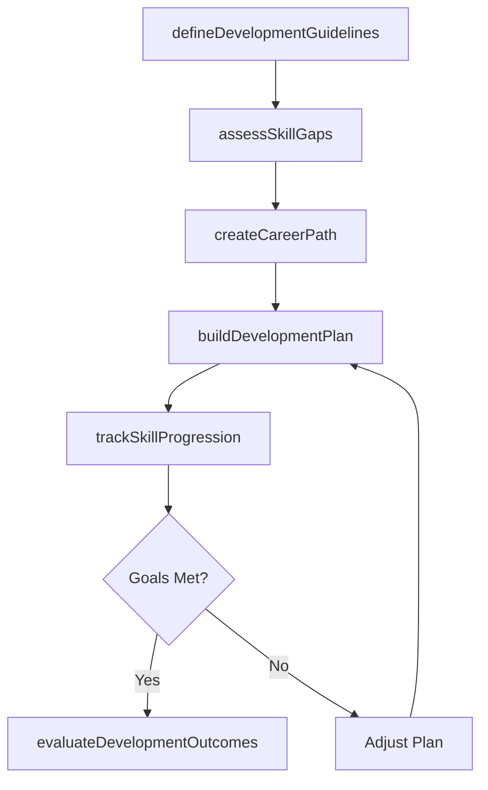

# Manage employee development

> Business-as-Code definition for employee development management. Models development guideline creation, career path planning, and skill and competency development programs.

## Overview

Establishing employee development guidelines. Lay out career paths and plans for them. Manage the development of their skills to enhance their skills, ability, and knowledge.

## Process Hierarchy



## GraphDL

```yaml
manage:
  object: Employee Development
  actor: TalentDevelopmentManager
  result: DevelopmentPlan
```

## Actions

| Action | Description |
|--------|-------------|
| defineDevelopmentGuidelines | Establish organizational policies for employee development and career growth |
| assessSkillGaps | Evaluate current competencies against role requirements and career aspirations |
| createCareerPath | Design structured progression routes with role milestones and competency requirements |
| buildDevelopmentPlan | Construct individualized development plans with learning activities and timelines |
| trackSkillProgression | Monitor employee competency advancement against development plan milestones |
| evaluateDevelopmentOutcomes | Measure program impact on employee readiness and career advancement |

## Events

| Event | Description |
|-------|-------------|
| developmentGuidelinesDefined | Organizational development policies published |
| skillGapsAssessed | Competency gap analysis completed for employee or team |
| careerPathCreated | Structured career progression route established |
| developmentPlanBuilt | Individualized development plan approved and activated |
| skillProgressionTracked | Competency milestone achievement recorded |
| developmentOutcomesEvaluated | Development program impact assessment completed |

## Searches

| Search | Description |
|--------|-------------|
| getDevelopmentPlans | Retrieve development plans by employee, department, or status |
| getCareerPaths | List available career paths by role family or level |
| getSkillGapAnalysis | Query competency gap data by employee, team, or skill category |
| getSuccessionCandidates | List employees ready for advancement based on development progress |

## Process Flow



## RACI Matrix

| Activity | Responsible | Accountable | Consulted | Informed |
|----------|-------------|-------------|-----------|----------|
| defineDevelopmentGuidelines | Talent Development Manager | VP HR | Department Heads | All Managers |
| assessSkillGaps | Manager | Department Head | HR Business Partner | Employee |
| createCareerPath | Talent Development Manager | VP HR | Department Heads | All Employees |
| buildDevelopmentPlan | Manager | Department Head | Talent Development Manager | Employee |
| evaluateDevelopmentOutcomes | Talent Development Manager | CHRO | Finance | Executive Team |

## Sub-Processes

| ID | Name | Description |
|----|------|-------------|
| 7.3.3.1 | Define employee development guidelines | Outlining the guidelines for development of employees. Design development policies and procedures to |
| 7.3.3.2 | Develop employee career plans and career paths | Designing a future career path for the employees that encourages them to explore and gather informat |
| 7.3.3.3 | Manage employee skill and competency development | Administering the development of employee skills. Conduct training, coaching and mentoring, job-rota |

## Related Processes

| Process | Relationship |
|---------|-------------|
| 7.3.2 Manage employee performance | Upstream - performance gaps drive development planning |
| 7.3.4 Develop and train employees | Downstream - development plans feed into training programs |
| 7.5.1 Develop and manage reward, recognition, and motivation programs | Parallel - career advancement tied to reward structures |
| 7.1.2 Develop and implement workforce strategy and policies | Upstream - workforce strategy defines competency frameworks |

## Related Departments

| Department | Role |
|-----------|------|
| Learning and Development | Designs career frameworks and manages development programs |
| Human Resources | Governs development policies and tracks succession readiness |
| All Departments | Managers create and monitor individual development plans |
| Finance | Approves development budgets and tracks investment returns |

## Related Occupations

| Occupation | Involvement |
|-----------|-------------|
| Talent Development Manager | Designs career paths and organizational competency frameworks |
| HR Business Partner | Advises managers on development planning and succession |
| Career Coach | Provides one-on-one guidance for employee career progression |

## KPIs

| KPI | Description | Unit |
|-----|-------------|------|
| Development Plan Completion Rate | Percentage of employees completing their development plans on schedule | % |
| Internal Promotion Rate | Percentage of open positions filled by internal candidates | % |
| Skill Gap Closure Rate | Percentage of identified competency gaps closed within target period | % |
| Succession Pipeline Depth | Average number of ready-now successors per critical role | Ratio |

## Usage

```typescript
import { manageEmployeeDevelopment } from '@headlessly/manage-employee-development'

const development = manageEmployeeDevelopment()

// Assess skill gaps for an employee
const gaps = await development.assessSkillGaps({
  employeeId: 'emp_12345',
  targetRole: 'senior-product-manager',
  competencyFramework: 'product-management-v3'
})

// Build a development plan
const plan = await development.buildDevelopmentPlan({
  employeeId: 'emp_12345',
  skillGaps: gaps.gaps,
  activities: ['leadership-workshop', 'cross-functional-project', 'executive-mentoring'],
  targetDate: '2025-12-31'
})
```
