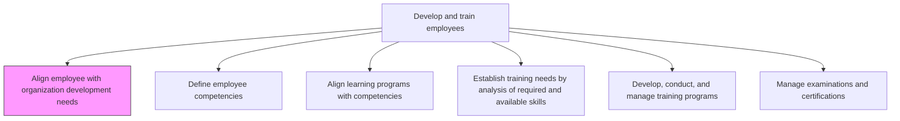
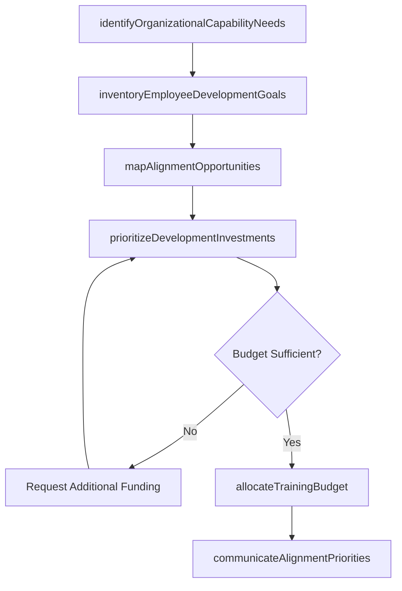

# Align employee with organization development needs

> Business-as-Code definition for align employee with organization development needs. Models the complete process of aligning the needs of the employees to organizational development needs.

## Overview

Aligning the needs of the employees to organizational development needs. Identify strategic capability requirements from workforce planning and business strategy. Map employee development aspirations against these organizational needs. Prioritize development investments where individual growth goals and organizational capability gaps intersect. Ensure training budgets and development resources are directed toward the highest-impact alignment opportunities.

## Process Hierarchy



## GraphDL

```yaml
align:
  object: Employee Development Alignment
  actor: TalentManagementSpecialist
  result: DevelopmentAlignmentPlan
```

## Actions

| Action | Description |
|--------|-------------|
| identifyOrganizationalCapabilityNeeds | Extract strategic capability requirements from workforce plans and business strategy |
| inventoryEmployeeDevelopmentGoals | Collect individual employee development aspirations and growth interests |
| mapAlignmentOpportunities | Overlay individual goals onto organizational needs to identify high-impact intersections |
| prioritizeDevelopmentInvestments | Rank alignment opportunities by strategic impact and feasibility to guide resource allocation |
| allocateTrainingBudget | Direct training budgets and development resources toward prioritized alignment opportunities |
| communicateAlignmentPriorities | Share development alignment priorities with managers and employees to guide planning |

## Events

| Event | Description |
|-------|-------------|
| organizationalCapabilityNeedsIdentified | Strategic capability requirements extracted from workforce and business plans |
| employeeDevelopmentGoalsInventoried | Individual development aspirations collected across the organization |
| alignmentOpportunitiesMapped | High-impact intersections between individual goals and organizational needs identified |
| developmentInvestmentsPrioritized | Alignment opportunities ranked and resource allocation plan finalized |
| trainingBudgetAllocated | Development funds directed to prioritized alignment opportunities |
| alignmentPrioritiesCommunicated | Development priorities shared with managers and employees |

## Searches

| Search | Description |
|--------|-------------|
| getCapabilityNeedsByStrategy | Retrieve organizational capability gaps derived from strategic workforce plans |
| getEmployeeDevelopmentGoals | List individual development aspirations filtered by department, role, or skill area |
| getAlignmentMatrix | Query the overlay of employee goals against organizational needs with impact scores |
| getBudgetAllocationByPriority | Retrieve training budget distribution across alignment priority categories |

## Process Flow



## RACI Matrix

| Activity | Responsible | Accountable | Consulted | Informed |
|----------|-------------|-------------|-----------|----------|
| identifyOrganizationalCapabilityNeeds | TalentManagementSpecialist | VP HR | StrategyTeam | DepartmentHeads |
| inventoryEmployeeDevelopmentGoals | HRBusinessPartner | LearningDevelopmentManager | AllManagers | Employees |
| prioritizeDevelopmentInvestments | LearningDevelopmentManager | VP HR | Finance | CHRO |
| allocateTrainingBudget | LearningDevelopmentManager | VP HR | Finance | DepartmentHeads |

## Related Processes

| Process | Relationship |
|---------|-------------|
| 7.3.4.2 Define employee competencies | Downstream - alignment priorities inform which competencies to develop |
| 7.3.4.4 Establish training needs by analysis of required and available skills | Downstream - alignment drives training needs analysis scope and priorities |
| 7.3.3.1 Define employee development guidelines | Upstream - development guidelines provide the policy framework for alignment |

## Related Departments

| Department | Role |
|-----------|------|
| Talent Management | Maps organizational capability needs against individual employee goals |
| Learning and Development | Translates alignment priorities into development programs |
| Strategy/Planning | Provides strategic capability requirements from business plans |
| Finance | Approves and monitors training budget allocation |

## Related Occupations

| Occupation | Involvement |
|-----------|-------------|
| Talent Management Specialist | Leads alignment analysis between organizational needs and employee goals |
| Learning and Development Manager | Translates alignment priorities into actionable development plans |
| HR Business Partner | Collects employee development aspirations and facilitates alignment conversations |

## KPIs

| KPI | Description | Unit |
|-----|-------------|------|
| Alignment Score | Percentage of development investments directed at organizational capability gaps | % |
| Employee Goal Coverage | Percentage of employees whose development goals map to organizational needs | % |
| Strategic Capability Gap Closure | Percentage of identified strategic capability gaps with active development investments | % |
| Budget Utilization Efficiency | Ratio of development budget spent on aligned priorities vs. total budget | % |

## Usage

```typescript
import { alignEmployeeWithOrganizationDevelopmentNeeds } from '@headlessly/align-employee-with-organization-development-needs'

const alignment = alignEmployeeWithOrganizationDevelopmentNeeds()

// Map alignment opportunities between employee goals and organizational needs
const opportunities = await alignment.mapAlignmentOpportunities({
  department: 'engineering',
  strategyPeriod: '2026-2028',
  capabilityAreas: ['cloud-architecture', 'ai-ml', 'platform-engineering']
})

// Prioritize development investments based on alignment impact
const priorities = await alignment.prioritizeDevelopmentInvestments({
  alignmentMapId: opportunities.id,
  budgetPool: 250000,
  rankBy: ['strategic-impact', 'employee-count', 'time-to-capability']
})
```
