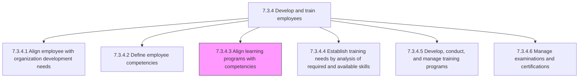
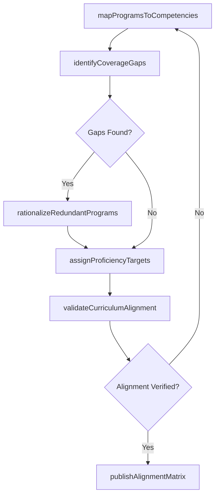

# Align learning programs with competencies

> Business-as-Code definition for aligning learning programs with competencies. Models the process of mapping organizational training offerings to defined competency frameworks so that every course, module, and learning path directly addresses a specific skill or knowledge gap.

## Overview

Aligning the learning programs with the core capabilities and competencies of the organization. Map each training offering to specific competency domains and proficiency levels. Identify coverage gaps where no learning program addresses a required competency, and eliminate redundant offerings that overlap without adding value. Contextualize training so employees can expand their knowledge base along defined career progression paths aligned with organizational competency models.

## Process Hierarchy



## GraphDL

```yaml
align:
  object: Learning Programs With Competencies
  actor: LearningDevelopmentManager
  result: CompetencyAlignmentMap
```

## Actions

| Action | Description |
|--------|-------------|
| mapProgramsToCompetencies | Create explicit linkages between learning programs and competency framework domains |
| identifyCoverageGaps | Detect competencies that lack corresponding learning programs or adequate depth |
| rationalizeRedundantPrograms | Consolidate or retire overlapping learning offerings targeting the same competency |
| assignProficiencyTargets | Set target proficiency levels each learning program is designed to achieve |
| validateCurriculumAlignment | Review course content against competency definitions to ensure accurate mapping |
| publishAlignmentMatrix | Release the finalized competency-to-program mapping for organizational use |

## Events

| Event | Description |
|-------|-------------|
| programsMappedToCompetencies | Learning programs linked to their corresponding competency domains |
| coverageGapsIdentified | Competencies lacking adequate learning program coverage detected |
| redundantProgramsRationalized | Overlapping learning offerings consolidated or retired |
| proficiencyTargetsAssigned | Target proficiency levels set for each learning program |
| curriculumAlignmentValidated | Course content verified against competency definitions |
| alignmentMatrixPublished | Finalized competency-to-program mapping released to stakeholders |

## Searches

| Search | Description |
|--------|-------------|
| findProgramsByCompetency | List learning programs mapped to a specific competency domain or skill area |
| getCoverageGapReport | Retrieve competencies with insufficient or missing learning program coverage |
| getAlignmentMatrix | Access the full competency-to-program mapping for a business unit or job family |
| getProficiencyPathways | Retrieve learning paths organized by proficiency level progression |

## Process Flow



## RACI Matrix

| Activity | Responsible | Accountable | Consulted | Informed |
|----------|-------------|-------------|-----------|----------|
| mapProgramsToCompetencies | InstructionalDesigner | LearningDevelopmentManager | SubjectMatterExperts | HRBusinessPartner |
| identifyCoverageGaps | LearningDevelopmentManager | HRDirector | DepartmentManagers | TalentManagement |
| validateCurriculumAlignment | InstructionalDesigner | LearningDevelopmentManager | SubjectMatterExperts | CompetencyFrameworkOwner |
| publishAlignmentMatrix | LearningDevelopmentManager | HRDirector | TalentManagement | AllManagers |

## Related Processes

| Process | Relationship |
|---------|-------------|
| 7.3.4.2 Define employee competencies | Upstream - provides the competency framework to align against |
| 7.3.4.4 Establish training needs by analysis of required and available skills | Downstream - uses alignment data to identify skills gaps |
| 7.3.4.5 Develop, conduct, and manage training programs | Downstream - alignment drives curriculum design and delivery |
| 7.3.4 Develop and train employees | Parent - governing process group |

## Related Departments

| Department | Role |
|-----------|------|
| Learning and Development | Owns the alignment process and learning program catalog |
| Talent Management | Provides competency framework and career path definitions |
| Human Resources | Ensures alignment supports workforce planning objectives |
| Business Units | Validate that aligned programs address operational skill requirements |

## Related Occupations

| Occupation | Involvement |
|-----------|-------------|
| Learning Development Manager | Leads the alignment effort and approves the final mapping |
| Instructional Designer | Maps course content to competency elements and proficiency levels |
| Talent Management Specialist | Provides competency framework structure and career path data |

## KPIs

| KPI | Description | Unit |
|-----|-------------|------|
| Competency Coverage Rate | Percentage of defined competencies with at least one aligned learning program | % |
| Program Utilization by Competency | Enrollment rate for programs mapped to high-priority competency gaps | % |
| Alignment Accuracy | Percentage of program-competency mappings validated by subject matter experts | % |
| Redundancy Reduction | Number of overlapping programs consolidated during alignment | Count |

## Usage

```typescript
import { alignLearningProgramsWithCompetencies } from '@headlessly/align-learning-programs-with-competencies'

const alignment = alignLearningProgramsWithCompetencies()

// Map all active programs to competency domains
const matrix = await alignment.mapProgramsToCompetencies({
  competencyFrameworkId: 'enterprise-competency-model-v3',
  programCatalog: 'active',
  includeExternalProviders: true
})

// Identify competencies with no learning coverage
const gaps = await alignment.identifyCoverageGaps({
  frameworkId: 'enterprise-competency-model-v3',
  minimumProficiencyLevel: 3,
  businessUnit: 'engineering'
})
```
