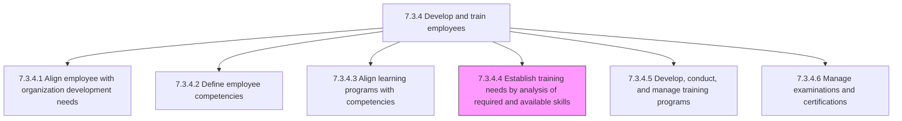
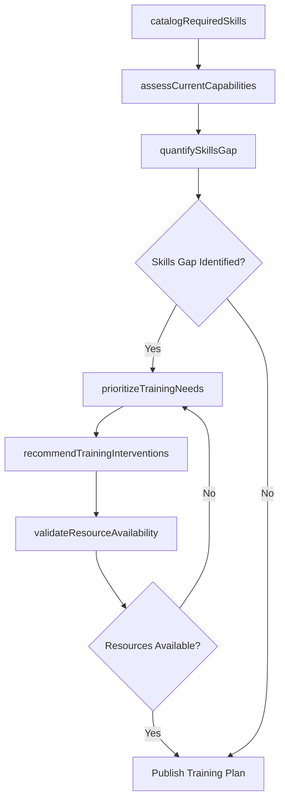

# Establish training needs by analysis of required and available skills

> Business-as-Code definition for establishing training needs through skills gap analysis. Models the end-to-end process of inventorying required skills, assessing current workforce capabilities, quantifying gaps, and translating those gaps into prioritized training requirements.

## Overview

Determining the training necessitated by business processes, using an examination of skill sets that are needed by the organization and those already possessed. Catalog the skills and proficiency levels required for each role. Assess current employee capabilities through self-assessments, manager evaluations, and competency testing. Quantify the gap between required and available skills. Prioritize training needs based on business impact, urgency, and resource availability. Design training recommendations in light of the availability of resources to provide specific segments of training.

## Process Hierarchy



## GraphDL

```yaml
establish:
  object: Training Needs By Analysis Of Required And Available Skills
  actor: LearningDevelopmentManager
  result: SkillsGapAnalysis
```

## Actions

| Action | Description |
|--------|-------------|
| catalogRequiredSkills | Inventory the skills and proficiency levels required for each role and business process |
| assessCurrentCapabilities | Evaluate existing workforce skills through assessments, evaluations, and testing |
| quantifySkillsGap | Calculate the delta between required and available skills across the organization |
| prioritizeTrainingNeeds | Rank training needs by business impact, strategic urgency, and feasibility |
| recommendTrainingInterventions | Propose specific training programs, formats, and timelines to close priority gaps |
| validateResourceAvailability | Confirm budget, facilitator capacity, and scheduling feasibility for recommended training |

## Events

| Event | Description |
|-------|-------------|
| requiredSkillsCataloged | Skills inventory for all target roles and processes completed |
| currentCapabilitiesAssessed | Workforce skills assessment data collected and scored |
| skillsGapQuantified | Gap analysis between required and available skills calculated |
| trainingNeedsPrioritized | Training needs ranked by business impact and urgency |
| trainingInterventionsRecommended | Specific training programs proposed to close identified gaps |
| resourceAvailabilityValidated | Budget and capacity confirmed for recommended training plan |

## Searches

| Search | Description |
|--------|-------------|
| findSkillsGapsByDepartment | List skills gaps filtered by department, role, or business unit |
| getRequiredSkillsInventory | Retrieve the required skills catalog for a specific role or job family |
| getCapabilityAssessmentResults | Access individual or aggregate skills assessment scores |
| getTrainingNeedsPriority | Retrieve prioritized training needs ranked by business impact |

## Process Flow



## RACI Matrix

| Activity | Responsible | Accountable | Consulted | Informed |
|----------|-------------|-------------|-----------|----------|
| catalogRequiredSkills | TalentManagementSpecialist | LearningDevelopmentManager | DepartmentManagers | HRBusinessPartner |
| assessCurrentCapabilities | HRAnalyst | LearningDevelopmentManager | Employees | DepartmentManagers |
| quantifySkillsGap | HRAnalyst | LearningDevelopmentManager | TalentManagementSpecialist | HRDirector |
| prioritizeTrainingNeeds | LearningDevelopmentManager | HRDirector | DepartmentManagers | Finance |

## Related Processes

| Process | Relationship |
|---------|-------------|
| 7.3.4.2 Define employee competencies | Upstream - competency definitions provide the required skills baseline |
| 7.3.4.3 Align learning programs with competencies | Upstream - alignment data reveals coverage gaps informing training needs |
| 7.3.4.5 Develop, conduct, and manage training programs | Downstream - training needs drive program design and delivery |
| 7.3.4 Develop and train employees | Parent - governing process group |

## Related Departments

| Department | Role |
|-----------|------|
| Learning and Development | Leads the skills gap analysis and training needs assessment |
| Talent Management | Provides competency frameworks and workforce planning data |
| Human Resources | Coordinates workforce capability assessments and data collection |
| Business Units | Identify role-specific skill requirements and validate gap priorities |

## Related Occupations

| Occupation | Involvement |
|-----------|-------------|
| Learning Development Manager | Leads the training needs assessment and approves recommendations |
| HR Analyst | Collects and analyzes skills assessment data and gap metrics |
| Talent Management Specialist | Provides competency models and career path skill requirements |

## KPIs

| KPI | Description | Unit |
|-----|-------------|------|
| Skills Gap Coverage | Percentage of identified skills gaps addressed by a training plan | % |
| Assessment Completion Rate | Percentage of employees completing skills assessments on schedule | % |
| Training Need Accuracy | Proportion of recommended training that results in measurable skill improvement | % |
| Time to Needs Identification | Average calendar days from assessment launch to published training plan | Days |

## Usage

```typescript
import { establishTrainingNeeds } from '@headlessly/establish-training-needs'

const analysis = establishTrainingNeeds()

// Assess current capabilities across an engineering department
const assessment = await analysis.assessCurrentCapabilities({
  department: 'engineering',
  assessmentMethod: ['self-assessment', 'manager-evaluation', 'skills-test'],
  competencyFrameworkId: 'enterprise-competency-model-v3'
})

// Quantify skills gaps and prioritize training needs
const gaps = await analysis.quantifySkillsGap({
  assessmentId: assessment.id,
  minimumGapThreshold: 1.5,
  prioritizeBy: 'business-impact'
})
```
