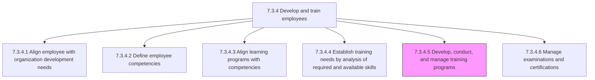
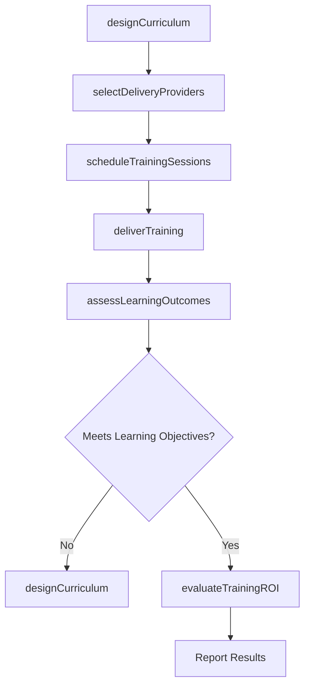

# Develop, conduct, and manage employee and/or management training programs

> Business-as-Code definition for developing, conducting, and managing employee and management training programs. Models the end-to-end lifecycle of designing training curricula, sourcing delivery resources, delivering sessions across multiple formats, and administering program logistics for technical, interpersonal, and leadership development tracks.

## Overview

Creating, implementing, and managing the programs for training employees. Design course curricula based on established skills gaps and competency alignment data. Source internal facilitators and external vendors for specialized content areas. Conduct sessions through classroom, virtual, blended, and self-paced formats. Manage all enrollment, scheduling, venue, materials, and budget logistics. Evaluate training effectiveness through post-session assessments, on-the-job observation, and business outcome correlation. Consider including literacy training, interpersonal skills training, technical training, problem-solving training, diversity or sensitivity training, and leadership development.

## Process Hierarchy



## GraphDL

```yaml
develop:
  object: Training Programs
  actor: LearningDevelopmentManager
  result: TrainingProgramPortfolio
```

## Actions

| Action | Description |
|--------|-------------|
| designCurriculum | Author course content, learning objectives, and assessment criteria for each training track |
| selectDeliveryProviders | Evaluate and engage internal facilitators or external vendors for specialized training delivery |
| scheduleTrainingSessions | Plan session dates, cohort assignments, and venue or platform arrangements |
| deliverTraining | Conduct training sessions through classroom, virtual, or blended learning formats |
| assessLearningOutcomes | Measure participant knowledge gain through post-session tests and practical exercises |
| evaluateTrainingROI | Correlate training investment with on-the-job performance improvement and business results |

## Events

| Event | Description |
|-------|-------------|
| curriculumDesigned | Course content and learning objectives finalized for a training track |
| deliveryProvidersSelected | Internal or external training facilitators evaluated and engaged |
| trainingSessionsScheduled | Session calendar published with cohort assignments and logistics confirmed |
| trainingDelivered | Training session conducted and attendance recorded |
| learningOutcomesAssessed | Post-training knowledge assessments scored and analyzed |
| trainingROIEvaluated | Training investment correlated with performance improvement metrics |

## Searches

| Search | Description |
|--------|-------------|
| findTrainingPrograms | List training programs filtered by track type, department, format, or status |
| getSessionCalendar | Retrieve upcoming training sessions with enrollment counts and availability |
| getLearningOutcomes | Query participant completion rates and assessment scores by program or cohort |
| getTrainingBudgetUtilization | Access training spend and remaining budget by program, department, or fiscal period |

## Process Flow



## RACI Matrix

| Activity | Responsible | Accountable | Consulted | Informed |
|----------|-------------|-------------|-----------|----------|
| designCurriculum | InstructionalDesigner | LearningDevelopmentManager | SubjectMatterExperts | HRBusinessPartner |
| selectDeliveryProviders | LearningDevelopmentManager | HRDirector | Procurement | Finance |
| deliverTraining | TrainingFacilitator | LearningDevelopmentManager | DepartmentManagers | Participants |
| evaluateTrainingROI | HRAnalyst | LearningDevelopmentManager | Finance | ExecutiveLeadership |

## Related Processes

| Process | Relationship |
|---------|-------------|
| 7.3.4.4 Establish training needs by analysis of required and available skills | Upstream - skills gap data drives curriculum design |
| 7.3.4.3 Align learning programs with competencies | Upstream - competency alignment ensures programs target the right skills |
| 7.3.4.6 Manage examinations and certifications | Downstream - training completion feeds into certification eligibility |
| 7.3.4 Develop and train employees | Parent - governing process group |

## Related Departments

| Department | Role |
|-----------|------|
| Learning and Development | Designs, delivers, and manages training programs end-to-end |
| Human Resources | Oversees employee development strategy and training budget |
| Business Units | Nominate participants and validate training relevance to operational needs |
| IT | Supports learning management systems and virtual delivery platforms |

## Related Occupations

| Occupation | Involvement |
|-----------|-------------|
| Learning Development Manager | Leads training program strategy, vendor selection, and effectiveness measurement |
| Instructional Designer | Creates training content, learning assessments, and course materials |
| Training Facilitator | Delivers training sessions and manages in-session participant engagement |

## KPIs

| KPI | Description | Unit |
|-----|-------------|------|
| Training Completion Rate | Percentage of enrolled participants who complete assigned training on time | % |
| Post-Training Proficiency Gain | Average competency score increase measured before and after training | Score delta |
| Participant Satisfaction | Average satisfaction rating from post-training evaluation surveys | Score (1-5) |
| Training ROI | Net performance improvement value relative to training program cost | Ratio |

## Usage

```typescript
import { developTrainingPrograms } from '@headlessly/develop-training-programs'

const training = developTrainingPrograms()

// Design a new leadership curriculum
const curriculum = await training.designCurriculum({
  trackType: 'leadership-development',
  targetAudience: 'people-managers',
  learningObjectives: ['strategic-thinking', 'coaching', 'change-management'],
  deliveryFormat: 'blended'
})

// Evaluate ROI for completed training programs
const roi = await training.evaluateTrainingROI({
  programId: 'leadership-foundations-2026',
  metrics: ['promotion-rate', 'engagement-score', 'retention-rate'],
  measurementPeriod: '6-months-post-completion'
})
```
