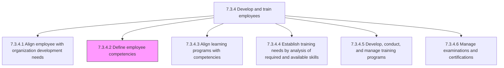
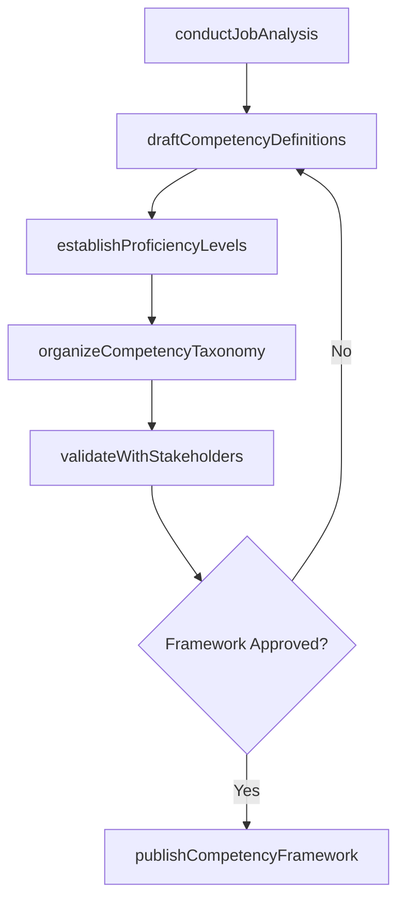

# Define employee competencies

> Business-as-Code definition for defining employee competencies. Models the process of identifying, articulating, and structuring the skills, knowledge, abilities, and behavioral attributes required for each role, forming the competency framework that underpins talent development, performance management, and succession planning.

## Overview

Defining the skills, knowledge, abilities, and attributes needed to carry out a specific job. Analyze each role to identify functional, technical, and behavioral competencies required at various proficiency levels. Structure competencies into a hierarchical framework organized by competency domains, clusters, and individual competency elements. Establish proficiency level descriptors (e.g., foundational, proficient, advanced, expert) for each competency. Validate the framework with subject matter experts and business leaders. Publish the competency model for use in hiring, development, performance evaluation, and career pathing.

## Process Hierarchy



## GraphDL

```yaml
define:
  object: Employee Competencies
  actor: TalentManagementSpecialist
  result: CompetencyFramework
```

## Actions

| Action | Description |
|--------|-------------|
| conductJobAnalysis | Analyze roles through interviews, observation, and task inventories to identify required competencies |
| draftCompetencyDefinitions | Author clear descriptions for each competency including behavioral indicators |
| establishProficiencyLevels | Define proficiency scales with observable descriptors for each competency element |
| organizeCompetencyTaxonomy | Structure competencies into domains, clusters, and elements in a hierarchical framework |
| validateWithStakeholders | Review the competency framework with business leaders and subject matter experts for accuracy |
| publishCompetencyFramework | Release the approved competency model for organizational use across HR processes |

## Events

| Event | Description |
|-------|-------------|
| jobAnalysisConducted | Role analysis completed with required competencies identified |
| competencyDefinitionsDrafted | Competency descriptions and behavioral indicators authored |
| proficiencyLevelsEstablished | Proficiency scales defined with observable descriptors for each competency |
| competencyTaxonomyOrganized | Competencies structured into hierarchical domains and clusters |
| frameworkValidatedByStakeholders | Competency framework reviewed and approved by business leaders |
| competencyFrameworkPublished | Approved competency model released for organizational use |

## Searches

| Search | Description |
|--------|-------------|
| findCompetenciesByRole | List competencies required for a specific role or job family |
| getCompetencyDefinition | Retrieve the full definition, behavioral indicators, and proficiency levels for a competency |
| getCompetencyFramework | Access the complete competency taxonomy for a business unit or the enterprise |
| findRolesByCompetency | List roles that require a specific competency at or above a given proficiency level |

## Process Flow



## RACI Matrix

| Activity | Responsible | Accountable | Consulted | Informed |
|----------|-------------|-------------|-----------|----------|
| conductJobAnalysis | TalentManagementSpecialist | LearningDevelopmentManager | DepartmentManagers | HRBusinessPartner |
| draftCompetencyDefinitions | TalentManagementSpecialist | LearningDevelopmentManager | SubjectMatterExperts | InstructionalDesigner |
| validateWithStakeholders | LearningDevelopmentManager | HRDirector | ExecutiveLeadership | AllManagers |
| publishCompetencyFramework | LearningDevelopmentManager | HRDirector | TalentManagementSpecialist | AllEmployees |

## Related Processes

| Process | Relationship |
|---------|-------------|
| 7.3.4.1 Align employee with organization development needs | Upstream - organizational development goals inform which competencies matter most |
| 7.3.4.3 Align learning programs with competencies | Downstream - competency definitions provide the framework for program alignment |
| 7.3.4.4 Establish training needs by analysis of required and available skills | Downstream - competency definitions establish the required skills baseline |
| 7.3.4 Develop and train employees | Parent - governing process group |

## Related Departments

| Department | Role |
|-----------|------|
| Talent Management | Owns the competency framework and career architecture |
| Learning and Development | Uses competencies to design and align training programs |
| Human Resources | Integrates competencies into hiring, performance, and succession processes |
| Business Units | Validate functional and technical competency requirements for their roles |

## Related Occupations

| Occupation | Involvement |
|-----------|-------------|
| Talent Management Specialist | Leads job analysis and competency framework development |
| Learning Development Manager | Ensures competency definitions are actionable for training design |
| Organizational Development Consultant | Provides methodology for competency modeling and validation |

## KPIs

| KPI | Description | Unit |
|-----|-------------|------|
| Framework Coverage | Percentage of organizational roles mapped to the competency framework | % |
| Competency Definition Quality | Percentage of competencies with validated behavioral indicators at all proficiency levels | % |
| Stakeholder Validation Rate | Percentage of competency definitions approved by SMEs without revision | % |
| Time to Framework Publication | Calendar days from analysis kickoff to published competency framework | Days |

## Usage

```typescript
import { defineEmployeeCompetencies } from '@headlessly/define-employee-competencies'

const competencies = defineEmployeeCompetencies()

// Conduct job analysis for a role family
const analysis = await competencies.conductJobAnalysis({
  jobFamily: 'software-engineering',
  roles: ['junior-engineer', 'senior-engineer', 'staff-engineer', 'principal-engineer'],
  methods: ['structured-interview', 'task-inventory', 'critical-incident']
})

// Publish the validated competency framework
const framework = await competencies.publishCompetencyFramework({
  frameworkId: 'engineering-competency-model-v2',
  effectiveDate: '2026-04-01',
  integrateWith: ['performance-management', 'career-pathing', 'recruiting']
})
```
