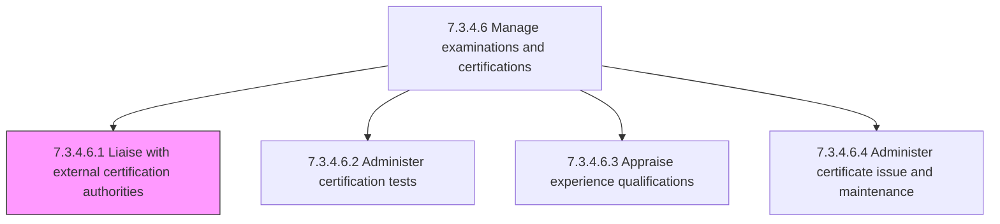
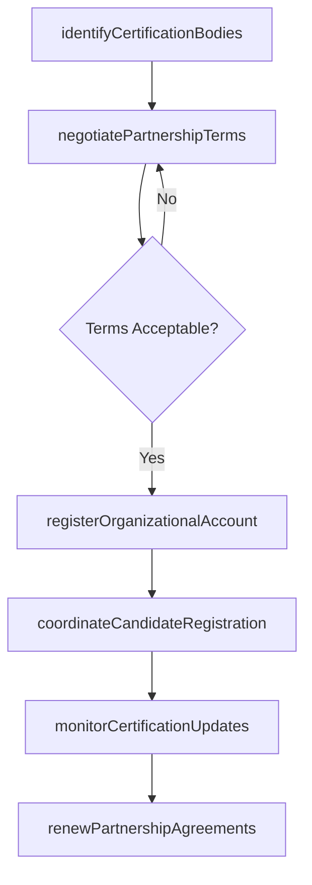

# Liaise with external certification authorities

> Business-as-Code definition for liaising with external certification authorities. Models the process of establishing, maintaining, and managing relationships with third-party certification bodies to ensure employees can obtain and maintain industry-recognized credentials.

## Overview

Coordinating with third-party certification authorities to provide training and certifications for necessary skills. Identify relevant certification bodies for required industry credentials (e.g., PMP, AWS, CISSP, CPA). Negotiate organizational pricing, bulk enrollment agreements, and testing center access. Maintain current knowledge of certification requirements, exam updates, and renewal policies. Coordinate exam scheduling, proctoring arrangements, and candidate registration. Serve as the organizational point of contact for certification authority communications, audit requests, and partnership renewals.

## Process Hierarchy



## GraphDL

```yaml
liaise:
  object: With External Certification Authorities
  actor: CertificationCoordinator
  result: CertificationPartnership
```

## Actions

| Action | Description |
|--------|-------------|
| identifyCertificationBodies | Research and catalog relevant external certification authorities for required credentials |
| negotiatePartnershipTerms | Establish organizational pricing, volume discounts, and partnership agreements with authorities |
| registerOrganizationalAccount | Set up the organization as an authorized training partner or exam sponsor |
| monitorCertificationUpdates | Track changes to exam content, eligibility requirements, and renewal policies |
| coordinateCandidateRegistration | Manage bulk candidate enrollment and exam scheduling with certification authorities |
| renewPartnershipAgreements | Process annual partnership renewals, fee payments, and compliance attestations |

## Events

| Event | Description |
|-------|-------------|
| certificationBodiesIdentified | Relevant certification authorities cataloged for required organizational credentials |
| partnershipTermsNegotiated | Pricing and enrollment agreements finalized with certification authority |
| organizationalAccountRegistered | Organization established as authorized partner or exam sponsor |
| certificationUpdatesReceived | Changes to exam content or eligibility requirements communicated from authority |
| candidateRegistrationCoordinated | Bulk candidate enrollment and exam scheduling completed with authority |
| partnershipAgreementRenewed | Annual partnership terms and compliance attestations processed |

## Searches

| Search | Description |
|--------|-------------|
| findCertificationAuthorities | List external certification bodies filtered by credential type, industry, or region |
| getPartnershipStatus | Retrieve current partnership agreement status and terms with a certification authority |
| getExamScheduleAvailability | Access available exam dates and testing center slots from an authority |
| getCertificationRequirements | Retrieve current eligibility, exam content, and renewal requirements for a credential |

## Process Flow



## RACI Matrix

| Activity | Responsible | Accountable | Consulted | Informed |
|----------|-------------|-------------|-----------|----------|
| identifyCertificationBodies | CertificationCoordinator | LearningDevelopmentManager | DepartmentManagers | HRBusinessPartner |
| negotiatePartnershipTerms | CertificationCoordinator | LearningDevelopmentManager | Procurement | Finance |
| coordinateCandidateRegistration | CertificationCoordinator | LearningDevelopmentManager | Employees | DepartmentManagers |
| renewPartnershipAgreements | CertificationCoordinator | LearningDevelopmentManager | LegalCounsel | Finance |

## Related Processes

| Process | Relationship |
|---------|-------------|
| 7.3.4.6.2 Administer certification tests | Downstream - partnership enables test administration |
| 7.3.4.6.3 Appraise experience qualifications | Parallel - authority requirements define experience prerequisites |
| 7.3.4.6.4 Administer certificate issue and maintenance | Downstream - authority issues certificates upon completion |
| 7.3.4.6 Manage examinations and certifications | Parent - governing process group |

## Related Departments

| Department | Role |
|-----------|------|
| Learning and Development | Owns certification program strategy and authority relationships |
| Procurement | Supports vendor negotiation and contract management |
| Finance | Manages certification program budget and vendor payments |
| Business Units | Identify required certifications for their workforce |

## Related Occupations

| Occupation | Involvement |
|-----------|-------------|
| Certification Coordinator | Primary point of contact with external certification authorities |
| Learning Development Manager | Oversees certification program strategy and authority selection |
| Procurement Specialist | Supports partnership agreement negotiation and contract terms |

## KPIs

| KPI | Description | Unit |
|-----|-------------|------|
| Partnership Coverage | Percentage of required certifications covered by active authority partnerships | % |
| Volume Discount Savings | Cost savings achieved through organizational pricing versus individual rates | USD |
| Registration Turnaround | Average days from candidate nomination to confirmed exam registration | Days |
| Partnership Renewal Rate | Percentage of authority partnerships renewed on time without lapse | % |

## Usage

```typescript
import { liaiseWithExternalCertificationAuthorities } from '@headlessly/liaise-with-external-certification-authorities'

const liaison = liaiseWithExternalCertificationAuthorities()

// Identify certification bodies for cloud engineering credentials
const authorities = await liaison.identifyCertificationBodies({
  credentialDomain: 'cloud-engineering',
  certifications: ['AWS Solutions Architect', 'Azure Administrator', 'GCP Professional'],
  region: 'global'
})

// Coordinate bulk candidate registration for upcoming exam cycle
const registration = await liaison.coordinateCandidateRegistration({
  authorityId: authorities[0].id,
  candidates: ['emp-1201', 'emp-1205', 'emp-1210'],
  examCode: 'SAA-C03',
  preferredWindow: '2026-Q2'
})
```
