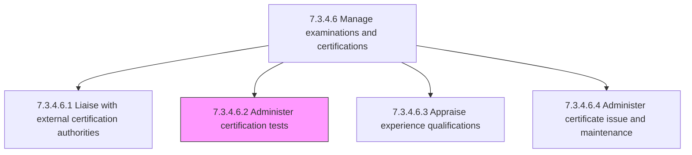
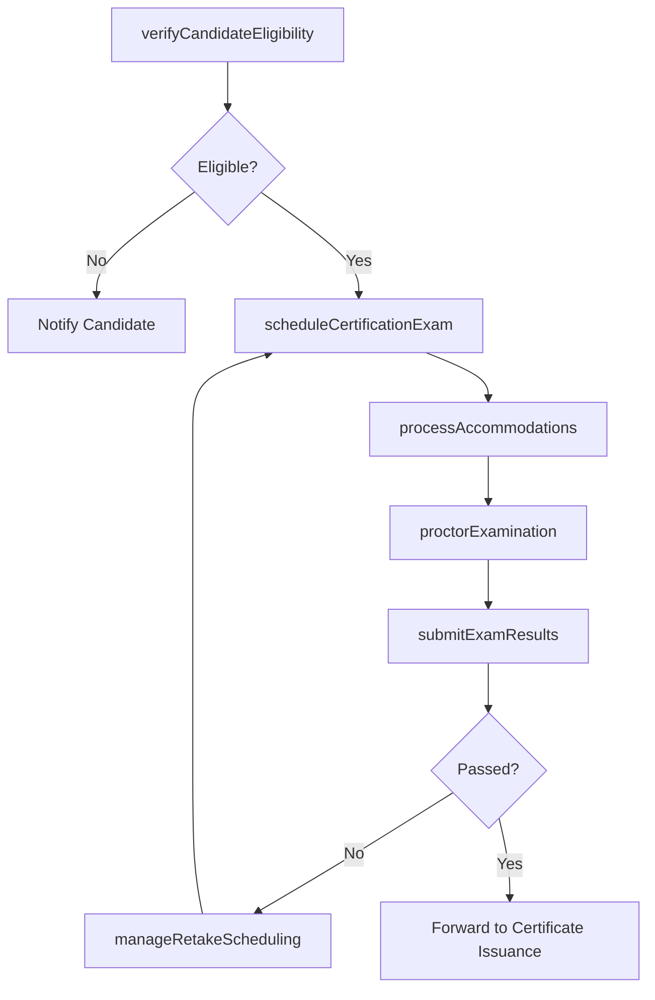

# Administer certification tests

> Business-as-Code definition for administering certification tests. Models the process of scheduling, proctoring, and managing certification examinations so that employees can demonstrate competency and satisfy requirements for industry or internal credentials.

## Overview

Providing tests to the workforce that will satisfy completion of certifications. Schedule examination sessions at authorized testing centers or through online proctoring platforms. Verify candidate eligibility and identity before test administration. Proctor exams in accordance with certification authority standards for test integrity, time limits, and accommodation requirements. Collect and submit test results to the issuing certification authority. Handle test irregularities, accommodations requests, and retake scheduling. Maintain secure handling of exam materials and candidate data throughout the process.

## Process Hierarchy



## GraphDL

```yaml
administer:
  object: Certification Tests
  actor: CertificationCoordinator
  result: ExamSession
```

## Actions

| Action | Description |
|--------|-------------|
| scheduleCertificationExam | Book examination sessions at testing centers or online proctoring platforms |
| verifyCandidateEligibility | Confirm candidates meet prerequisite training, experience, and enrollment requirements |
| proctorExamination | Oversee exam administration ensuring compliance with integrity and timing standards |
| submitExamResults | Transmit completed exam data to the certification authority for scoring |
| processAccommodations | Handle special accommodation requests for candidates with documented needs |
| manageRetakeScheduling | Coordinate rescheduling for candidates who did not pass or missed their exam session |

## Events

| Event | Description |
|-------|-------------|
| certificationExamScheduled | Examination session booked with date, venue, and candidate assignments confirmed |
| candidateEligibilityVerified | Candidate prerequisites validated and exam admission authorized |
| examinationProctored | Exam administered under compliant conditions with integrity maintained |
| examResultsSubmitted | Completed exam data transmitted to certification authority for scoring |
| accommodationsProcessed | Special accommodation requests evaluated and arrangements confirmed |
| retakeScheduled | Failed or missed exam rescheduled for eligible candidate |

## Searches

| Search | Description |
|--------|-------------|
| findScheduledExams | List upcoming certification exam sessions filtered by credential, date, or location |
| getCandidateExamStatus | Retrieve exam eligibility, scheduling, and result status for a specific candidate |
| getExamPassRates | Access pass/fail rates by certification type, department, or time period |
| getAccommodationRequests | List pending or processed accommodation requests for upcoming exams |

## Process Flow



## RACI Matrix

| Activity | Responsible | Accountable | Consulted | Informed |
|----------|-------------|-------------|-----------|----------|
| scheduleCertificationExam | CertificationCoordinator | LearningDevelopmentManager | TestingCenterAdmin | Candidates |
| verifyCandidateEligibility | CertificationCoordinator | LearningDevelopmentManager | DepartmentManagers | HRBusinessPartner |
| proctorExamination | TestProctor | CertificationCoordinator | CertificationAuthority | LearningDevelopmentManager |
| submitExamResults | CertificationCoordinator | LearningDevelopmentManager | CertificationAuthority | Candidates |

## Related Processes

| Process | Relationship |
|---------|-------------|
| 7.3.4.6.1 Liaise with external certification authorities | Upstream - authority partnerships enable exam scheduling and proctoring |
| 7.3.4.6.3 Appraise experience qualifications | Parallel - experience verification is a prerequisite for exam eligibility |
| 7.3.4.6.4 Administer certificate issue and maintenance | Downstream - passed exams trigger certificate issuance |
| 7.3.4.6 Manage examinations and certifications | Parent - governing process group |

## Related Departments

| Department | Role |
|-----------|------|
| Learning and Development | Coordinates exam scheduling and candidate preparation |
| IT | Supports online proctoring platforms and testing center infrastructure |
| Compliance | Ensures exam administration meets regulatory and authority standards |
| Business Units | Nominate candidates and support exam preparation time |

## Related Occupations

| Occupation | Involvement |
|-----------|-------------|
| Certification Coordinator | Manages exam scheduling, eligibility verification, and result submission |
| Test Proctor | Administers exams and ensures testing integrity during sessions |
| Learning Development Manager | Oversees certification testing program and pass rate analytics |

## KPIs

| KPI | Description | Unit |
|-----|-------------|------|
| First-Attempt Pass Rate | Percentage of candidates passing the certification exam on their first attempt | % |
| Exam Scheduling Lead Time | Average days from candidate request to confirmed exam date | Days |
| Testing Integrity Rate | Percentage of exam sessions completed without irregularities or violations | % |
| Retake Conversion Rate | Percentage of retake candidates who pass on subsequent attempts | % |

## Usage

```typescript
import { administerCertificationTests } from '@headlessly/administer-certification-tests'

const testing = administerCertificationTests()

// Verify candidate eligibility for an AWS certification exam
const eligibility = await testing.verifyCandidateEligibility({
  candidateId: 'emp-1205',
  certificationCode: 'AWS-SAA-C03',
  checkPrerequisites: true,
  checkTrainingCompletion: true
})

// Schedule the certification exam for eligible candidates
const exam = await testing.scheduleCertificationExam({
  candidates: ['emp-1201', 'emp-1205'],
  certificationCode: 'AWS-SAA-C03',
  preferredDate: '2026-03-15',
  format: 'online-proctored'
})
```
