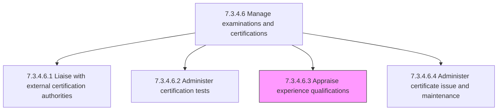
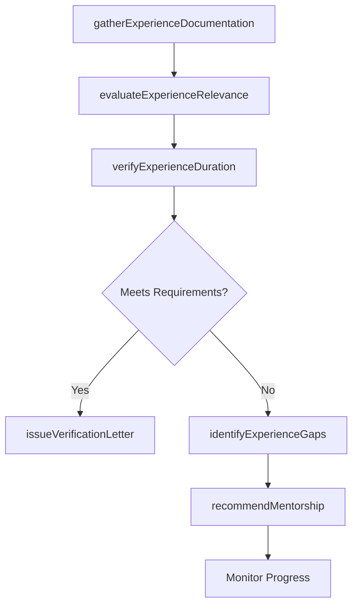

# Appraise experience qualifications

> Business-as-Code definition for appraising experience qualifications. Models the process of evaluating whether candidates possess the practical work experience required to qualify for specific certifications or roles, verifying documented experience against established criteria.

## Overview

Ascertaining the experience level needed to qualify for a specific job or certification within the organization. Many certifications require documented practical experience in addition to training program completion and exam passage. Review candidate work history, project portfolios, and supervisor attestations against certification authority experience requirements. Evaluate the relevance, depth, and duration of experience claimed. Issue experience verification letters or approve experience documentation for submission to certification authorities. Identify experience gaps and recommend supervised practice or mentorship to meet requirements.

## Process Hierarchy



## GraphDL

```yaml
appraise:
  object: Experience Qualifications
  actor: CertificationCoordinator
  result: ExperienceAppraisal
```

## Actions

| Action | Description |
|--------|-------------|
| gatherExperienceDocumentation | Collect candidate work history, project records, and supervisor attestations |
| evaluateExperienceRelevance | Assess whether documented experience aligns with certification domain requirements |
| verifyExperienceDuration | Confirm that the candidate meets minimum hours or years of qualifying experience |
| identifyExperienceGaps | Detect shortfalls between candidate experience and certification prerequisites |
| issueVerificationLetter | Produce formal documentation attesting to the candidate's qualifying experience |
| recommendMentorship | Propose supervised practice or mentorship assignments to close experience gaps |

## Events

| Event | Description |
|-------|-------------|
| experienceDocumentationGathered | Candidate work history and attestation materials collected for review |
| experienceRelevanceEvaluated | Documented experience assessed against certification domain requirements |
| experienceDurationVerified | Minimum qualifying hours or years of experience confirmed |
| experienceGapsIdentified | Shortfalls between candidate experience and certification prerequisites detected |
| verificationLetterIssued | Formal attestation of qualifying experience produced for certification authority |
| mentorshipRecommended | Supervised practice or mentorship assignment proposed to close experience gaps |

## Searches

| Search | Description |
|--------|-------------|
| findCandidatesByExperienceStatus | List candidates filtered by experience appraisal status (pending, qualified, gap-identified) |
| getExperienceRequirements | Retrieve experience prerequisites for a specific certification or role |
| getExperienceAppraisalHistory | Access previous experience appraisals and verification decisions for a candidate |
| getExperienceGapReport | Retrieve candidates with identified experience shortfalls by certification type |

## Process Flow



## RACI Matrix

| Activity | Responsible | Accountable | Consulted | Informed |
|----------|-------------|-------------|-----------|----------|
| gatherExperienceDocumentation | CertificationCoordinator | LearningDevelopmentManager | Candidates | DepartmentManagers |
| evaluateExperienceRelevance | CertificationCoordinator | LearningDevelopmentManager | SubjectMatterExperts | HRBusinessPartner |
| verifyExperienceDuration | CertificationCoordinator | LearningDevelopmentManager | DirectSupervisors | Candidates |
| issueVerificationLetter | LearningDevelopmentManager | HRDirector | CertificationCoordinator | CertificationAuthority |

## Related Processes

| Process | Relationship |
|---------|-------------|
| 7.3.4.6.1 Liaise with external certification authorities | Upstream - authority defines experience requirements to appraise against |
| 7.3.4.6.2 Administer certification tests | Parallel - experience appraisal is often a prerequisite for exam eligibility |
| 7.3.4.6.4 Administer certificate issue and maintenance | Downstream - verified experience is required for certificate issuance |
| 7.3.4.6 Manage examinations and certifications | Parent - governing process group |

## Related Departments

| Department | Role |
|-----------|------|
| Learning and Development | Manages experience appraisal process and verification documentation |
| Business Units | Provide supervisor attestations and project assignment records |
| Human Resources | Maintains employee work history and assignment records |
| Compliance | Ensures experience verification meets certification authority audit standards |

## Related Occupations

| Occupation | Involvement |
|-----------|-------------|
| Certification Coordinator | Conducts experience appraisals and prepares verification documentation |
| Direct Supervisor | Attests to candidate work experience and project involvement |
| Subject Matter Expert | Evaluates the relevance and depth of claimed experience |

## KPIs

| KPI | Description | Unit |
|-----|-------------|------|
| Appraisal Turnaround Time | Average days from documentation submission to appraisal decision | Days |
| First-Pass Qualification Rate | Percentage of candidates meeting experience requirements on initial appraisal | % |
| Experience Gap Closure Rate | Percentage of candidates with identified gaps who achieve qualification within 12 months | % |
| Verification Accuracy | Percentage of issued verification letters accepted by certification authorities without challenge | % |

## Usage

```typescript
import { appraiseExperienceQualifications } from '@headlessly/appraise-experience-qualifications'

const appraisal = appraiseExperienceQualifications()

// Evaluate a candidate's experience against PMP certification requirements
const result = await appraisal.evaluateExperienceRelevance({
  candidateId: 'emp-2045',
  certificationCode: 'PMI-PMP',
  experienceDocuments: ['project-log-2024', 'supervisor-attestation-2025'],
  requiredHours: 4500
})

// Issue verification letter for a qualified candidate
const letter = await appraisal.issueVerificationLetter({
  candidateId: 'emp-2045',
  certificationCode: 'PMI-PMP',
  appraisalId: result.id,
  recipientAuthority: 'PMI'
})
```
