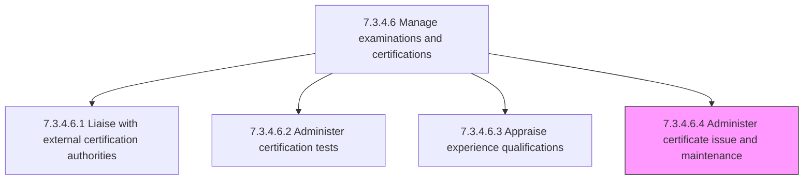
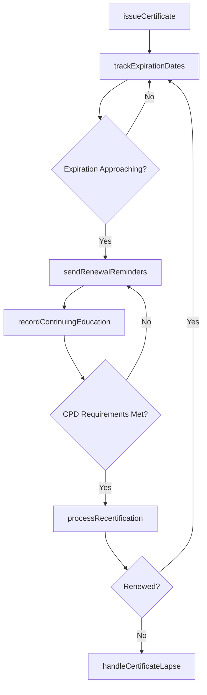

# Administer certificate issue and maintenance

> Business-as-Code definition for administering certificate issuance and maintenance. Models the process of issuing certificates to qualified candidates, tracking expiration dates, managing renewal requirements, and ensuring continuous certification currency across the workforce.

## Overview

Administering certificates to all candidates that have successfully met experience qualifications and passed all tests necessary to obtain the certificate. Record issued certifications in the employee credentials database. Track certification expiration dates and continuing education requirements. Send renewal reminders and coordinate recertification activities. Manage continuing professional development (CPD) credit tracking for certifications that require ongoing education. Handle certificate revocations, lapses, and reinstatements. Produce compliance reports on organizational certification coverage.

## Process Hierarchy



## GraphDL

```yaml
administer:
  object: Certificate Issue And Maintenance
  actor: CertificationCoordinator
  result: CertificateRecord
```

## Actions

| Action | Description |
|--------|-------------|
| issueCertificate | Record the awarded certification in the employee credentials database upon successful completion |
| trackExpirationDates | Monitor certification validity periods and flag upcoming expirations |
| sendRenewalReminders | Notify certificate holders and managers of approaching renewal deadlines |
| recordContinuingEducation | Log continuing professional development credits toward certification maintenance requirements |
| processRecertification | Coordinate renewal applications, recertification exams, or CPD submissions with authorities |
| handleCertificateLapse | Manage expired certifications including reinstatement procedures and compliance implications |

## Events

| Event | Description |
|-------|-------------|
| certificateIssued | Certification recorded in employee credentials database with validity dates |
| expirationFlagged | Certification approaching expiration date identified for renewal action |
| renewalReminderSent | Notification dispatched to certificate holder and manager about upcoming renewal |
| continuingEducationRecorded | CPD credits logged toward certification maintenance requirements |
| recertificationProcessed | Renewal application or recertification exam submitted to certification authority |
| certificateLapseHandled | Expired certification managed with reinstatement or compliance action taken |

## Searches

| Search | Description |
|--------|-------------|
| findCertificationsByEmployee | List all active and expired certifications held by a specific employee |
| getExpiringCertifications | Retrieve certifications approaching expiration within a specified time window |
| getCPDCreditStatus | Access continuing education credit progress toward renewal requirements |
| getCertificationComplianceReport | Generate organizational certification coverage report by department or role |

## Process Flow



## RACI Matrix

| Activity | Responsible | Accountable | Consulted | Informed |
|----------|-------------|-------------|-----------|----------|
| issueCertificate | CertificationCoordinator | LearningDevelopmentManager | CertificationAuthority | Employee |
| trackExpirationDates | CertificationCoordinator | LearningDevelopmentManager | HRISAdministrator | DepartmentManagers |
| processRecertification | CertificationCoordinator | LearningDevelopmentManager | CertificationAuthority | Employee |
| handleCertificateLapse | LearningDevelopmentManager | HRDirector | Compliance | DepartmentManagers |

## Related Processes

| Process | Relationship |
|---------|-------------|
| 7.3.4.6.2 Administer certification tests | Upstream - passed exams trigger certificate issuance |
| 7.3.4.6.3 Appraise experience qualifications | Upstream - verified experience is a prerequisite for issuance |
| 7.3.4.6.1 Liaise with external certification authorities | Parallel - authority manages the official credential record |
| 7.3.4.6 Manage examinations and certifications | Parent - governing process group |

## Related Departments

| Department | Role |
|-----------|------|
| Learning and Development | Manages certificate issuance, tracking, and renewal coordination |
| HRIS / IT | Maintains the employee credentials database and automated reminder systems |
| Compliance | Monitors certification currency for regulatory and contractual requirements |
| Business Units | Track team certification coverage for operational readiness |

## Related Occupations

| Occupation | Involvement |
|-----------|-------------|
| Certification Coordinator | Manages certificate issuance, CPD tracking, and renewal processing |
| HRIS Administrator | Configures certification tracking and automated renewal notifications |
| Compliance Officer | Audits organizational certification currency against regulatory requirements |

## KPIs

| KPI | Description | Unit |
|-----|-------------|------|
| Certification Currency Rate | Percentage of required certifications that are current (not expired or lapsed) | % |
| Renewal On-Time Rate | Percentage of certifications renewed before expiration date | % |
| Average Renewal Processing Time | Days from renewal submission to confirmed recertification | Days |
| CPD Completion Rate | Percentage of certificate holders meeting continuing education requirements on schedule | % |

## Usage

```typescript
import { administerCertificateIssueMaintenance } from '@headlessly/administer-certificate-issue-and-maintenance'

const certificates = administerCertificateIssueMaintenance()

// Issue a new certification record for a qualified candidate
const cert = await certificates.issueCertificate({
  employeeId: 'emp-2045',
  certificationCode: 'PMI-PMP',
  dateIssued: '2026-02-01',
  expirationDate: '2029-02-01',
  issuingAuthority: 'PMI'
})

// Get all certifications expiring in the next 90 days
const expiring = await certificates.getExpiringCertifications({
  windowDays: 90,
  department: 'engineering',
  includeRenewalStatus: true
})
```
