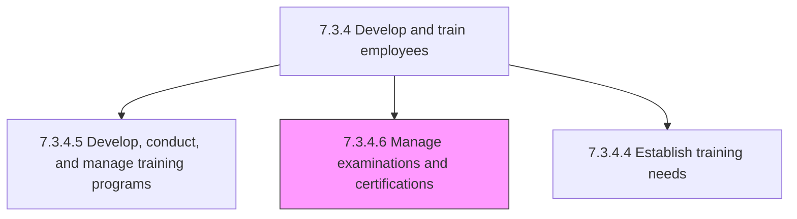
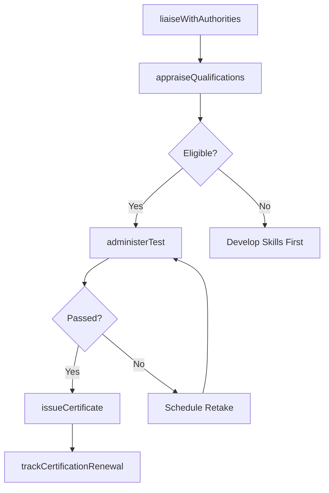

# Manage examinations and certifications

> Business-as-Code definition for examination and certification management. Models external authority liaison, test administration, experience qualification appraisal, and certificate issuance and renewal.

## Overview

Managing identified training programs for employees. Engage with industries to provide certifications, administer certification test, and maintain active certification.

## Process Hierarchy



## GraphDL

```yaml
manage:
  object: Examinations And Certifications
  actor: CertificationCoordinator
  result: EmployeeCertification
```

## Actions

| Action | Description |
|--------|-------------|
| liaiseWithAuthorities | Coordinate with external certification bodies on requirements and scheduling |
| administerTest | Schedule and proctor certification examinations for eligible employees |
| appraiseQualifications | Evaluate employee experience and prerequisites against certification requirements |
| issueCertificate | Grant certification credentials to employees who pass requirements |
| trackCertificationRenewal | Monitor certification expiration dates and initiate renewal processes |

## Events

| Event | Description |
|-------|-------------|
| authorityLiaisonCompleted | Coordination with external certification body concluded |
| testAdministered | Certification examination conducted and results recorded |
| qualificationsAppraised | Employee experience evaluated against certification prerequisites |
| certificateIssued | Certification credential granted to qualifying employee |
| certificationRenewalTracked | Upcoming certification expiration flagged for renewal action |

## Searches

| Search | Description |
|--------|-------------|
| getEmployeeCertifications | List certifications held by employee, type, or expiration status |
| getUpcomingExams | Query scheduled certification examinations by date or type |
| getExpiringCertifications | List certifications approaching renewal deadline |
| getCertificationPassRates | Retrieve examination pass rates by certification type or period |

## Process Flow



## RACI Matrix

| Activity | Responsible | Accountable | Consulted | Informed |
|----------|-------------|-------------|-----------|----------|
| liaiseWithAuthorities | Certification Coordinator | L&D Manager | Legal | Training Team |
| administerTest | Certification Coordinator | L&D Manager | External Authority | Employee |
| appraiseQualifications | Certification Coordinator | L&D Manager | Manager | Employee |
| issueCertificate | Certification Coordinator | L&D Manager | HR | Employee, Manager |

## Sub-Processes

| ID | Name | Description |
|----|------|-------------|
| 7.3.4.6.1 | Liaise with external certification authorities | Coordinating with third party certification authorities to provide training and certifications for n |
| 7.3.4.6.2 | Administer certification tests | Providing tests to the workforce that will satisfy completion of certifications. |
| 7.3.4.6.3 | Appraise experience qualifications | Ascertaining the experience level needed to qualify for a specific job or certification within the o |
| 7.3.4.6.4 | Administer certificate issue and maintenance | Administering certificates to all candidates that have successfully met experience qualifications, a |

## Related Processes

| Process | Relationship |
|---------|-------------|
| 7.3.4.5 Develop, conduct, and manage employee training programs | Upstream - training programs prepare employees for certification |
| 7.3.3.3 Manage employee skill and competency development | Parallel - certifications validate competency development |

## Related Departments

| Department | Role |
|-----------|------|
| Learning and Development | Manages certification programs and authority relationships |
| Human Resources | Tracks certification records in employee files |
| Compliance | Ensures mandatory certifications are maintained |
| All Departments | Nominates employees for role-relevant certifications |

## Related Occupations

| Occupation | Involvement |
|-----------|-------------|
| Certification Coordinator | Manages exam scheduling and certificate administration |
| L&D Manager | Oversees certification program strategy and vendor relationships |
| Compliance Officer | Ensures regulatory certification requirements are met |

## KPIs

| KPI | Description | Unit |
|-----|-------------|------|
| Certification Pass Rate | Percentage of employees passing certification exams on first attempt | % |
| Certification Coverage | Percentage of role-required certifications held across the workforce | % |
| Certification Currency Rate | Percentage of employee certifications that are current and not expired | % |
| Average Time to Certification | Days from eligibility to certification achievement | Days |

## Usage

```typescript
import { manageExaminationsAndCertifications } from '@headlessly/manage-examinations-and-certifications'

const certifications = manageExaminationsAndCertifications()

// Administer a certification test
const exam = await certifications.administerTest({
  certificationId: 'AWS-Solutions-Architect',
  employeeId: 'emp_12345',
  scheduledDate: '2025-08-15',
  proctorType: 'online'
})

// Track certification renewals
const expiring = await certifications.trackCertificationRenewal({
  lookAheadDays: 90,
  department: 'engineering'
})
```
