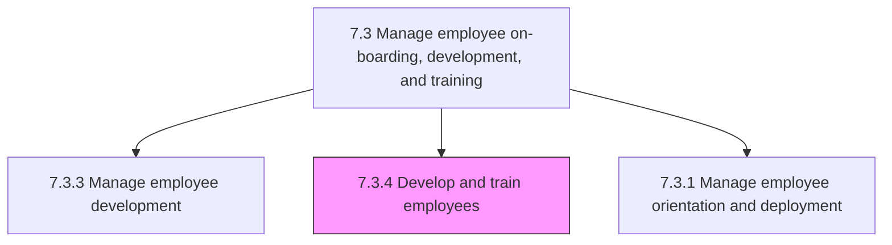
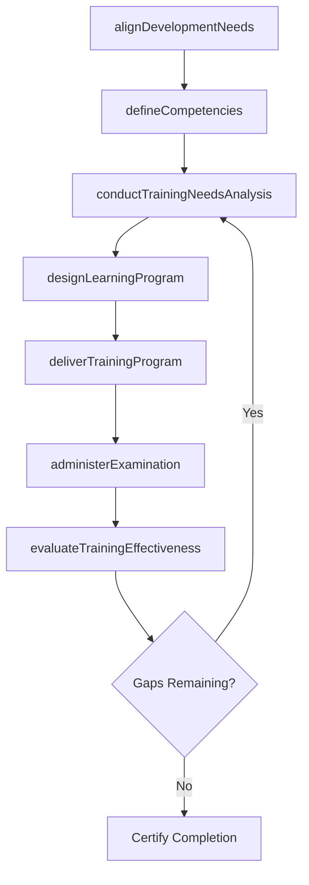

# Develop and train employees

> Business-as-Code definition for employee training and development. Models needs alignment, competency definition, learning program design, training delivery, and certification management.

## Overview

Creating a link between employee and organizational development needs. Conduct and manage employee training programs by considering the need and availability of these programs.

## Process Hierarchy



## GraphDL

```yaml
develop:
  object: And Train Employees
  actor: LearningAndDevelopmentManager
  result: TrainedWorkforce
```

## Actions

| Action | Description |
|--------|-------------|
| alignDevelopmentNeeds | Map employee growth objectives to organizational capability requirements |
| defineCompetencies | Establish skill, knowledge, and behavioral competency models by role |
| designLearningProgram | Create training curricula aligned with defined competency frameworks |
| conductTrainingNeedsAnalysis | Assess gaps between required and available skills across the workforce |
| deliverTrainingProgram | Execute instructor-led, e-learning, or blended training programs |
| administerExamination | Manage assessments, testing, and certification processes for trainees |
| evaluateTrainingEffectiveness | Measure training outcomes against learning objectives and business impact |

## Events

| Event | Description |
|-------|-------------|
| developmentNeedsAligned | Employee development goals mapped to organizational needs |
| competenciesDefined | Role competency models established and published |
| learningProgramDesigned | Training curriculum created and approved |
| trainingNeedsAnalysisCompleted | Workforce skill gap analysis finalized |
| trainingProgramDelivered | Training session or course completed by participants |
| examinationAdministered | Assessment or certification exam conducted and scored |
| trainingEffectivenessEvaluated | Training program impact assessment completed |

## Searches

| Search | Description |
|--------|-------------|
| getTrainingCatalog | List available training programs by competency, format, or department |
| getTrainingEnrollments | Retrieve enrollment and completion data by employee or program |
| getCertificationStatus | Query employee certification records by credential type or expiry |
| getTrainingNeedsReport | List skill gaps and recommended training by team or role |
| getTrainingEffectivenessData | Retrieve program evaluation scores and business impact metrics |

## Process Flow



## RACI Matrix

| Activity | Responsible | Accountable | Consulted | Informed |
|----------|-------------|-------------|-----------|----------|
| alignDevelopmentNeeds | L&D Manager | VP HR | Department Heads | CHRO |
| defineCompetencies | L&D Manager | VP HR | Subject Matter Experts | All Managers |
| conductTrainingNeedsAnalysis | Training Coordinator | L&D Manager | Managers | HR Business Partner |
| designLearningProgram | Instructional Designer | L&D Manager | Subject Matter Experts | IT |
| deliverTrainingProgram | Trainer | L&D Manager | Department Heads | Participants |
| administerExamination | Training Coordinator | L&D Manager | Certification Bodies | Employee |

## Sub-Processes

| ID | Name | Description |
|----|------|-------------|
| 7.3.4.1 | Align employee with organization development needs | Aligning the needs of the employees to development needs. |
| 7.3.4.2 | Define employee competencies | Defining the skills, knowledge, abilities, and attributes needed to carry out a specific job. |
| 7.3.4.3 | Align learning programs with competencies | Aligning the learning programs with the core capabilities and competencies of the organization. Cont |
| 7.3.4.4 | Establish training needs by analysis of required and available skills | Determining the training necessitated by business processes, using an examination of skill sets that |
| 7.3.4.5 | Develop, conduct, and manage employee and/or management training programs | Creating, implementing, and managing the programs for training employees. Create and design sessions |
| 7.3.4.6 | Manage examinations and certifications | Managing identified training programs for employees. Engage with industries to provide certification |

## Related Processes

| Process | Relationship |
|---------|-------------|
| 7.3.3 Manage employee development | Upstream - development plans define training requirements |
| 7.3.2 Manage employee performance | Upstream - performance reviews identify skill gaps |
| 7.3.1 Manage employee orientation and deployment | Parallel - onboarding includes initial training |
| 7.1.2 Develop and implement workforce strategy and policies | Upstream - workforce strategy drives competency frameworks |

## Related Departments

| Department | Role |
|-----------|------|
| Learning and Development | Designs, delivers, and evaluates training programs |
| Human Resources | Governs training policies and compliance requirements |
| All Departments | Identifies training needs and nominates participants |
| Information Technology | Maintains learning management systems and e-learning platforms |
| Finance | Manages training budgets and tracks ROI |

## Related Occupations

| Occupation | Involvement |
|-----------|-------------|
| L&D Manager | Oversees training strategy and program portfolio |
| Instructional Designer | Creates learning content and course curricula |
| Training Coordinator | Manages logistics, scheduling, and enrollment |
| Corporate Trainer | Delivers instructor-led training sessions |

## KPIs

| KPI | Description | Unit |
|-----|-------------|------|
| Training Hours Per Employee | Average annual training hours completed per employee | Hours |
| Training Completion Rate | Percentage of enrolled employees completing assigned training | % |
| Certification Pass Rate | Percentage of employees passing certification exams on first attempt | % |
| Training ROI | Business impact value divided by total training investment | Ratio |
| Learning Satisfaction Score | Participant rating of training quality and relevance | Score (1-5) |

## Usage

```typescript
import { developAndTrainEmployees } from '@headlessly/develop-and-train-employees'

const training = developAndTrainEmployees()

// Conduct training needs analysis
const needs = await training.conductTrainingNeedsAnalysis({
  department: 'engineering',
  competencyFramework: 'software-engineering-v2',
  period: '2025-H2'
})

// Deliver a training program
const session = await training.deliverTrainingProgram({
  programId: 'cloud-architecture-101',
  format: 'blended',
  participants: ['emp_111', 'emp_222', 'emp_333'],
  startDate: '2025-07-15'
})
```
