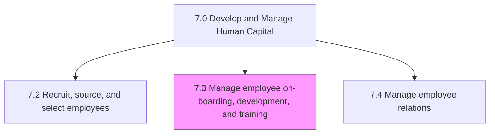
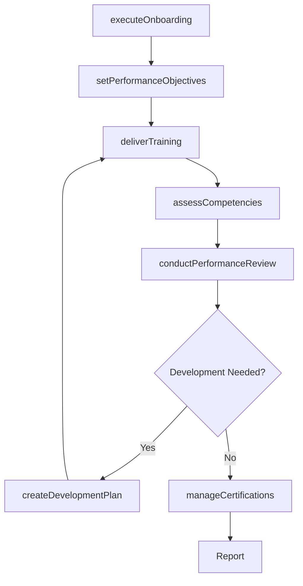

# Manage employee on-boarding, development, and training

> Business-as-Code definition for employee onboarding, development, and training management. Models orientation programs, performance management, career development, competency building, and training delivery.

## Overview

Assisting employees in developing their capabilities, and providing them counseling services. Handle the orientation and deployment of the employees. Administer the performance of employees. Administer the development and enhancement of the employees. Provide training and development programs for employees.

## Process Hierarchy



## GraphDL

```yaml
manage:
  object: Employee On-boarding, Development, And Training
  actor: LearningAndDevelopmentManager
  result: EmployeeDevelopmentOutcome
```

## Actions

| Action | Description |
|--------|-------------|
| executeOnboarding | Deliver orientation program for new hires |
| setPerformanceObjectives | Define measurable performance goals for employees |
| conductPerformanceReview | Execute periodic performance appraisals |
| createDevelopmentPlan | Build individual career development plans |
| deliverTraining | Conduct training programs aligned with competency needs |
| assessCompetencies | Evaluate employee skill levels against role requirements |
| manageCertifications | Track and administer professional certifications |

## Events

| Event | Description |
|-------|-------------|
| onboardingExecuted | New hire orientation program completed |
| performanceObjectivesSet | Employee performance goals defined and agreed upon |
| performanceReviewConducted | Periodic performance appraisal completed and documented |
| developmentPlanCreated | Individual development plan established with milestones |
| trainingDelivered | Training program or course completed by employee |
| competenciesAssessed | Employee competency evaluation completed |
| certificationManaged | Professional certification tracked or renewed |

## Searches

| Search | Description |
|--------|-------------|
| getOnboardingStatus | Query onboarding completion status for new hires |
| getPerformanceReviews | Retrieve performance review data by employee, team, or period |
| getDevelopmentPlans | List employee development plans by status or department |
| getTrainingRecords | Query training completion records by employee or course |
| getCompetencyGaps | Identify skill gaps across teams or departments |

## Process Flow



## RACI Matrix

| Activity | Responsible | Accountable | Consulted | Informed |
|----------|-------------|-------------|-----------|----------|
| executeOnboarding | HR Coordinator | L&D Manager | Hiring Manager | IT, Facilities |
| setPerformanceObjectives | Employee and Manager | Department Head | HR Business Partner | VP HR |
| conductPerformanceReview | Manager | Department Head | HR Business Partner | Compensation Team |
| deliverTraining | L&D Specialist | L&D Manager | Subject Matter Experts | Department Heads |
| assessCompetencies | HR Business Partner | L&D Manager | Managers | Employees |

## Sub-Processes

| ID | Name | Description |
|----|------|-------------|
| 7.3.1 | Manage employee orientation and deployment | Creating and maintaining various employee on-boarding programs typically known as induction programs |
| 7.3.2 | Manage employee performance | Defining individual performance objectives. Review performance in order to provide appraisals. Evalu |
| 7.3.3 | Manage employee development | Establishing employee development guidelines. Lay out career paths and plans for them. Manage the de |
| 7.3.4 | Develop and train employees | Creating a link between employee and organizational development needs. Conduct and manage employee t |

## Related Processes

| Process | Relationship |
|---------|-------------|
| 7.2 Recruit, source, and select employees | Upstream - new hires transition to onboarding |
| 7.5 Reward and retain employees | Downstream - development outcomes inform compensation |
| 7.1 Develop and manage HR planning, policies, and strategies | Upstream - strategy guides training priorities |

## Related Departments

| Department | Role |
|-----------|------|
| Learning and Development | Designs and delivers training and development programs |
| Human Resources | Manages performance review cycles and policy compliance |
| All Business Units | Participates in performance management and skills assessment |
| Information Technology | Provides learning management system infrastructure |

## Related Occupations

| Occupation | Involvement |
|-----------|-------------|
| Learning and Development Specialist | Designs and delivers training programs |
| HR Business Partner | Supports performance management and career planning |
| Training Coordinator | Schedules and administers training logistics |
| Instructional Designer | Creates training content and learning materials |

## KPIs

| KPI | Description | Unit |
|-----|-------------|------|
| Onboarding Completion Rate | Percentage of new hires completing onboarding within target timeframe | % |
| Training Hours Per Employee | Average training hours delivered per employee annually | Hours |
| Performance Review Completion Rate | Percentage of employees with completed annual reviews | % |
| Employee Competency Score | Average competency assessment score across the organization | Score (1-5) |
| Development Plan Achievement Rate | Percentage of development plan milestones completed on time | % |

## Usage

```typescript
import { manageEmployeeOnBoardingDevelopmentAndTraining } from '@headlessly/manage-employee-on-boarding-development-and-training'

const development = manageEmployeeOnBoardingDevelopmentAndTraining()

// Execute onboarding for a new hire
const onboarding = await development.executeOnboarding({
  employeeId: 'emp_56789',
  programType: 'engineering-track',
  startDate: '2025-04-01',
  buddy: 'emp_12345'
})

// Conduct a performance review
const review = await development.conductPerformanceReview({
  employeeId: 'emp_56789',
  reviewPeriod: '2025-H1',
  type: 'mid-year'
})
```
