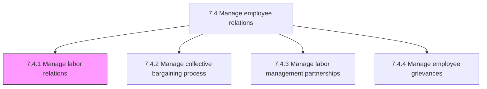
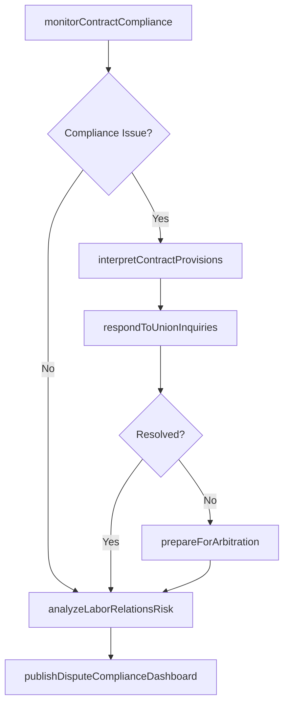

# Manage labor relations

> Business-as-Code definition for managing labor relations. Models the comprehensive process of governing the relationship between the organization and its unionized workforce, ensuring compliance with labor laws, administering collective bargaining agreements, and fostering constructive engagement with labor representatives.

## Overview

Managing labor relations, the collective bargaining process, and the relationships between labor and management. Monitor compliance with current collective bargaining agreements, labor laws, and regulatory requirements. Interpret contract provisions and advise management on permissible actions under existing agreements. Prepare for and participate in union organizing drives, representation elections, and certification proceedings. Administer grievance and arbitration procedures specified in collective agreements. Track labor relations metrics including dispute frequency, resolution outcomes, and contract compliance. Foster ongoing communication channels between management and labor representatives.

## Process Hierarchy



## GraphDL

```yaml
manage:
  object: Labor Relations
  actor: LaborRelationsManager
  result: LaborRelationsStrategy
```

## Actions

| Action | Description |
|--------|-------------|
| monitorContractCompliance | Track adherence to collective bargaining agreement provisions across the organization |
| interpretContractProvisions | Advise management on permissible actions and obligations under existing labor agreements |
| respondToUnionInquiries | Address formal and informal inquiries from union representatives on contract matters |
| prepareForArbitration | Assemble evidence, witnesses, and legal arguments for grievance arbitration proceedings |
| analyzeLaborRelationsRisk | Assess organizational exposure to labor disputes, unfair labor practice charges, and work stoppages |
| publishDisputeComplianceDashboard | Produce dashboards on dispute frequency, resolution outcomes, and contract compliance rates |

## Events

| Event | Description |
|-------|-------------|
| contractComplianceMonitored | Review of collective bargaining agreement adherence completed |
| contractProvisionInterpreted | Management advisory issued on contract interpretation question |
| unionInquiryResolved | Formal union inquiry addressed and response communicated |
| arbitrationPrepared | Evidence and arguments assembled for upcoming grievance arbitration |
| laborRelationsRiskAssessed | Organizational exposure to labor disputes and charges evaluated |
| disputeComplianceDashboardPublished | Labor relations performance dashboard published to stakeholders |

## Searches

| Search | Description |
|--------|-------------|
| findActiveAgreements | List current collective bargaining agreements filtered by bargaining unit, expiration, or facility |
| getContractProvision | Retrieve specific contract clause, article, or side letter from an active agreement |
| getDisputeHistory | Access historical labor disputes, grievances, and arbitration outcomes |
| getLaborRelationsDashboard | Retrieve aggregate labor relations metrics and trend data |

## Process Flow



## RACI Matrix

| Activity | Responsible | Accountable | Consulted | Informed |
|----------|-------------|-------------|-----------|----------|
| monitorContractCompliance | LaborRelationsManager | VP HumanResources | LegalCounsel | DepartmentManagers |
| interpretContractProvisions | LaborRelationsManager | LegalCounsel | HRBusinessPartner | OperationsManagers |
| prepareForArbitration | LaborRelationsManager | LegalCounsel | OutsideCounsel | VP HumanResources |
| publishDisputeComplianceDashboard | HRAnalyst | LaborRelationsManager | Finance | ExecutiveLeadership |

## Related Processes

| Process | Relationship |
|---------|-------------|
| 7.4.2 Manage collective bargaining process | Downstream - labor relations strategy informs bargaining approach |
| 7.4.3 Manage labor management partnerships | Parallel - constructive relationships reduce adversarial disputes |
| 7.4.4 Manage employee grievances | Downstream - labor relations framework governs grievance procedures |
| 7.4 Manage employee relations | Parent - governing process group |

## Related Departments

| Department | Role |
|-----------|------|
| Human Resources | Owns labor relations strategy and day-to-day union interaction |
| Legal | Provides labor law guidance, contract interpretation, and arbitration representation |
| Operations | Implements labor agreement provisions on the front line |
| Finance | Analyzes financial impact of labor agreements and dispute resolution costs |

## Related Occupations

| Occupation | Involvement |
|-----------|-------------|
| Labor Relations Manager | Leads all labor relations activities and serves as primary management representative |
| Employment Attorney | Provides legal counsel on labor law compliance and arbitration strategy |
| HR Business Partner | Advises line management on labor agreement application in daily operations |

## KPIs

| KPI | Description | Unit |
|-----|-------------|------|
| Contract Compliance Rate | Percentage of audited provisions found in full compliance | % |
| Grievance Filing Rate | Number of formal grievances filed per 1,000 union-represented employees | Per 1,000 |
| Arbitration Win Rate | Percentage of arbitration cases decided in management's favor | % |
| Work Stoppage Days | Total employee-days lost to strikes, lockouts, or work stoppages | Days |

## Usage

```typescript
import { manageLaborRelations } from '@headlessly/manage-labor-relations'

const laborRelations = manageLaborRelations()

// Monitor compliance with the current collective bargaining agreement
const compliance = await laborRelations.monitorContractCompliance({
  agreementId: 'cba-manufacturing-2024',
  auditScope: ['wages', 'hours', 'safety-provisions', 'seniority'],
  facility: 'plant-midwest'
})

// Prepare for an upcoming grievance arbitration
const arbPrep = await laborRelations.prepareForArbitration({
  grievanceId: 'grv-2026-0047',
  hearingDate: '2026-04-15',
  includeWitnesses: true,
  assemblePriorDecisions: true
})
```
