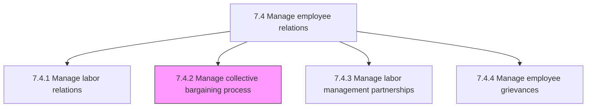
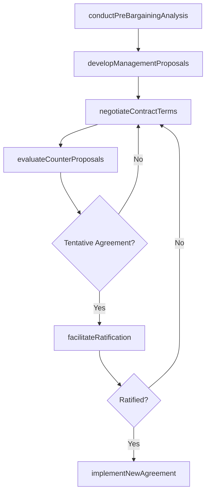

# Manage collective bargaining process

> Business-as-Code definition for managing the collective bargaining process. Models the end-to-end negotiation lifecycle between employer and union representatives, from pre-bargaining preparation through contract ratification and implementation.

## Overview

Managing negotiations between an employer and a group of employees that determine the conditions of employment. Prepare for bargaining by analyzing current contract costs, surveying industry compensation trends, and developing management proposals. Engage employee representatives to reach agreements on wages, hours, benefits, working conditions, and dispute resolution procedures. Manage the negotiation timeline, counter-proposal exchanges, and tentative agreement packages. Facilitate ratification voting and communicate new contract terms to the workforce. Coordinate contract implementation across all affected departments and systems.

## Process Hierarchy



## GraphDL

```yaml
manage:
  object: Collective Bargaining Process
  actor: LaborRelationsManager
  result: CollectiveBargainingAgreement
```

## Actions

| Action | Description |
|--------|-------------|
| conductPreBargainingAnalysis | Analyze current contract costs, market benchmarks, and organizational priorities to develop bargaining positions |
| developManagementProposals | Draft proposed contract terms, economic packages, and language changes for negotiation |
| negotiateContractTerms | Engage in formal bargaining sessions with union representatives to reach tentative agreements |
| evaluateCounterProposals | Assess union proposals for financial impact, operational feasibility, and legal compliance |
| facilitateRatification | Coordinate the tentative agreement presentation and employee ratification vote process |
| implementNewAgreement | Roll out ratified contract terms across payroll, benefits, scheduling, and policy systems |

## Events

| Event | Description |
|-------|-------------|
| preBargainingAnalysisCompleted | Current contract costs, benchmarks, and bargaining priorities analyzed |
| managementProposalsDeveloped | Management's proposed contract terms drafted and approved for presentation |
| contractTermsNegotiated | Formal bargaining session conducted with positions exchanged |
| counterProposalsEvaluated | Union proposals assessed for financial and operational impact |
| agreementRatified | Tentative agreement approved through employee ratification vote |
| newAgreementImplemented | Ratified contract terms deployed across organizational systems |

## Searches

| Search | Description |
|--------|-------------|
| findBargainingHistory | List past collective bargaining rounds with outcomes, durations, and key terms |
| getProposalComparison | Retrieve side-by-side comparison of management and union proposals by article |
| getCostModeling | Access financial impact projections for proposed contract terms |
| getContractImplementationStatus | Track rollout progress of ratified agreement terms across departments |

## Process Flow



## RACI Matrix

| Activity | Responsible | Accountable | Consulted | Informed |
|----------|-------------|-------------|-----------|----------|
| conductPreBargainingAnalysis | LaborRelationsManager | VP HumanResources | Finance | ExecutiveLeadership |
| developManagementProposals | LaborRelationsManager | VP HumanResources | LegalCounsel | OperationsManagers |
| negotiateContractTerms | LaborRelationsManager | VP HumanResources | LegalCounsel | CEO |
| implementNewAgreement | HRBusinessPartner | LaborRelationsManager | PayrollManager | AllManagers |

## Related Processes

| Process | Relationship |
|---------|-------------|
| 7.4.1 Manage labor relations | Upstream - labor relations strategy shapes bargaining approach |
| 7.4.3 Manage labor management partnerships | Parallel - partnership quality influences bargaining dynamics |
| 7.4.4 Manage employee grievances | Downstream - new contract terms redefine grievance procedures |
| 7.4 Manage employee relations | Parent - governing process group |

## Related Departments

| Department | Role |
|-----------|------|
| Human Resources | Leads bargaining preparation, negotiation, and contract implementation |
| Legal | Provides labor law counsel, reviews contract language, and advises on legal risk |
| Finance | Models economic impact of proposed terms and validates budget feasibility |
| Operations | Ensures proposed terms are operationally feasible and supports implementation |

## Related Occupations

| Occupation | Involvement |
|-----------|-------------|
| Labor Relations Manager | Chief negotiator representing management at the bargaining table |
| Employment Attorney | Reviews contract language, assesses legal risk, and advises on bargaining strategy |
| Compensation Analyst | Models financial impact of wage, benefit, and incentive proposals |

## KPIs

| KPI | Description | Unit |
|-----|-------------|------|
| Bargaining Duration | Calendar days from opening session to tentative agreement | Days |
| Ratification Vote Margin | Percentage of eligible voters approving the tentative agreement | % |
| Contract Cost Variance | Difference between budgeted and actual cost of negotiated terms | % |
| Implementation Completion Rate | Percentage of ratified terms fully implemented within target timeline | % |

## Usage

```typescript
import { manageCollectiveBargainingProcess } from '@headlessly/manage-collective-bargaining-process'

const bargaining = manageCollectiveBargainingProcess()

// Conduct pre-bargaining analysis for upcoming contract renewal
const analysis = await bargaining.conductPreBargainingAnalysis({
  currentAgreementId: 'cba-manufacturing-2024',
  expirationDate: '2026-06-30',
  benchmarkSources: ['bls-eci', 'industry-survey', 'regional-market'],
  priorityTopics: ['wages', 'healthcare-contributions', 'scheduling-flexibility']
})

// Evaluate a union counter-proposal for financial impact
const evaluation = await bargaining.evaluateCounterProposals({
  proposalId: 'union-counter-03',
  modelScenarios: ['base-case', 'high-enrollment', 'low-turnover'],
  includeRetroactivity: true
})
```
