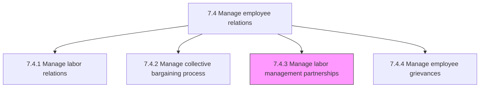
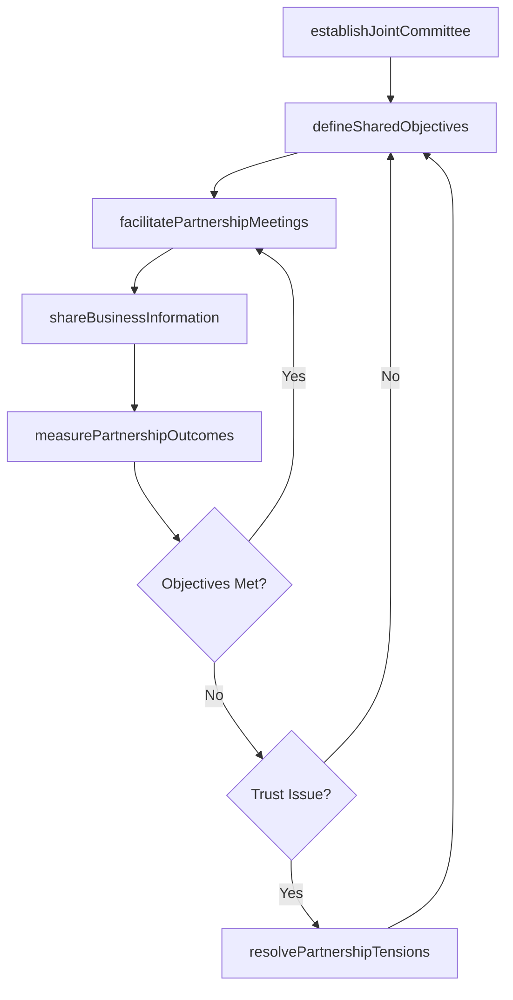

# Manage labor management partnerships

> Business-as-Code definition for managing labor management partnerships. Models the process of building and sustaining collaborative relationships between organizational leadership and labor representatives to advance shared interests in workplace safety, productivity, and employee well-being.

## Overview

Handling partnerships between labor and management. Develop a lasting two-way relationship that is beneficial for the labor, management, and the organization. Establish joint labor-management committees to address workplace issues collaboratively. Define partnership charters with shared goals, governance structures, and decision-making protocols. Facilitate regular partnership meetings to discuss operational improvements, safety initiatives, and workforce development. Measure partnership effectiveness through joint outcome metrics. Resolve partnership tensions through structured dialogue before they escalate to formal disputes. Share relevant business information to build trust and enable informed joint decision-making.

## Process Hierarchy



## GraphDL

```yaml
manage:
  object: Labor Management Partnerships
  actor: LaborRelationsManager
  result: PartnershipCharter
```

## Actions

| Action | Description |
|--------|-------------|
| establishJointCommittee | Form labor-management committees with defined charter, membership, and governance protocols |
| defineSharedObjectives | Collaboratively set partnership goals around safety, productivity, and workforce development |
| facilitatePartnershipMeetings | Convene regular joint sessions to discuss operational issues and collaborative initiatives |
| shareBusinessInformation | Provide relevant financial and operational data to labor partners to enable informed participation |
| measurePartnershipOutcomes | Track joint performance metrics on safety incidents, productivity gains, and employee satisfaction |
| resolvePartnershipTensions | Address disagreements or trust breakdowns through structured facilitated dialogue |

## Events

| Event | Description |
|-------|-------------|
| jointCommitteeEstablished | Labor-management committee formed with charter and membership confirmed |
| sharedObjectivesDefined | Partnership goals collaboratively agreed upon by labor and management representatives |
| partnershipMeetingFacilitated | Scheduled joint session conducted with agenda items addressed |
| businessInformationShared | Relevant operational or financial data provided to labor partners |
| partnershipOutcomesMeasured | Joint performance metrics collected and partnership effectiveness assessed |
| partnershipTensionsResolved | Disagreement or trust issue addressed through facilitated dialogue |

## Searches

| Search | Description |
|--------|-------------|
| findJointCommittees | List active labor-management committees filtered by facility, topic area, or status |
| getPartnershipCharter | Retrieve the charter, objectives, and governance rules for a specific partnership |
| getMeetingHistory | Access past partnership meeting agendas, minutes, and action items |
| getPartnershipMetrics | Retrieve joint outcome metrics including safety, productivity, and satisfaction trends |

## Process Flow



## RACI Matrix

| Activity | Responsible | Accountable | Consulted | Informed |
|----------|-------------|-------------|-----------|----------|
| establishJointCommittee | LaborRelationsManager | VP HumanResources | UnionPresident | PlantManagers |
| defineSharedObjectives | LaborRelationsManager | VP HumanResources | UnionRepresentatives | DepartmentManagers |
| facilitatePartnershipMeetings | LaborRelationsManager | VP HumanResources | CommitteeMembers | ExecutiveLeadership |
| measurePartnershipOutcomes | HRAnalyst | LaborRelationsManager | UnionRepresentatives | Finance |

## Related Processes

| Process | Relationship |
|---------|-------------|
| 7.4.1 Manage labor relations | Upstream - labor relations strategy provides the foundation for partnership approach |
| 7.4.2 Manage collective bargaining process | Parallel - strong partnerships improve bargaining dynamics and outcomes |
| 7.4.4 Manage employee grievances | Downstream - effective partnerships reduce the volume and intensity of grievances |
| 7.4 Manage employee relations | Parent - governing process group |

## Related Departments

| Department | Role |
|-----------|------|
| Human Resources | Facilitates partnership formation and maintains ongoing relationship management |
| Operations | Participates in joint committees and implements collaborative initiatives |
| Safety / EHS | Contributes to joint safety committees and workplace improvement programs |
| Finance | Provides business data for informed partnership discussions |

## Related Occupations

| Occupation | Involvement |
|-----------|-------------|
| Labor Relations Manager | Facilitates partnership activities and serves as management co-chair |
| Union Representative | Serves as labor co-chair and represents workforce interests in joint initiatives |
| EHS Manager | Leads joint safety committees and workplace improvement programs |

## KPIs

| KPI | Description | Unit |
|-----|-------------|------|
| Partnership Meeting Frequency | Number of joint committee meetings held per quarter | Count |
| Joint Initiative Completion Rate | Percentage of collaborative initiatives completed within agreed timelines | % |
| Safety Incident Reduction | Year-over-year change in recordable safety incidents at partnered facilities | % |
| Grievance Volume Reduction | Change in formal grievance filings at facilities with active partnerships | % |

## Usage

```typescript
import { manageLaborManagementPartnerships } from '@headlessly/manage-labor-management-partnerships'

const partnerships = manageLaborManagementPartnerships()

// Establish a new joint safety committee at a manufacturing facility
const committee = await partnerships.establishJointCommittee({
  facility: 'plant-midwest',
  focusArea: 'workplace-safety',
  managementMembers: ['ops-director', 'ehs-manager', 'hr-partner'],
  laborMembers: ['union-steward-a', 'union-steward-b', 'safety-rep'],
  meetingCadence: 'bi-weekly'
})

// Measure partnership outcomes for the current quarter
const outcomes = await partnerships.measurePartnershipOutcomes({
  committeeId: committee.id,
  metrics: ['safety-incidents', 'grievance-volume', 'productivity-index'],
  period: '2026-Q1'
})
```
