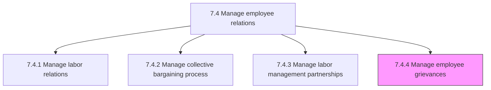
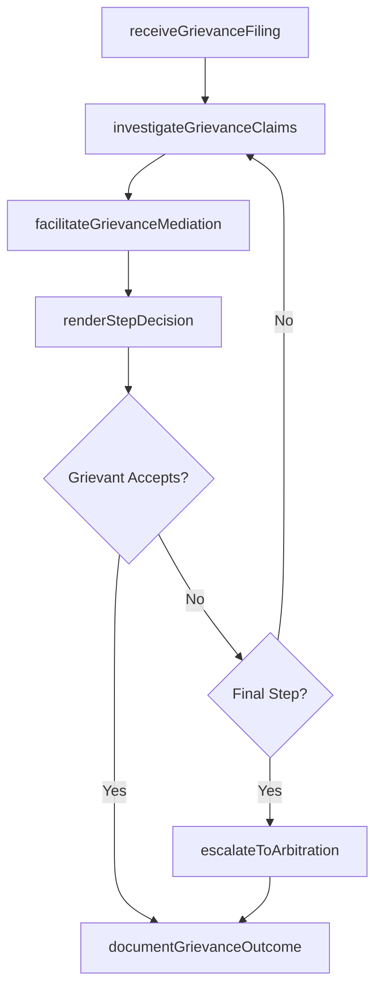

# Manage employee grievances

> Business-as-Code definition for managing employee grievances. Models the end-to-end process of receiving, investigating, mediating, and resolving formal employee complaints through procedures established in collective agreements, employment contracts, or organizational policy.

## Overview

Taking care of or resolving any complaint raised by an employee by procedures provided for in a collective agreement, an employment contract, or by other mechanisms established by an employer. Receive and acknowledge formal grievance filings within required timeframes. Investigate grievance claims through witness interviews, document review, and site inspections. Facilitate mediation sessions between the grievant, their representative, and management. Render formal written decisions at each step of the grievance procedure. Process appeals and escalations through successive management levels. Coordinate with legal counsel on grievances that proceed to arbitration. Document all resolutions, corrective actions, and precedent-setting outcomes for future reference.

## Process Hierarchy



## GraphDL

```yaml
manage:
  object: Employee Grievances
  actor: EmployeeRelationsSpecialist
  result: GrievanceResolution
```

## Actions

| Action | Description |
|--------|-------------|
| receiveGrievanceFiling | Accept, log, and acknowledge a formal grievance within contractual or policy-required timeframes |
| investigateGrievanceClaims | Conduct fact-finding through witness interviews, document review, and site inspections |
| facilitateGrievanceMediation | Arrange and mediate structured discussions between grievant, representative, and management |
| renderStepDecision | Issue a formal written determination at the current grievance procedure step |
| escalateToArbitration | Prepare and forward unresolved grievances to external arbitration proceedings |
| documentGrievanceOutcome | Record the final resolution, corrective actions, and precedent implications |

## Events

| Event | Description |
|-------|-------------|
| grievanceFilingReceived | Formal grievance complaint logged, acknowledged, and assigned for investigation |
| grievanceClaimsInvestigated | Fact-finding investigation completed with findings and evidence documented |
| grievanceMediationFacilitated | Mediation session conducted between grievant and management parties |
| stepDecisionRendered | Formal written determination issued at the current grievance procedure step |
| grievanceEscalatedToArbitration | Unresolved grievance forwarded to external arbitration with supporting materials |
| grievanceOutcomeDocumented | Final resolution, corrective actions, and lessons learned recorded |

## Searches

| Search | Description |
|--------|-------------|
| findGrievances | List grievances filtered by status, type, department, grievant, or filing date |
| getGrievanceTimeline | Retrieve the step-by-step procedural history and decision chain for a grievance |
| getGrievanceTrends | Access grievance filing rates, categories, and resolution patterns over time |
| getArbitrationHistory | List grievances that proceeded to arbitration with outcomes and precedent notes |

## Process Flow



## RACI Matrix

| Activity | Responsible | Accountable | Consulted | Informed |
|----------|-------------|-------------|-----------|----------|
| receiveGrievanceFiling | EmployeeRelationsSpecialist | VP HumanResources | HRBusinessPartner | DepartmentManager |
| investigateGrievanceClaims | EmployeeRelationsSpecialist | VP HumanResources | LegalCounsel | UnionRepresentative |
| renderStepDecision | DepartmentManager | VP HumanResources | LegalCounsel | EmployeeRelationsSpecialist |
| escalateToArbitration | LaborRelationsManager | LegalCounsel | OutsideCounsel | VP HumanResources |

## Related Processes

| Process | Relationship |
|---------|-------------|
| 7.4.1 Manage labor relations | Upstream - labor relations framework defines grievance procedures and contractual rights |
| 7.4.2 Manage collective bargaining process | Parallel - grievance patterns inform bargaining priorities for the next contract cycle |
| 7.4.3 Manage labor management partnerships | Upstream - effective partnerships reduce grievance volume and severity |
| 7.4 Manage employee relations | Parent - governing process group |

## Related Departments

| Department | Role |
|-----------|------|
| Human Resources | Manages the grievance process and provides investigation resources |
| Legal | Advises on contractual obligations, legal exposure, and arbitration strategy |
| Operations / Line Management | Responds to grievances and implements corrective actions |
| Union / Employee Representatives | Advocates for grievants and participates in mediation and hearings |

## Related Occupations

| Occupation | Involvement |
|-----------|-------------|
| Employee Relations Specialist | Receives grievances, conducts investigations, and facilitates mediation |
| Labor Relations Manager | Manages arbitration preparation and represents management at hearings |
| Employment Attorney | Provides legal counsel on grievance decisions and arbitration strategy |

## KPIs

| KPI | Description | Unit |
|-----|-------------|------|
| Grievance Resolution Time | Average calendar days from filing to final resolution | Days |
| First-Step Resolution Rate | Percentage of grievances resolved at the initial procedural step | % |
| Arbitration Rate | Percentage of filed grievances that escalate to external arbitration | % |
| Repeat Grievance Rate | Percentage of grievances involving the same issue or department within 12 months | % |

## Usage

```typescript
import { manageEmployeeGrievances } from '@headlessly/manage-employee-grievances'

const grievances = manageEmployeeGrievances()

// Receive and log a new employee grievance
const filing = await grievances.receiveGrievanceFiling({
  grievantId: 'emp-3456',
  representativeId: 'union-steward-12',
  grievanceType: 'contract-violation',
  articleCited: 'Article 14 - Overtime Assignment',
  description: 'Overtime bypassed in violation of seniority provisions',
  reliefRequested: 'back-pay-and-policy-compliance'
})

// Investigate the grievance claims
const investigation = await grievances.investigateGrievanceClaims({
  grievanceId: filing.id,
  investigationScope: ['overtime-records', 'seniority-list', 'supervisor-interviews'],
  dueDate: '2026-02-20'
})
```
